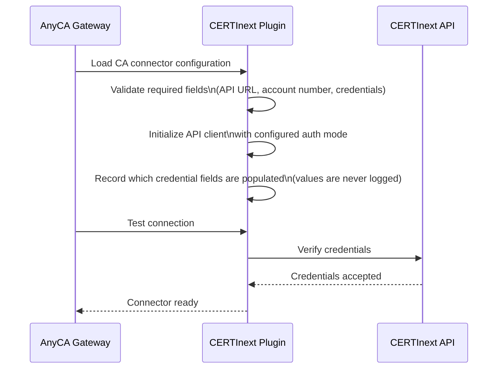
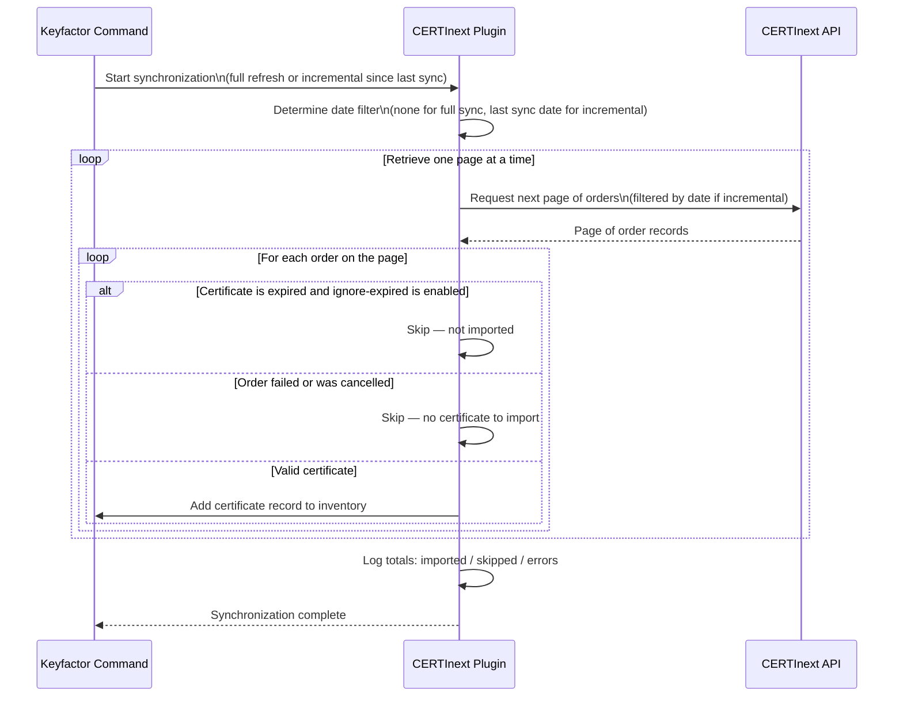
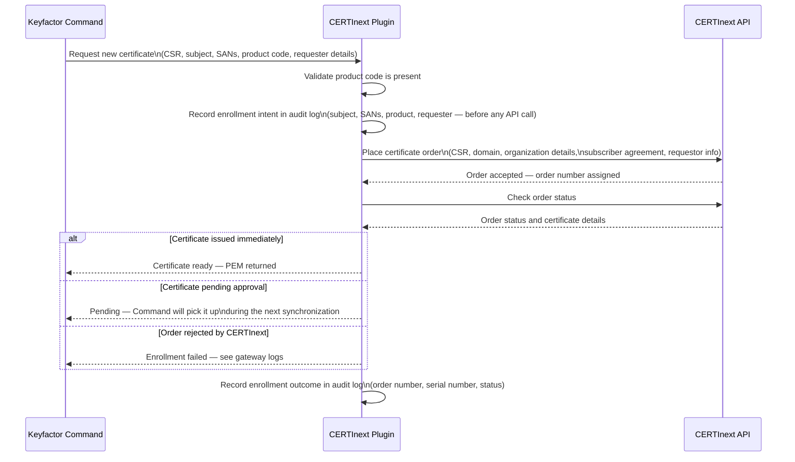
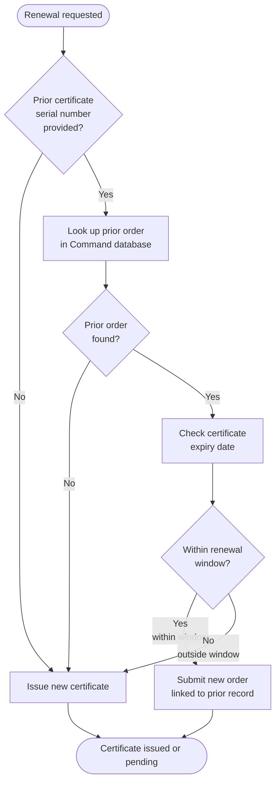
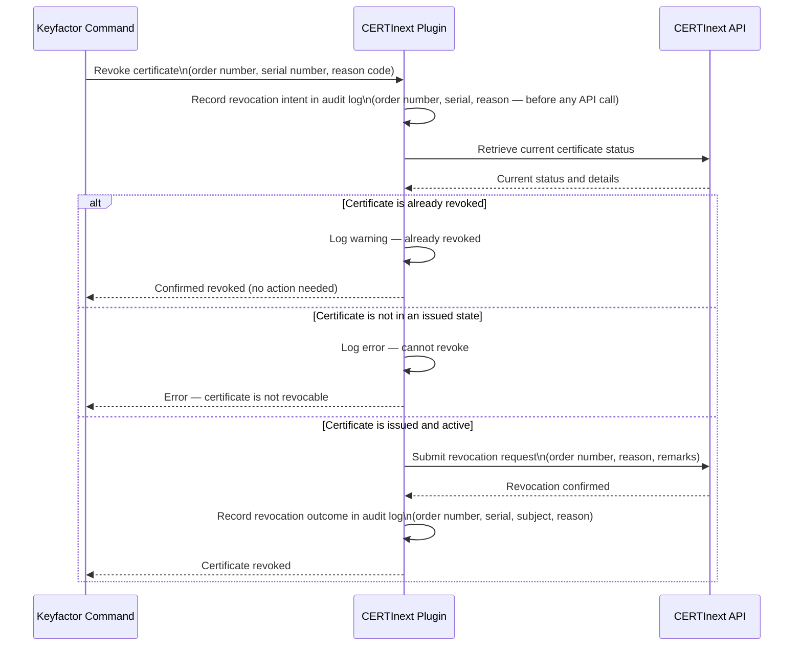
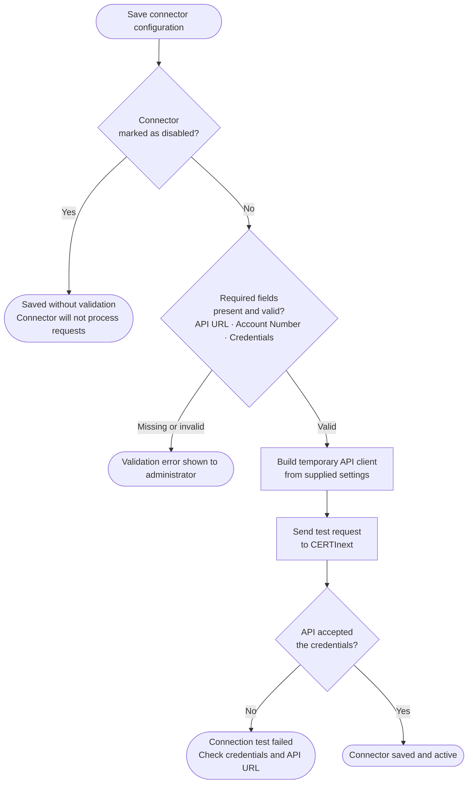

<h1 align="center" style="border-bottom: none">
    CERTInext AnyCA Gateway REST Plugin
</h1>

<p align="center">
  <!-- Badges -->

<a href="https://github.com/Keyfactor/certinext-caplugin/releases"></a>


</p>

<p align="center">
  <!-- TOC -->
  <a href="#support">
    <b>Support</b>
  </a>
  ·
  <a href="#requirements">
    <b>Requirements</b>
  </a>
  ·
  <a href="#installation">
    <b>Installation</b>
  </a>
  ·
  <a href="#license">
    <b>License</b>
  </a>
  ·
  <a href="https://github.com/orgs/Keyfactor/repositories?q=anycagateway">
    <b>Related Integrations</b>
  </a>
</p>

The CERTInext AnyCA Gateway REST plugin extends the certificate lifecycle capabilities of the CERTInext platform (by eMudhra) to Keyfactor Command via the Keyfactor AnyCA Gateway REST. The plugin represents a fully featured AnyCA REST plugin with the following capabilities:

* CA Synchronization:
    * Download all certificates issued through the CERTInext CA, either as a full inventory or incrementally since the last sync.
    * Expired certificates can optionally be excluded from synchronization using the `IgnoreExpired` configuration flag.
* Certificate Enrollment for profiles configured in CERTInext:
    * New certificate enrollment (new keys and certificate).
    * Certificate renewal — submits a new `GenerateOrderSSL` order when the prior certificate is within the configured renewal window (CERTInext has no dedicated renewal endpoint; the renewal-window check governs how Command tracks old→new, not which API is called).
    * Certificate reissuance (new keys with the same or updated subject/SANs) when outside the renewal window or no prior certificate is found.
* Certificate Revocation:
    * Request revocation of a previously issued certificate using any RFC 5280 CRL reason code.
* Supported authentication modes for calls to the CERTInext API:
    * AccessKey (HMAC-based request signing) — the primary and recommended mode
    * OAuth (bearer token via client credentials flow)

## Compatibility

The CERTInext AnyCA Gateway REST plugin is compatible with the Keyfactor AnyCA Gateway REST 25.5.0 and later.

## Support
The CERTInext AnyCA Gateway REST plugin is supported by Keyfactor for Keyfactor customers. If you have a support issue, please open a support ticket via the Keyfactor Support Portal at https://support.keyfactor.com.

> To report a problem or suggest a new feature, use the **[Issues](../../issues)** tab. If you want to contribute actual bug fixes or proposed enhancements, use the **[Pull requests](../../pulls)** tab.

## Requirements

* Keyfactor Command 25.5.x or later
* AnyCA Gateway REST framework version 25.5.0 or later
* A CERTInext account with API access enabled and at least one certificate product configured
* Network connectivity from the AnyCA Gateway host to the CERTInext API endpoint for your region (see table below)
* The AnyCA Gateway host must trust the TLS certificate presented by the CERTInext API endpoint

### CERTInext Environments

CERTInext operates three separate environments. Use the sandbox environment for initial integration testing. Switch to a production environment only after all functionality has been verified.

| Environment | Portal Sign-in URL | API Base URL |
|---|---|---|
| Sandbox | https://sandbox-us.certinext.io/ | `https://sandbox-us-api.certinext.io/emSignHub-API/` |
| Production — India (Global) | https://in.certinext.io/ | `https://api.certinext.io/emSignHub-API/` |
| Production — US | https://us.certinext.io/ | `https://us-api.certinext.io/emSignHub-API/` |

> Note: Product codes differ between sandbox and production. Always confirm product codes from the GetProductDetails API call against the environment you are targeting before going live.

## Installation

1. Install the AnyCA Gateway REST per the [official Keyfactor documentation](https://software.keyfactor.com/Guides/AnyCAGatewayREST/Content/AnyCAGatewayREST/InstallIntroduction.htm).

2. On the server hosting the AnyCA Gateway REST, download and unzip the latest [CERTInext AnyCA Gateway REST plugin](https://github.com/Keyfactor/certinext-caplugin/releases/latest) from GitHub.

3. Copy the unzipped directory (usually called `net8.0` or `net10.0`) to the Extensions directory:


    ```shell
    Depending on your AnyCA Gateway REST version, copy the unzipped directory to one of the following locations:
    Program Files\Keyfactor\AnyCA Gateway\AnyGatewayREST\net8.0\Extensions
    Program Files\Keyfactor\AnyCA Gateway\AnyGatewayREST\net10.0\Extensions
    ```

    > The directory containing the CERTInext AnyCA Gateway REST plugin DLLs (`net8.0` or `net10.0`) can be named anything, as long as it is unique within the `Extensions` directory.

4. Restart the AnyCA Gateway REST service.

5. Navigate to the AnyCA Gateway REST portal and verify that the Gateway recognizes the CERTInext plugin by hovering over the ⓘ symbol to the right of the Gateway on the top left of the portal.

## Configuration

1. Follow the [official AnyCA Gateway REST documentation](https://software.keyfactor.com/Guides/AnyCAGatewayREST/Content/AnyCAGatewayREST/AddCA-Gateway.htm) to define a new Certificate Authority, and use the notes below to configure the **Gateway Registration** and **CA Connection** tabs:

    * **Gateway Registration**

        Before enrolling certificates, the Keyfactor Command server must trust the CERTInext issuing CA chain.
        
        1. Log in to the CERTInext portal and download the root CA certificate and any intermediate CA certificates in the chain as PEM or DER files.
        2. On the Keyfactor Command server, import those certificates into the appropriate Windows certificate store — **Trusted Root Certification Authorities** for the root CA and **Intermediate Certification Authorities** for any subordinate CAs.
        3. In the Keyfactor Command Management Portal, navigate to **CA Connectors** and add a new CA using the **CERTInext AnyCA REST Gateway Plugin**.
        4. Complete the CA connector configuration fields described in the next section, then save and test the connection. The gateway performs a live connectivity test against the CERTInext `ValidateCredentials` endpoint during validation.

    * **CA Connection**

        Populate using the configuration fields collected in the [requirements](#requirements) section.

        * **ApiUrl** - REQUIRED: CERTInext API base URL. Sandbox (US): https://sandbox-us-api.certinext.io/emSignHub-API/ — Production (US): https://us-api.certinext.io/emSignHub-API/ — Production (Global/India): https://api.certinext.io/emSignHub-API/
        * **AccountNumber** - REQUIRED: Your CERTInext account number (numeric string). Available in the CERTInext portal.
        * **GroupNumber** - OPTIONAL: CERTInext group (delegation) number. When set, it is included in GetProductDetails requests AND in the `delegationInformation.groupNumber` field of every SSL order so the order is routed to the correct account group. Some accounts will queue orders for additional review when this field is omitted. Available in the CERTInext portal under Delegation → Groups.
        * **OrganizationNumber** - STRONGLY RECOMMENDED for OV/EV and faster DV issuance: numeric CERTInext organization number for a pre-vetted organization (e.g. your company's pre-vetted entry). When set, every SSL order is submitted with `organizationDetails.preVetting="1"` and the configured `organizationNumber`, telling CERTInext to skip the manual organization-vetting queue. Without this value, orders are placed without any organizationDetails block and CERTInext may park them in `Pending System RA` for extended manual review (observed: tens of hours). Available in the CERTInext portal under Organizations → Pre-vetted Organizations.
        * **TechnicalContactName** - OPTIONAL: Name sent in the `technicalPointOfContact.tpcName` field of every SSL order. Defaults to the configured RequestorName when blank. Some product configurations require a TPoC to be present; omitting it can cause CERTInext to park orders awaiting manual completion of the field.
        * **TechnicalContactEmail** - OPTIONAL: Email sent in the `technicalPointOfContact.tpcEmail` field of every SSL order. Defaults to the configured RequestorEmail when blank.
        * **TechnicalContactIsdCode** - OPTIONAL: International dialing code for the TPoC phone number. Defaults to the configured RequestorIsdCode when blank.
        * **TechnicalContactMobileNumber** - OPTIONAL: Mobile number for the TPoC (digits only). Defaults to the configured RequestorMobileNumber when blank.
        * **AuthMode** - REQUIRED: Authentication mode. 'AccessKey' (default) — uses authKey = SHA256(accessKey + ts + txn) in every request body. 'OAuth' — uses an OAuth2 bearer token (requires OAuthTokenUrl, OAuthClientId, OAuthClientSecret).
        * **ApiKey** - REQUIRED when AuthMode is 'AccessKey': the REST API Access Key generated in the CERTInext portal under Integrations → APIs. This value is used to compute authKey = SHA256(accessKey + ts + txn); it is never transmitted directly.
        * **OAuthTokenUrl** - OAuth token endpoint URL. Required when AuthMode is 'OAuth'.
        * **OAuthClientId** - OAuth client ID. Required when AuthMode is 'OAuth'.
        * **OAuthClientSecret** - OAuth client secret. Required when AuthMode is 'OAuth'.
        * **RequestorName** - REQUIRED: Default requestor name submitted with all certificate orders. This is the name of the person/service responsible for the certificates.
        * **RequestorEmail** - REQUIRED: Default requestor email submitted with all certificate orders. Must be a valid email address registered in your CERTInext account.
        * **RequestorIsdCode** - International dialing code for the requestor phone number (e.g. '1' for US). Default: '1'.
        * **RequestorMobileNumber** - Requestor mobile number (digits only, no country code).
        * **SignerPlace** - City or location of the subscriber agreement signer. Required by CERTInext for all orders.
        * **SignerIp** - IP address of the subscriber agreement signer. Required by CERTInext for all orders.
        * **DefaultProductCode** - OPTIONAL: Default numeric product code used when not specified at template level. Product codes are provided by eMudhra (e.g. the SSL DV 1-year code for your account). Retrieve available codes from Integrations → APIs → GetProductDetails.
        * **AccountingModel** - OPTIONAL: CERTInext billing model sent in `orderDetails.accountingModel`. "2" = credit-based (most accounts, default). "1" = cash model.
        * **EmailNotifications** - OPTIONAL: Whether CERTInext sends lifecycle-event emails to the requestor. "1" = enabled, "0" = silent (recommended for gateway-driven orders so end users aren't surprised by CA emails). Default: "0".
        * **SubscriptionValidityYears** - OPTIONAL: Default validity in years for SSL orders. "1", "2", or "3". Override per template via the ValidityYears product parameter. Default: "1".
        * **SubscriptionAutoRenew** - OPTIONAL: Whether CERTInext should auto-renew certificates issued through this connector. "0" = disabled (recommended — renewal is driven by Keyfactor Command), "1" = enabled. Default: "0".
        * **SubscriptionRenewCriteriaDays** - OPTIONAL: Days before expiry at which CERTInext auto-renews (only honored when SubscriptionAutoRenew = "1"). Typical values: "30" or "60". Default: "30".
        * **AutoSecureWww** - OPTIONAL: If "1", CERTInext automatically adds the `www.` variant of the primary domain as an additional SAN. "0" = use only the CN/SANs supplied with the CSR. Default: "0".
        * **IgnoreExpired** - If true, expired certificates will be skipped during synchronization. Default: false.
        * **PageSize** - Number of orders to fetch per page during synchronization. Default: 100, max: 500.
        * **Enabled** - Enables or disables the CA connector. Set to false to create the connector record before credentials are available. Default: true.
        * **DcvEnabled** - OPTIONAL: When true, the gateway will perform DNS-based Domain Control Validation (DCV) during enrollment for orders that require it, using the configured DNS provider plugin. Requires a DNS provider plugin (e.g. azure-azuredns-dnsplugin) to be deployed on the gateway. Default: false.
        * **DcvTxtRecordTemplate** - OPTIONAL: Format string for the DNS TXT record hostname used during DCV. {0} is replaced with the domain name being validated. Default: _emsign-validation.{0}
        * **DcvPropagationDelaySeconds** - OPTIONAL: Seconds to wait after publishing the DNS TXT record before asking CERTInext to verify it. Increase for zones with slow propagation. Default: 30.
        * **DcvTimeoutMinutes** - OPTIONAL: Maximum minutes to wait for the entire DCV flow (DNS publish + propagation + verify) before timing out the enrollment. Can also be set via the CERTINEXT_DCV_TIMEOUT_MINUTES environment variable; the env var takes precedence when both are set. Default: 10.
        * **DcvWaitForChallengeSeconds** - OPTIONAL: How long (seconds) the plugin will wait inside Enroll() for CERTInext to expose the DCV challenge (i.e. populate `domainVerification` in TrackOrder). Under concurrent load CERTInext sometimes takes a few seconds after GenerateOrderSSL before the slot appears. Without this wait, the plugin's initial TrackOrder check sees null and skips DCV — the order then has to wait for the next gateway sync cycle to be picked up. Setting to 0 disables the wait (single-check behaviour). Can also be set via the CERTINEXT_DCV_WAIT_FOR_CHALLENGE_SECONDS environment variable; the env var takes precedence when both are set. Default: 60.
        * **DcvWaitForIssuanceSeconds** - OPTIONAL: How long (seconds) the plugin will wait inside Enroll() after DCV verifies for CERTInext to finish generating the certificate. CERTInext issuance is async — DCV may be verified but the cert PEM isn't yet available for download. Without this wait, Enroll() returns a pending result and the issued cert is picked up by the next sync cycle. Setting to 0 disables the wait (single-fetch behaviour). Can also be set via the CERTINEXT_DCV_WAIT_FOR_ISSUANCE_SECONDS environment variable; the env var takes precedence when both are set. Default: 60.
        * **DcvSyncMaxOrderAgeHours** - OPTIONAL: During synchronization, only pending DV orders younger than this many hours are eligible to be driven through DCV. This keeps a sync pass fast when there is a large backlog of old, never-completing pending orders (e.g. abandoned orders or domains outside the configured DNS provider's zone): they age out and are simply reported as pending rather than retried every pass. Recently-placed orders (the ones that legitimately deferred DCV) are always within the window and complete via the normal scan cadence. Set to 0 to disable the age filter (attempt DCV for all pending). Default: 24.
        * **DcvSyncMaxPerPass** - OPTIONAL: Maximum number of pending DV orders the plugin will attempt to drive through DCV in a single synchronization pass. Bounds the per-pass cost regardless of backlog size; remaining pending orders are reported as-is and picked up on a later pass (the per-minute incremental scan keeps recent orders moving). Set to 0 to disable the cap. Default: 50.

2. A Keyfactor Command certificate template maps an enrollment request to a specific CERTInext product. Create one template per CERTInext product that you want to make available to requesters.

In the Keyfactor Command Management Portal, navigate to **Certificate Templates** and create a new template associated with the CERTInext CA connector. The following enrollment parameters are available:

| Parameter | Required / Optional | Type | Description | Example / Default |
|---|---|---|---|---|
| `ProductCode` | Optional | String | Override the numeric CERTInext product code for this template. Product codes are provisioned per account by eMudhra — obtain the correct code from `GetProductDetails` for your account. Set this explicitly when targeting the sandbox environment or when the connector `DefaultProductCode` should not apply to this template. See the [Product Codes](#product-codes) section for the sandbox/production lookup table. | DV SSL: `842` (sandbox) or `838` (production) |
| `ProfileId` | Deprecated | String | Legacy alias for `ProductCode`. Accepted for backward compatibility — if `ProductCode` is not set, `ProfileId` is used in its place. New templates should use `ProductCode`. | `838` |
| `ValidityYears` | Optional | Number | Subscription validity period in years: `1`, `2`, or `3`. Default: `1`. CERTInext certificates are issued within a subscription term at up to 390 days per certificate, with free renewals within the term. | `1` |
| `ValidityDays` | Deprecated | Number | Legacy validity field. If set, the value is divided by 365 and rounded up to derive a year count. New templates should use `ValidityYears`. | `365` |
| `AutoApprove` | Optional | Boolean | If `true`, the gateway will attempt automatic approval of certificates returned in a pending-approval state. Only set this if your CERTInext product is configured with automatic approval. Default: `false`. | `false` |
| `RequesterName` | Optional | String | Per-template override for the requestor name. When set, overrides the connector-level `RequestorName` for orders using this template. | `Keyfactor Automation` |
| `RequesterEmail` | Optional | String | Per-template override for the requestor email address. When set, overrides the connector-level `RequestorEmail` for orders using this template. | `pki-admin@example.com` |
| `RenewalWindowDays` | Optional | Number | Number of days before certificate expiration within which a renewal is attempted instead of a reissue. Default: `90`. | `90` |
| `KeyType` | Optional | String | Key algorithm to request at enrollment time. The key type is carried by the submitted CSR. CERTInext accepts **RSA 2048 / 3072 / 4096 and ECC P-256 / P-384** only — larger RSA, ECC P-521, and the Ed25519/Ed448 curves are rejected by the CA (`Invalid key size`). If omitted, the product default is used. | `RSA2048`, `RSA3072`, `RSA4096`, `EC256`, `EC384` |
| `DomainName` | Optional | String | Primary domain name for SSL/TLS orders. If omitted, the gateway derives the domain from the CSR `CN` field. | `example.com` |
| `SignerName` | Optional | String | Per-template override for the subscriber agreement signer name. When omitted, defaults to the connector-level `RequestorName`. | `Jane Smith` |
| `SignerPlace` | Optional | String | Per-template override for the subscriber agreement signer location. When omitted, defaults to the connector-level `SignerPlace`. | `Austin` |
| `SignerIp` | Optional | String | Per-template override for the subscriber agreement signer IP address. When omitted, defaults to the connector-level `SignerIp`. | `203.0.113.10` |

3. Follow the [official Keyfactor documentation](https://software.keyfactor.com/Guides/AnyCAGatewayREST/Content/AnyCAGatewayREST/AddCA-Keyfactor.htm) to add each defined Certificate Authority to Keyfactor Command and import the newly defined Certificate Templates.

4. In Keyfactor Command (v12.3+), for each imported Certificate Template, follow the [official documentation](https://software.keyfactor.com/Core-OnPrem/Current/Content/ReferenceGuide/Configuring%20Template%20Options.htm) to define enrollment fields for each of the following parameters:

    * **ProductCode** - OPTIONAL: Override the numeric CERTInext product code for this template. When omitted, the default production code for the selected product is used automatically (e.g. DV SSL → 838). Set this explicitly when targeting sandbox or a non-standard code.
    * **ProfileId** - DEPRECATED: Use ProductCode instead. Kept for backward compatibility — mapped to ProductCode if ProductCode is not set.
    * **ValidityYears** - OPTIONAL: Subscription validity in years: 1, 2, or 3. Default: 1. Note: CERTInext validates per 390-day certificate within the subscription; the 'validity' field in the order is the subscription term, not certificate lifetime.
    * **ValidityDays** - DEPRECATED: Use ValidityYears instead. If set, value is divided by 365 and rounded up to get the subscription year count.
    * **AutoApprove** - OPTIONAL: If true, the gateway will attempt automatic approval of certificates that are returned in a pending-approval state. Default: false.
    * **RequesterName** - OPTIONAL: Default requester name to include in the enrollment request. Used when no requester name can be derived from the subject.
    * **RequesterEmail** - OPTIONAL: Default requester email address. Used when no email can be derived from the subject.
    * **RenewalWindowDays** - OPTIONAL: Number of days before certificate expiration within which a renewal is triggered. Certificates expiring further than this window are reissued instead. Certificates that have already expired also fall back to reissue. Default: 90.
    * **KeyType** - OPTIONAL: Key algorithm to request (e.g. 'RSA2048', 'RSA4096', 'EC256', 'EC384'). If omitted, the profile default is used.
    * **DomainName** - OPTIONAL: Primary domain for SSL/TLS orders. Derived from the CSR CN if omitted.
    * **SignerName** - OPTIONAL: Per-template subscriber agreement signer name. Falls back to the connector-level RequestorName if omitted.
    * **SignerPlace** - OPTIONAL: Per-template signer city/location. Falls back to the connector-level SignerPlace if omitted.
    * **SignerIp** - OPTIONAL: Per-template signer IP address. Falls back to the connector-level SignerIp if omitted.

## CERTInext API Setup

### AccessKey (HMAC) — the primary auth mode

The CERTInext REST API uses HMAC-style request signing. Every API call includes a computed `authKey` field in the request body. The access key itself is never transmitted — only the derived hash is sent.

The `authKey` is computed as:

```
authKey = SHA256(accessKey + requestTs + requestTxnId)
```

Where `requestTs` is the ISO 8601 timestamp of the request and `requestTxnId` is the unique transaction ID generated per request. The gateway performs this computation automatically on every outbound API call.

**Steps to generate an Access Key:**

1. Log in to the CERTInext portal for your environment (e.g. https://in.certinext.io).
2. Navigate to **Integrations → APIs**.
3. Click **+ Create API Credentials** at the top right of the page.
4. In the dialog, fill in the following fields:
    - **API Type**: Select `REST`.
    - **Description**: Enter a descriptive label, such as `keyfactor-gateway`.
    - **User**: Select the CERTInext user account this credential will be associated with.
    - **Auth Type**: Select `Access Key`.
5. Click **Generate**.
6. In the confirmation dialog, copy the displayed Access Key immediately. This is the only time the key is shown in plaintext.
7. Confirm that the new credential row appears in the APIs list with status **Active** before proceeding.

Enter the copied value in the `ApiKey` field of the CA connector configuration. The field is masked in the Keyfactor Command UI and stored in Command's encrypted gateway configuration.

### OAuth — alternative auth mode

If your CERTInext account has OAuth enabled, you can use OAuth client credentials as an alternative to AccessKey signing.

1. Log in to the CERTInext portal.
2. Navigate to **Integrations → APIs**.
3. Click **+ Create API Credentials**.
4. Set **API Type** to `REST` and **Auth Type** to `OAuth`.
5. Complete the form and click **Generate**.
6. Note the **Client ID** and **Client Secret**. Enter them in the `OAuthClientId` and `OAuthClientSecret` fields respectively.
7. Confirm the OAuth token endpoint URL with eMudhra and enter it in the `OAuthTokenUrl` field.
8. Set the `AuthMode` connector field to `OAuth`.

> Note: Credentials are stored in Keyfactor Command's encrypted gateway configuration and are never written to disk by the plugin.

## CA Configuration

The following fields are presented in the Keyfactor Command Management Portal when creating or editing the CERTInext CA connector. All fields marked **Required** must be provided before the connector can be saved in an enabled state.

| Field | Required / Optional | Description | Where to find it | Example |
|---|---|---|---|---|
| `ApiUrl` | Required | CERTInext API base URL for your environment. Must include the `/emSignHub-API/` path segment. No trailing slash is required but is accepted. | See the environments table above. | `https://api.certinext.io/emSignHub-API/` |
| `AccountNumber` | Required | Your CERTInext account number (numeric string). Included in the `meta` block of every API request. | Portal → click your name or avatar → **Account Settings** or **My Profile**. | `1234567890` |
| `AuthMode` | Required | Authentication mode. `AccessKey` uses HMAC signing (recommended). `OAuth` uses a bearer token. | N/A — choose based on the credential type you created. | `AccessKey` |
| `ApiKey` | Conditional | The REST API Access Key generated in the CERTInext portal. Used to compute `authKey = SHA256(accessKey + ts + txn)`. The raw key is never transmitted. Required when `AuthMode` is `AccessKey`. This field is masked in the UI. | Portal → **Integrations → APIs** → generate or view the credential row. | *(generated, masked in UI)* |
| `OAuthTokenUrl` | Conditional | OAuth token endpoint URL. Required when `AuthMode` is `OAuth`. | Provided by eMudhra for your account. | `https://auth.certinext.io/oauth/token` |
| `OAuthClientId` | Conditional | OAuth client ID. Required when `AuthMode` is `OAuth`. | Portal → **Integrations → APIs** → the OAuth credential row. | `keyfactor-gateway` |
| `OAuthClientSecret` | Conditional | OAuth client secret. Required when `AuthMode` is `OAuth`. This field is masked in the UI. | Generated at OAuth credential creation time. | *(generated, masked in UI)* |
| `RequestorName` | Required | Default name of the person or service submitting certificate orders. Sent in the `requestorInformation` block of every order request. | Use the name of the team or automation account responsible for these certificates. | `PKI Automation` |
| `RequestorEmail` | Required | Default email address for the requestor. Must be a valid email address associated with your CERTInext account. Sent in the `requestorInformation` block of every order request. | Use a monitored team inbox or the account holder's email. | `pki-admin@example.com` |
| `RequestorIsdCode` | Optional | International dialing code for the requestor phone number (digits only, no `+` prefix). Default: `1` (United States). | N/A — use the country code for your requestor. | `1` |
| `RequestorMobileNumber` | Optional | Requestor mobile number (digits only, no country code). Included in the `requestorInformation` block. | N/A | `5551234567` |
| `SignerPlace` | Required | City or location of the person accepting the subscriber agreement on behalf of your organization. Required by CERTInext for all orders. | Use the physical city where the signer is located. | `Austin` |
| `SignerIp` | Required | Public IP address of the host accepting the subscriber agreement. Required by CERTInext for all orders. | Use the outbound IP of the AnyCA Gateway host, or the IP of the workstation from which the agreement was accepted. | `203.0.113.10` |
| `GroupNumber` | Optional | CERTInext group (delegation) number. When set, it is passed in the `productDetails.groupNumber` field of `GetProductDetails` requests. Some sandbox accounts return an empty product list from `GetProductDetails` unless this field is included. Available in the CERTInext portal under **Delegation → Groups**. | Portal → **Delegation → Groups**. | `2345678901` |
| `DefaultProductCode` | Optional | Default numeric product code to use when no product code is set on the certificate template. If omitted and the template also has no product code, enrollment will fail. Product codes are provisioned per account by eMudhra — contact your eMudhra account representative to obtain the numeric codes available to your account. | Call `GetProductDetails` against your account/environment (see product code table below). | `842` |
| `IgnoreExpired` | Optional | If `true`, expired certificates are skipped during synchronization and are not imported into Keyfactor Command. Default: `false`. | N/A | `false` |
| `PageSize` | Optional | Number of orders to retrieve per page during synchronization. Default: `100`. Maximum: `500`. Reduce this value if synchronization requests time out. | N/A | `100` |
| `Enabled` | Optional | Enables or disables the CA connector. Setting this to `false` allows the connector record to be created before all credentials are available, without triggering a live connectivity test. Default: `true`. | N/A | `true` |
| `DcvEnabled` | Optional | When `true`, the gateway performs DNS-based Domain Control Validation (DCV) during enrollment for orders that require it. Requires a DNS provider plugin (e.g. `azure-azuredns-dnsplugin`) to be deployed on the gateway. Default: `false`. | N/A | `false` |
| `DcvTxtRecordTemplate` | Optional | Format string for the DNS TXT record hostname published during DCV. `{0}` is replaced with the domain being validated. Default: `_emsign-validation.{0}`. | N/A | `_emsign-validation.{0}` |
| `DcvPropagationDelaySeconds` | Optional | Seconds to wait after publishing the DNS TXT record before asking CERTInext to verify it. Increase for zones with slow propagation. Default: `30`. | N/A | `30` |
| `DcvTimeoutMinutes` | Optional | Maximum minutes to wait for the entire DCV flow (DNS publish + propagation + verify) before cancelling the enrollment. Can also be set via the `CERTINEXT_DCV_TIMEOUT_MINUTES` environment variable; the environment variable takes precedence when both are set. Default: `10`. | N/A | `10` |

> Note: `AccountNumber` and group-level identifiers are distinct values. The `AccountNumber` is your top-level user account identifier. CERTInext groups (cost centers or departments) each have their own `groupNumber`, which is passed per-order and is separate from any organization number displayed on the Organizations page.

> Note: Only the credential fields that correspond to the selected `AuthMode` are evaluated at runtime. Fields belonging to the other auth mode are ignored.

## Product Codes

CERTInext uses numeric product codes to identify certificate types. **Product codes are provisioned per account by eMudhra** — the codes available to your account are determined when your account is set up. The codes in the tables below are the values observed on specific sandbox and production accounts; your account may have different codes.

To retrieve the exact codes available to your account, call the `GetProductDetails` endpoint:
- If you have a `GroupNumber` configured, include it in the request `productDetails` block — some accounts require this to return a non-empty list.
- Use the `make get-product-details-group` Makefile target to retrieve products from the sandbox with `groupNumber` included.

> Note: Product codes differ between the sandbox and production environments. Always verify the correct code before switching environments.

> Note: Product codes are per-account. If you receive "Invalid Product Code" (EMS-1162) when placing an order, your account does not have that product provisioned. Contact your eMudhra account representative to request provisioning of the product codes you need.

### SSL/TLS

The product codes in this table were observed on:
- the US sandbox environment (`sandbox-us-api.certinext.io`) in April–May 2026
- the Production India environment (`api.certinext.io`) via the live draft-order coverage matrix in [development.md](development.md)

**Your account may still have different codes.** Always call `GetProductDetails` against your target environment before going live.

| Product | Sandbox Code | Production Code | Required fields beyond base (`domainName`, `csr`, `requestorInformation`, `subscriptionDetails`, `agreementDetails`) |
|---|---|---|---|
| DV (Domain Validated) | `842` | `838` | None. `domainName` is derived from the CSR CN if omitted on the template. |
| DV Wildcard | `843` | `839` | CSR CN must use wildcard format (e.g. `*.example.com`). `domainName` in the order must also use the wildcard format. |
| DV UCC (Multi-domain) | `844` | `840` | `certificateInformation.additionalDomains` — array of additional SAN values beyond the primary `domainName`. |
| DV Wildcard UCC (Multi-domain Wildcard) | `845` | `841` | Combines wildcard and multi-domain requirements. CSR CN and `domainName` must use wildcard format; `certificateInformation.additionalDomains` required. |
| OV (Organization Validated) | `846` | `842` | `organizationDetails.organizationNumber` (your CERTInext org ID); `certificateInformation.locality`, `postalCode`, and full organization address fields (`streetAddress`, `city`, `state`, `country`). |
| OV Wildcard | `847` | `843` | Same as OV. CSR CN and `domainName` must use wildcard format. |
| OV UCC (Multi-domain) | `848` | `844` | Same as OV plus `certificateInformation.additionalDomains`. |
| OV Wildcard UCC (Multi-domain Wildcard) | `849` | `845` | Combines OV, wildcard, and multi-domain requirements. Same as OV plus wildcard CN/domainName and `certificateInformation.additionalDomains`. |
| EV (Extended Validation) | `850` | `846` | All OV fields plus: `contractSignerInfo` object (`name`, `email`, `isdCode`, `mobileNumber`, `designation`, `employeeID`); `certificateApproverInfo` object (same fields); `certificateInformation.companyRegistrationNumber`; `streetAddress2` must be non-empty. |
| EV UCC (Multi-domain EV) | `851` | `847` | Same as EV plus `certificateInformation.additionalDomains`. |

> Note: SSL/TLS codes appear to be offset by 4 between the US sandbox and Production India in the snapshots we've observed — but treat that as a coincidence, not a guarantee. eMudhra controls the per-account mapping and may use different numeric codes for any new account. Always confirm via `GetProductDetails`.

> Note: The CERTInext portal may display additional short-validity products (e.g. **DV SSL Certificate 1 Month**, **DV SSL Certificate Wildcard 1 Month**) that do not appear in the `GetProductDetails` API response and have no published product code. These products are not accessible via the API and are therefore **not supported by this plugin**. Contact eMudhra to determine whether API ordering is available for these products on your account.

### Private PKI

| Product | Sandbox Code | Production Code | Availability |
|---|---|---|---|
| emSign Intranet SSL 1 year | `149` | `100` | Requires special provisioning by eMudhra. Not orderable on standard accounts. |
| IGTF Host 1 year | (not observed) | `104` | Requires special provisioning by eMudhra. Not orderable on standard accounts. |

> Note: Private PKI products are not available for ordering on standard CERTInext accounts. Attempting to place an order will return EMS-1162 (product not provisioned). The sandbox Private PKI code (`149`) also returns EMS-1162 on standard sandbox accounts even though it appears in the `GetProductDetails` list. Contact eMudhra to have these products enabled on your account.

### S/MIME and Document Signing

The same numeric product codes have been observed for S/MIME and document-signing products on both the US sandbox and Production India in the snapshots we have. **Treat that as an empirical observation, not a contract** — eMudhra is free to assign different codes per account. Always confirm via `GetProductDetails`.

| Product | Sandbox / Production Code | Availability |
|---|---|---|
| S/MIME | `894` | Requires a separate S/MIME entitlement on the account. Not available on standard SSL accounts. |
| Natural Person Doc Signer (tier 1) | `825` | Requires document signing entitlement. Not orderable on standard accounts. |
| Natural Person Doc Signer (tier 2) | `826` | Requires document signing entitlement. Not orderable on standard accounts. |
| Natural Person Doc Signer (tier 3) | `827` | Requires document signing entitlement. Not orderable on standard accounts. |
| Legal Person Doc Signer (tier 1) | `822` | Requires document signing entitlement. Not orderable on standard accounts. |
| Legal Person Doc Signer (tier 2) | `823` | Requires document signing entitlement. Not orderable on standard accounts. |
| Legal Person Doc Signer (tier 3) | `824` | Requires document signing entitlement. Not orderable on standard accounts. |
| Legal Entity Doc Signer (tier 1) | `819` | Requires document signing entitlement. Not orderable on standard accounts. |
| Legal Entity Doc Signer (tier 2) | `820` | Requires document signing entitlement. Not orderable on standard accounts. |
| Legal Entity Doc Signer (tier 3) | `821` | Requires document signing entitlement. Not orderable on standard accounts. |

> Note: S/MIME (894) and document signing products (819–827) require a separate entitlement that is not included in a standard SSL/TLS account. Contact eMudhra to request access.

To retrieve the full list of product codes available to your account, call the `GetProductDetails` endpoint against your target environment. The sandbox and production APIs each return their own set of codes.

> Note: SSL/TLS products are supported on standard accounts — see the SSL/TLS table above for the exact sandbox/production code pair for each product. Private PKI (Production `100`, `104` / Sandbox `149`), S/MIME (`894`), and document-signing products (`819`–`827`) require special provisioning by eMudhra and are not available on standard SSL/TLS accounts — ordering them returns EMS-1162.

## Architecture

This document describes how the CERTInext AnyCA Gateway REST plugin integrates with Keyfactor Command and the CERTInext certificate authority. It covers the three primary certificate lifecycle operations — synchronization, enrollment, and revocation — and how the plugin routes each through the CERTInext API.

## Component Overview

```
┌─────────────────────────────────────────────────────────┐
│                  Keyfactor Command                       │
│                                                         │
│   Certificate Enrollment  ·  Revocation  ·  Sync Jobs   │
└────────────────────────────┬────────────────────────────┘
                             │
                    AnyCA Gateway REST
                    (plugin host process)
                             │
┌────────────────────────────▼────────────────────────────┐
│            CERTInext AnyCA Gateway Plugin                │
│                                                         │
│   Translates Keyfactor operations into CERTInext API    │
│   calls, maps responses back to Command's data model,   │
│   and enforces audit logging on every operation.        │
└────────────────────────────┬────────────────────────────┘
                             │  HTTPS · HMAC-signed requests
                             │
┌────────────────────────────▼────────────────────────────┐
│               CERTInext REST API (eMudhra)               │
│                                                         │
│   ValidateCredentials   GenerateOrderSSL   TrackOrder   │
│   GetCertificate   RevokeOrder   GetOrderReport         │
│   GetProductDetails   SubmitCSR                         │
└─────────────────────────────────────────────────────────┘
```

## Request Authentication

Every API call is signed using HMAC-SHA256. The access key itself is never transmitted — only a derived hash is sent:

```
authKey = SHA256(accessKey + requestTs + requestTxnId)
```

A unique transaction ID (`requestTxnId`) is generated for each request. The timestamp (`requestTs`) and transaction ID travel alongside the `authKey` so the CERTInext server can reproduce and verify the hash. The plugin handles this automatically; no manual signing is required during normal operation.

An OAuth client-credentials mode is also available as an alternative. When OAuth is configured, the plugin exchanges a client ID and secret for a short-lived bearer token and automatically refreshes it before expiry.

## Certificate Identifiers

CERTInext assigns two different reference numbers to each order. Understanding the difference matters when tracing certificates across systems:

| Identifier | When it is assigned | What it is used for |
|---|---|---|
| **Request Number** | Immediately when an order is created | Tracking a draft order before it is formally submitted; attaching a CSR to a pending order |
| **Order Number** | After the order is formally submitted and accepted | All post-issuance operations: checking status, downloading the certificate, revoking — **this is the identifier stored in Keyfactor Command** |

---

## Gateway Startup

When the AnyCA Gateway process starts, it loads each configured CA connector. For CERTInext, this step reads the connector settings, establishes the API client, and confirms that the credentials are structurally valid.



---

## Synchronization

Keyfactor Command periodically synchronizes its certificate inventory with CERTInext. The plugin retrieves all orders page by page and feeds them into Command's database. Synchronization can be a full refresh or incremental (only orders placed since the last successful sync).



**Full vs. incremental sync:** A full sync imports every order in the account regardless of age. An incremental sync requests only orders placed after the previous sync timestamp, which is faster for accounts with large order histories.

**Expired certificates:** The `IgnoreExpired` connector setting controls whether expired certificates are included in synchronization. When enabled, expired certificates are silently skipped and will not appear in the Keyfactor Command inventory.

---

## Certificate Enrollment

When a requester submits a certificate request through Keyfactor Command, the plugin translates the request into a CERTInext order and returns the result. The plugin handles three enrollment scenarios: new issuance, renewal (within a configured window before expiry), and reissuance (new keys, same profile).

### New Certificate or Reissuance



### Renewal

When Command initiates a renewal, the plugin checks whether the existing certificate is within the configured renewal window. If it is, the prior order record is used as context for the new request. If it is outside the window (or the prior certificate cannot be located), the plugin falls back to issuing a new certificate.

> **Note:** CERTInext does not have a dedicated certificate renewal endpoint. Both renewal and reissuance paths submit a new `GenerateOrderSSL` order. The distinction affects how Keyfactor Command tracks the certificate record, not what is sent to CERTInext.



---

## Revocation

When a certificate is revoked in Keyfactor Command, the plugin verifies the certificate's current state before calling the CERTInext revocation endpoint. This prevents unnecessary API calls for certificates that are already revoked or in a non-revocable state.



**Idempotency:** If Command retries a revocation request (for example, after a timeout), the plugin detects that the certificate is already revoked and returns success without submitting a duplicate request to CERTInext.

**Audit trail:** The revocation intent is written to the gateway log *before* the API call is made. This ensures that the intent is captured even if the API call subsequently fails, satisfying SOX audit requirements.

---

## Connector Validation

When an administrator saves or edits a CERTInext CA connector in the Keyfactor Command Management Portal, the gateway validates the configuration and performs a live connectivity check.



**Disabled connectors:** Setting `Enabled` to `false` allows the connector record to be created and saved before credentials are available. The live connectivity test is skipped, so no credentials are required at save time.

---

## API Endpoint Reference

The table below maps each Keyfactor Command operation to the CERTInext API endpoint it calls.

| Operation | CERTInext API endpoint |
|---|---|
| Test connection / verify credentials | `POST ValidateCredentials` |
| Issue new certificate | `POST GenerateOrderSSL` then `POST TrackOrder` |
| Renew certificate | `POST GenerateOrderSSL` then `POST TrackOrder` |
| Check certificate status | `POST TrackOrder` + `POST GetCertificate` |
| Revoke certificate | `POST RevokeOrder` |
| Synchronize inventory | `POST GetOrderReport` (paginated) |
| List available product codes | `POST GetProductDetails` |
| Attach CSR to draft order | `POST SubmitCSR` |

## License

Apache License 2.0, see [LICENSE](LICENSE).

## Related Integrations

See all [Keyfactor Any CA Gateways (REST)](https://github.com/orgs/Keyfactor/repositories?q=anycagateway).
