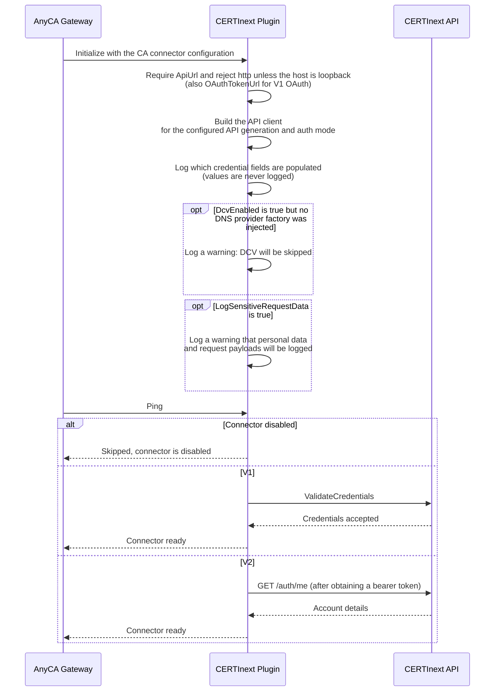
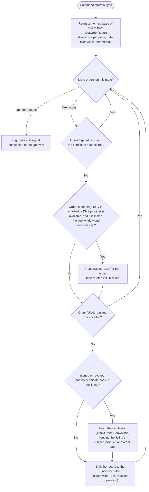
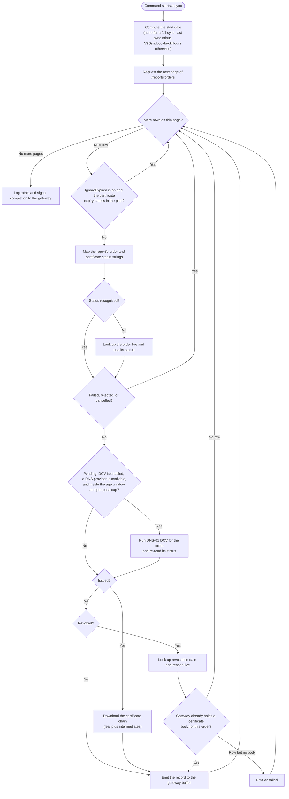
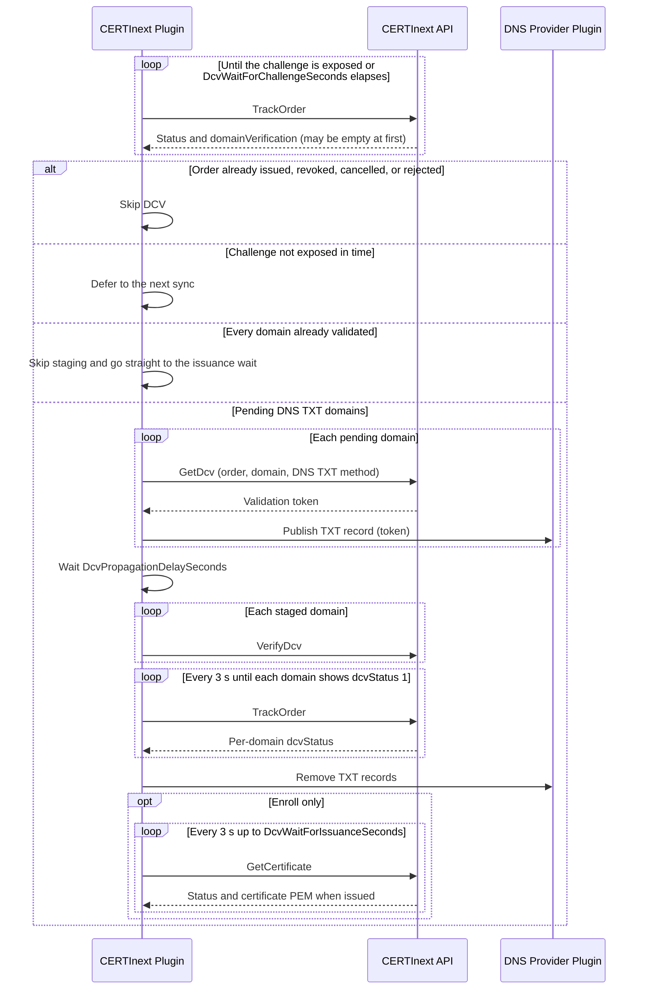
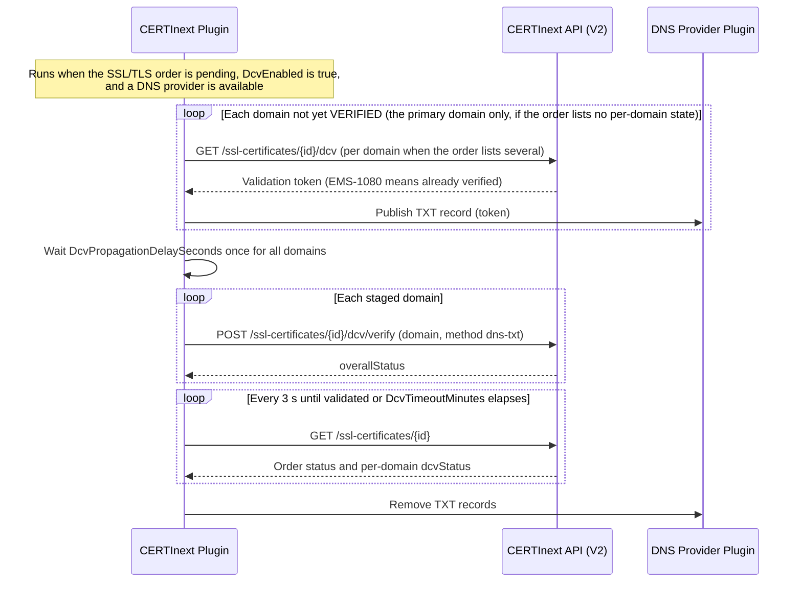
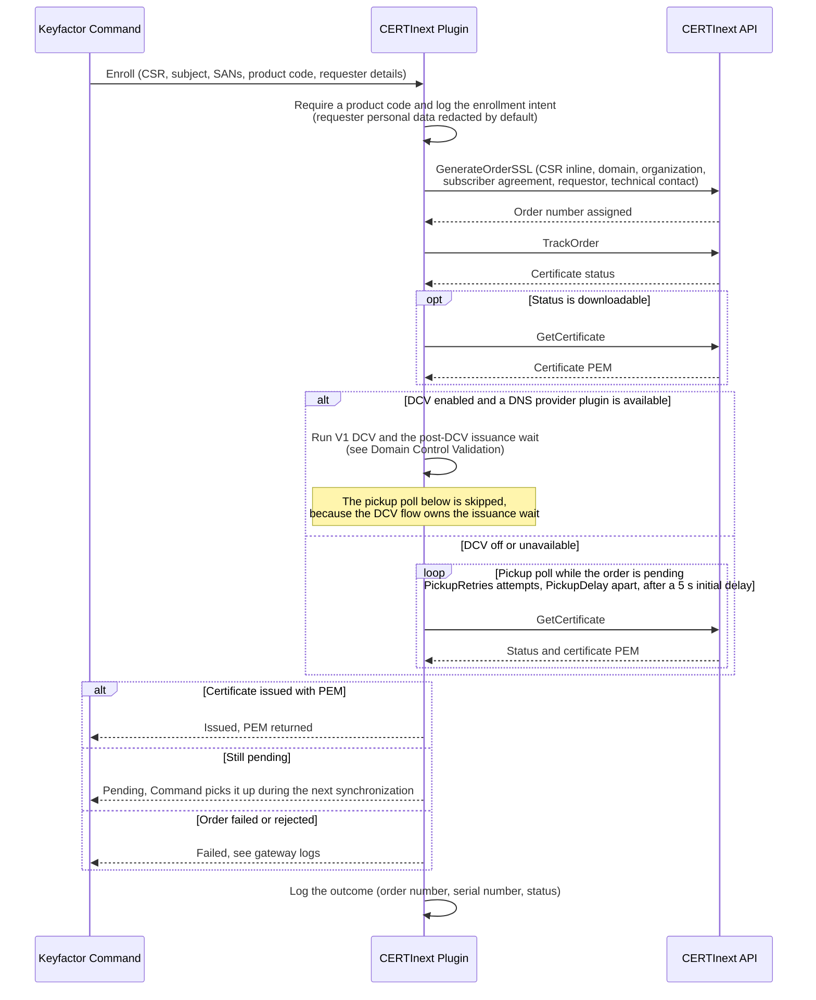
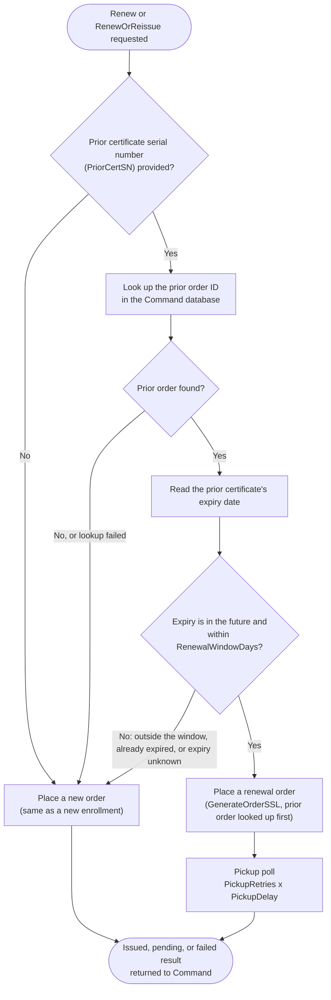
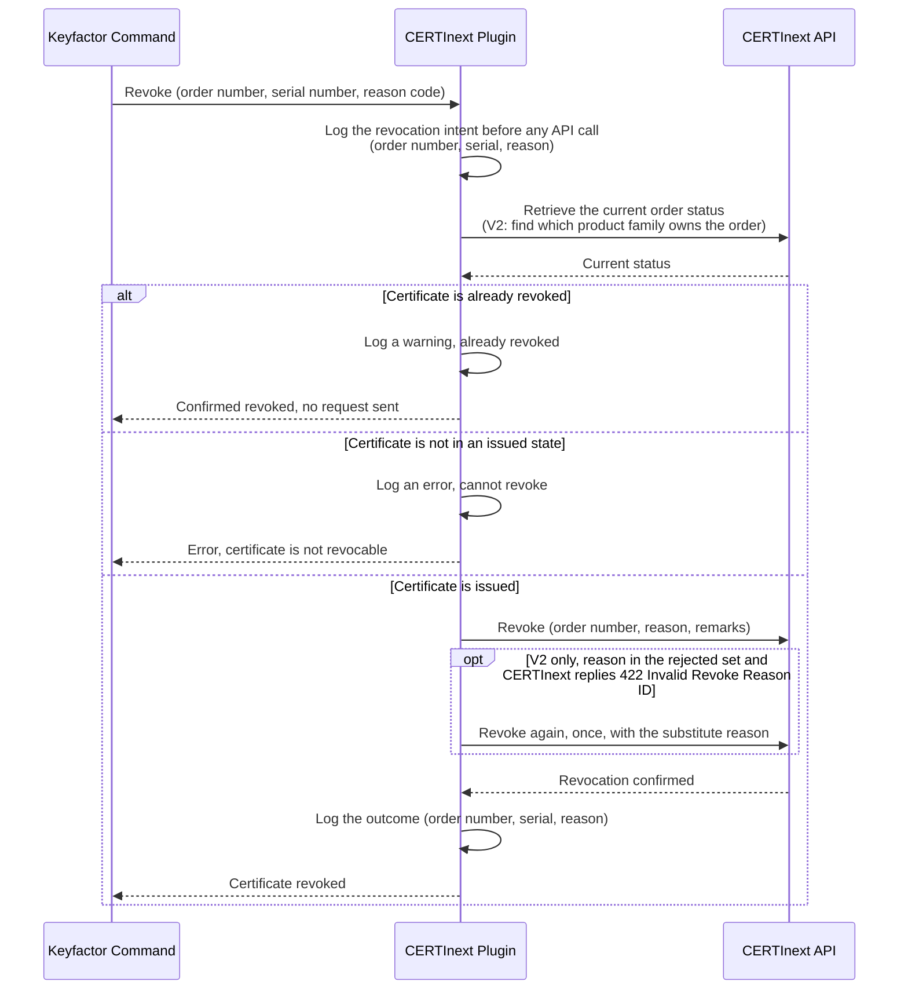
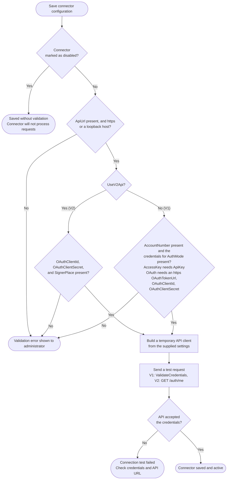

<h1 align="center" style="border-bottom: none">
    CERTInext AnyCA Gateway REST Plugin
</h1>

<p align="center">
  <!-- Badges -->

<a href="https://github.com/Keyfactor/certinext-caplugin/releases"></a>


</p>

<p align="center">
  <!-- TOC -->
  <a href="#support">
    <b>Support</b>
  </a>
  ·
  <a href="#requirements">
    <b>Requirements</b>
  </a>
  ·
  <a href="#installation">
    <b>Installation</b>
  </a>
  ·
  <a href="#license">
    <b>License</b>
  </a>
  ·
  <a href="https://github.com/orgs/Keyfactor/repositories?q=anycagateway">
    <b>Related Integrations</b>
  </a>
</p>

The CERTInext AnyCA Gateway REST plugin extends the certificate lifecycle capabilities of the CERTInext platform (by eMudhra) to Keyfactor Command via the Keyfactor AnyCA Gateway REST. The plugin represents a fully featured AnyCA REST plugin with the following capabilities:

* CA Synchronization:
    * Download all certificates issued through the CERTInext CA, either as a full inventory or incrementally since the last sync.
    * Expired certificates can optionally be excluded from synchronization using the `IgnoreExpired` configuration flag.
* Certificate Enrollment for profiles configured in CERTInext:
    * New certificate enrollment (new keys and certificate).
    * Certificate renewal — on the V1 API, submits a new `GenerateOrderSSL` order when the prior certificate is within the configured renewal window (CERTInext has no dedicated renewal endpoint; the renewal-window check governs how Command tracks old→new, not which API is called). On the V2 API every renewal places a new order.
    * Certificate reissuance (new keys with the same or updated subject/SANs) when outside the renewal window or no prior certificate is found.
    * Synchronous certificate pickup — a fast-issuing order (DV, or already-approved) can return the certificate in the same enrollment call instead of always waiting for the next sync, via `PickupRetries`/`PickupDelay`.
    * DNS-01 domain control validation (DCV) — the plugin publishes the validation TXT record through a DNS provider plugin deployed on the gateway and asks CERTInext to verify it, during enrollment and during synchronization (`DcvEnabled`, on by default).
* Certificate Revocation:
    * Request revocation of a previously issued certificate using any RFC 5280 CRL reason code.
* Supported authentication modes for calls to the CERTInext API:
    * AccessKey (HMAC-based request signing) — the primary and recommended mode for the V1 API
    * OAuth (bearer token via client credentials flow) — optional for V1, and the only mode for the V2 API
* Two CERTInext API generations, selected per connector with `UseV2Api`: the V1 API (default) and the order-centric V2 REST API, which adds Private PKI products. See [V2 API](#v2-api) and [Migrating from V1 to V2](#migrating-from-v1-to-v2).

## Compatibility

The CERTInext AnyCA Gateway REST plugin is compatible with the Keyfactor AnyCA Gateway REST 26.2.0 and later.

## Support
The CERTInext AnyCA Gateway REST plugin is supported by Keyfactor for Keyfactor customers. If you have a support issue, please open a support ticket via the Keyfactor Support Portal at https://support.keyfactor.com.

> To report a problem or suggest a new feature, use the **[Issues](../../issues)** tab. If you want to contribute actual bug fixes or proposed enhancements, use the **[Pull requests](../../pulls)** tab.

## Requirements

* Keyfactor Command 26.2 or later
* AnyCA Gateway REST framework version 26.2.0 or later
* A DNS provider plugin deployed on the AnyCA Gateway if the connector validates domains with DNS-01 DCV (the default; see `DcvEnabled`)
* A CERTInext account with API access enabled and at least one certificate product configured
* Network connectivity from the AnyCA Gateway host to the CERTInext API endpoint for your region (see table below)
* The AnyCA Gateway host must trust the TLS certificate presented by the CERTInext API endpoint

### CERTInext Environments

CERTInext operates three separate environments. Use the sandbox environment for initial integration testing. Switch to a production environment only after all functionality has been verified.

| Environment | Portal Sign-in URL | API Base URL |
|---|---|---|
| Sandbox | https://sandbox-us.certinext.io/ | `https://sandbox-us-api.certinext.io/emSignHub-API/` |
| Production — India (Global) | https://in.certinext.io/ | `https://api.certinext.io/emSignHub-API/` |
| Production — US | https://us.certinext.io/ | `https://us-api.certinext.io/emSignHub-API/` |

The V2 API (`UseV2Api` = `true`) is served from the bare host with no path segment, for example `https://sandbox-us-api.certinext.io` or `https://us-api.certinext.io`. See [V2 API](#v2-api).

> Note: Product codes differ between sandbox and production. Always confirm product codes from the GetProductDetails API call against the environment you are targeting before going live.

## Installation

1. Install the AnyCA Gateway REST per the [official Keyfactor documentation](https://software.keyfactor.com/Guides/AnyCAGatewayREST/Content/AnyCAGatewayREST/InstallIntroduction.htm).

2. On the server hosting the AnyCA Gateway REST, download and unzip the latest [CERTInext AnyCA Gateway REST plugin](https://github.com/Keyfactor/certinext-caplugin/releases/latest) from GitHub.

3. Copy the unzipped directory (usually called `net8.0` or `net10.0`) to the Extensions directory:


    ```shell
    Depending on your AnyCA Gateway REST version, copy the unzipped directory to one of the following locations:
    Program Files\Keyfactor\AnyCA Gateway\AnyGatewayREST\net8.0\Extensions
    Program Files\Keyfactor\AnyCA Gateway\AnyGatewayREST\net10.0\Extensions
    ```

    > The directory containing the CERTInext AnyCA Gateway REST plugin DLLs (`net8.0` or `net10.0`) can be named anything, as long as it is unique within the `Extensions` directory.

4. Restart the AnyCA Gateway REST service.

5. Navigate to the AnyCA Gateway REST portal and verify that the Gateway recognizes the CERTInext plugin by hovering over the ⓘ symbol to the right of the Gateway on the top left of the portal.

## Configuration

1. Follow the [official AnyCA Gateway REST documentation](https://software.keyfactor.com/Guides/AnyCAGatewayREST/Content/AnyCAGatewayREST/AddCA-Gateway.htm) to define a new Certificate Authority, and use the notes below to configure the **Gateway Registration** and **CA Connection** tabs:

    * **Gateway Registration**

        Before enrolling certificates, the Keyfactor Command server must trust the CERTInext issuing CA chain.
        
        1. Log in to the CERTInext portal and download the root CA certificate and any intermediate CA certificates in the chain as PEM or DER files.
        2. On the Keyfactor Command server, import those certificates into the appropriate Windows certificate store — **Trusted Root Certification Authorities** for the root CA and **Intermediate Certification Authorities** for any subordinate CAs.
        3. In the Keyfactor Command Management Portal, navigate to **CA Connectors** and add a new CA using the **CERTInext AnyCA REST Gateway Plugin**.
        4. Complete the CA connector configuration fields described in the next section, then save and test the connection. The gateway performs a live connectivity test during validation: the V1 `ValidateCredentials` endpoint, or `GET /api/certinext/v2/auth/me` when `UseV2Api` is `true`.

    * **CA Connection**

        Populate using the configuration fields collected in the [requirements](#requirements) section.

        * **ApiUrl** - REQUIRED: CERTInext API base URL. Its meaning follows UseV2Api. V1 (default): Sandbox (US): https://sandbox-us-api.certinext.io/emSignHub-API/ — Production (US): https://us-api.certinext.io/emSignHub-API/ — Production (Global/India): https://api.certinext.io/emSignHub-API/. V2 (UseV2Api=true): the bare V2 host, e.g. https://sandbox-us-api.certinext.io, no trailing slash or path suffix — V1 and V2 are hosted differently, so this value changes when UseV2Api is toggled.
        * **AccountNumber** - REQUIRED when UseV2Api is false: your CERTInext account number (numeric string). Included in the `meta` block of every V1 request. Not used when UseV2Api is true. Available in the CERTInext portal.
        * **GroupNumber** - OPTIONAL: CERTInext group (delegation) number. When set, it is included in product-catalog requests and in the order (`delegationInformation.groupNumber` on V1, `groupNumber` on V2) so the order is routed to the correct account group, and V2 synchronization is scoped to the group. Some accounts will queue orders for additional review when this field is omitted. Available in the CERTInext portal under Delegation → Groups.
        * **OrganizationNumber** - STRONGLY RECOMMENDED for OV/EV and faster DV issuance, and REQUIRED for OV/EV orders under V2: numeric CERTInext organization number for a pre-vetted organization (e.g. your company's pre-vetted entry). When set, V1 orders are submitted with `organizationDetails.preVetting="1"` and the configured `organizationNumber`, telling CERTInext to skip the manual organization-vetting queue; V2 OV/EV orders send it as `organization.organizationNumber` with `preVetted=true` (V2 DV orders never send an organization block). Without this value, V1 orders are placed without any organizationDetails block and CERTInext may park them in `Pending System RA` for extended manual review (potentially tens of hours), and V2 OV/EV enrollment fails before any CA call. Available in the CERTInext portal under Organizations → Pre-vetted Organizations.
        * **TechnicalContactName** - OPTIONAL: Name sent as the order's technical point of contact (V1 `technicalPointOfContact.tpcName`, V2 `technicalPointOfContact.name`). Defaults to the configured RequestorName when blank. Some product configurations require a TPoC to be present; omitting it can cause CERTInext to park orders awaiting manual completion of the field.
        * **TechnicalContactEmail** - OPTIONAL: Email sent as the order's technical point of contact (V1 `tpcEmail`, V2 `email`). Defaults to the configured RequestorEmail when blank.
        * **TechnicalContactIsdCode** - OPTIONAL: International dialing code for the technical contact phone number. Defaults to the configured RequestorIsdCode when blank.
        * **TechnicalContactMobileNumber** - OPTIONAL: Mobile number for the technical contact (digits only). Defaults to the configured RequestorMobileNumber when blank.
        * **AuthMode** - REQUIRED when UseV2Api is false: authentication mode. 'AccessKey' (default) — uses authKey = SHA256(accessKey + ts + txn) in every request body. 'OAuth' — uses an OAuth2 bearer token (requires OAuthTokenUrl, OAuthClientId, OAuthClientSecret). Ignored when UseV2Api is true; V2 always uses OAuth2 client credentials.
        * **ApiKey** - REQUIRED when UseV2Api is false and AuthMode is 'AccessKey': the REST API Access Key generated in the CERTInext portal under Integrations → APIs. This value is used to compute authKey = SHA256(accessKey + ts + txn); it is never transmitted directly. Not used when UseV2Api is true.
        * **OAuthTokenUrl** - OAuth token endpoint URL. Required when UseV2Api is false and AuthMode is 'OAuth'; must use https. Not used when UseV2Api is true — V2 requests its token from {ApiUrl}/oauth/token.
        * **OAuthClientId** - OAuth client ID. Required when AuthMode is 'OAuth' (V1). Also required, and reused, when UseV2Api is true — V2 authenticates with these same OAuthClientId/OAuthClientSecret fields via client_credentials against {ApiUrl}/oauth/token, rather than separate V2-only credentials. The key must be generated in OAuth mode in the CERTInext portal.
        * **OAuthClientSecret** - OAuth client secret. Required when AuthMode is 'OAuth' (V1). Also required, and reused, when UseV2Api is true (see OAuthClientId).
        * **RequestorName** - REQUIRED: Default requestor name submitted with all certificate orders. This is the name of the person/service responsible for the certificates.
        * **RequestorEmail** - REQUIRED: Default requestor email submitted with all certificate orders. Must be a valid email address registered in your CERTInext account.
        * **RequestorIsdCode** - International dialing code for the requestor phone number (e.g. '1' for US). Default: '1'.
        * **RequestorMobileNumber** - Requestor mobile number (digits only, no country code).
        * **RequestorDesignation** - OPTIONAL: Job title / role of the requestor (e.g. 'IT Administrator'). Sent in V2 orders' `requestor.designation` field. Free text with no CA-side enum. Left blank by default, in which case the field is omitted entirely from the order rather than sent with a default value.
        * **SignerPlace** - City or location of the subscriber agreement signer (e.g. 'San Francisco, CA'). REQUIRED when UseV2Api is on: the V2 Subscriber Agreement sent with every SSL order requires it, so the connector cannot be saved with it blank. A per-template SignerPlace enrollment parameter overrides it.
        * **SignerIp** - IP address of the subscriber agreement signer. Sent in the order's agreement block; a template-level SignerIp enrollment parameter overrides it on V2.
        * **DefaultProductCode** - OPTIONAL: Default numeric product code. V1: used for renewals when the template doesn't supply a product code (CERTInext's TrackOrder doesn't return the prior order's code). V2: disambiguates a ProductId-only template when the live catalog has more than one product at the same assurance level. Product codes are provided by eMudhra (e.g. the SSL DV 1-year code for your account). Retrieve available codes from Integrations → APIs → GetProductDetails.
        * **AccountingModel** - OPTIONAL: CERTInext billing model sent in `orderDetails.accountingModel` on V1 orders. "2" = credit-based (most accounts, default). "1" = cash model. Not used by V2.
        * **EmailNotifications** - OPTIONAL: Whether CERTInext sends lifecycle-event emails to the requestor. "1" = full notification set (V1 sends it as-is; V2 maps it to "all"). "0" = silent on both V1 and V2. Blank/unset stays silent on V1 (sent as "0") but is omitted on V2, so the CA's own default ("all", not silent) applies instead. Any other value fails V2 enrollment before any CA call. Default: "0" — V2 orders are silent by default, matching V1.
        * **SubscriptionValidityYears** - OPTIONAL: Default validity in years for SSL orders. "1", "2", or "3". Override per template via the ValidityYears product parameter. Default: "1".
        * **SubscriptionAutoRenew** - OPTIONAL: Whether CERTInext should auto-renew certificates issued through this connector. "0" = disabled (recommended — renewal is driven by Keyfactor Command), "1" = enabled. Default: "0".
        * **SubscriptionRenewCriteriaDays** - OPTIONAL: Days before expiry at which CERTInext auto-renews (only honored when SubscriptionAutoRenew = "1"). Typical values: "30" or "60". Default: "30".
        * **AutoSecureWww** - OPTIONAL: If "1", CERTInext automatically adds the `www.` variant of the primary domain as an additional SAN. "0" = use only the CN/SANs supplied with the CSR. Default: "0".
        * **IgnoreExpired** - If true, expired certificates will be skipped during synchronization. Default: false.
        * **SubmitNonDnsSans** - OPTIONAL: If true (default), V1 SANs that are not DNS names (IP address, email, URI) are submitted to CERTInext in additionalDomains along with the DNS names. CERTInext registers them verbatim as order domains and they cannot pass domain validation, so such an order will not issue until they are removed — but nothing the subscriber requested is dropped silently. Set to false to submit DNS names only: the order issues, but the certificate will not contain the non-DNS names. Not consulted on V2 (UCC `additionalDomains` takes DNS names only; Private PKI `additionalHosts` takes DNS names and IP addresses). Default: true.
        * **PageSize** - Number of orders to fetch per page during synchronization. Default: 100, max: 500 (V2 `/reports/orders` pages are capped at 100).
        * **Enabled** - Enables or disables the CA connector. Set to false to create the connector record before credentials are available. Default: true.
        * **LogSensitiveRequestData** - OPTIONAL diagnostic escape hatch. When true, enabling it writes requestor personal data (name, email, phone, and other organization contact details) and full CA request/response payloads to the gateway logs. Meant for temporary use while verifying a new deployment — confirming exactly what was sent to the CA and that the order succeeded — and should be turned back off once verification is complete. When false (default), personal-data fields are redacted (email is masked but keeps its domain, e.g. 'j***@example.com') and the enrollment log line omits the requester name entirely. Email SAN values (rfc822Name) in log lines are masked the same way; DNS, IP and URI SANs are always logged in full. Credentials (API keys, OAuth secrets, tokens) are always redacted regardless of this setting. Default: false.
        * **PickupRetries** - OPTIONAL: Number of times Enroll() polls CERTInext for the certificate after a successful order submission. If the certificate has not issued within this window it is picked up during the next synchronization instead. Set to 0 to disable the wait. Default: 5. OV/EV orders are issued asynchronously (organization verification, minutes to hours), so they typically exhaust the wait and are returned pending regardless of this value.
        * **PickupDelay** - OPTIONAL: Number of seconds between certificate-pickup retries. A fixed 5-second initial delay plus PickupRetries times this value is the maximum time an enrollment call occupies a Command worker thread; the plugin caps the effective total at 180 seconds regardless of how PickupRetries/PickupDelay are set, reducing the retry count to fit. Target a total well under ~90s so the request does not time out. Default: 10 (a ~55s ceiling with the default retries).
        * **DcvEnabled** - OPTIONAL: When true, the plugin performs DNS-based Domain Control Validation (DCV) during enrollment and synchronization for orders that require it, using the DNS provider plugin deployed on the gateway (e.g. azure-azuredns-dnsplugin). Without a DNS provider plugin, orders that need validation stay pending and the plugin logs why. Set to false to skip DCV. Default: true.
        * **DcvTxtRecordTemplate** - OPTIONAL: Format string for the DNS TXT record hostname used during DCV. {0} is replaced with the domain name being validated. Default: _emsign-validation.{0}
        * **DcvPropagationDelaySeconds** - OPTIONAL: Seconds to wait after publishing the DNS TXT record before asking CERTInext to verify it. Increase for zones with slow propagation. Default: 30.
        * **DcvTimeoutMinutes** - OPTIONAL: Maximum minutes for the entire DCV flow (DNS publish + propagation + verify) for one order before it is abandoned and left pending. Can also be set via the CERTINEXT_DCV_TIMEOUT_MINUTES environment variable; the env var takes precedence when both are set. Default: 10.
        * **DcvWaitForChallengeSeconds** - OPTIONAL (V1 only): How long (seconds) the plugin will wait inside Enroll() for CERTInext to expose the DCV challenge (i.e. populate `domainVerification` in TrackOrder). Under concurrent load CERTInext sometimes takes a few seconds after GenerateOrderSSL before the slot appears. Without this wait, the plugin's initial TrackOrder check sees null and skips DCV — the order then has to wait for the next gateway sync cycle to be picked up. Setting to 0 disables the wait (single-check behaviour). Can also be set via the CERTINEXT_DCV_WAIT_FOR_CHALLENGE_SECONDS environment variable; the env var takes precedence when both are set. Default: 60.
        * **DcvWaitForIssuanceSeconds** - OPTIONAL (V1 only): How long (seconds) the plugin will wait inside Enroll() after DCV verifies for CERTInext to finish generating the certificate. CERTInext issuance is async — DCV may be verified but the cert PEM isn't yet available for download. Without this wait, Enroll() returns a pending result and the issued cert is picked up by the next sync cycle. Setting to 0 disables the wait (single-fetch behaviour). Can also be set via the CERTINEXT_DCV_WAIT_FOR_ISSUANCE_SECONDS environment variable; the env var takes precedence when both are set. Default: 60.
        * **DcvSyncMaxOrderAgeHours** - OPTIONAL: During synchronization, only pending DV orders younger than this many hours are eligible to be driven through DCV. This keeps a sync pass fast when there is a large backlog of old, never-completing pending orders (e.g. abandoned orders or domains outside the configured DNS provider's zone): they age out and are simply reported as pending rather than retried every pass. Recently-placed orders (the ones that legitimately deferred DCV) are always within the window and complete via the normal scan cadence. Set to 0 to disable the age filter (attempt DCV for all pending). Default: 24.
        * **DcvSyncMaxPerPass** - OPTIONAL: Maximum number of pending DV orders the plugin will attempt to drive through DCV in a single synchronization pass. Bounds the per-pass cost regardless of backlog size; remaining pending orders are reported as-is and picked up on a later pass (the per-minute incremental scan keeps recent orders moving). Set to 0 to disable the cap. Default: 50.
        * **UseV2Api** - OPTIONAL: When true, the plugin routes Ping / Enroll / GetSingleRecord / Revoke / Synchronize through the CERTInext V2 REST API (/api/certinext/v2/), including V2 /reports/orders for Synchronize. Requires ApiUrl (the V2 base URL in this mode), OAuthClientId, OAuthClientSecret, and SignerPlace. V1 credentials (ApiKey/AccountNumber/AuthMode) are not required when this is true. Default: false (V1 API).
        * **V2SyncLookbackHours** - OPTIONAL (V2 mode only): during an incremental Synchronize, the plugin queries V2 /reports/orders with a 'from' date of (lastSync minus this many hours) rather than exactly lastSync, since the API's from/to filter may bracket either the order-placement date or the issuance date. A lookback window ensures an order created before lastSync but issued afterward (e.g. a slow DCV order) still surfaces on the next incremental pass. Ignored when UseV2Api is false. Default: 72.

2. A Keyfactor Command certificate template maps an enrollment request to a specific CERTInext product. Create one template per CERTInext product that you want to make available to requesters.

The AnyCA Gateway REST portal also needs one certificate profile per product before Command templates can be created against it. Create the profiles by hand in the gateway portal, or with the helper script this repository ships (`make register-profiles`; set `DRY_RUN=1` to preview). See [scripts/register/README.md](https://github.com/Keyfactor/certinext-caplugin/blob/main/scripts/register/README.md) for authentication and options.

In the Keyfactor Command Management Portal, navigate to **Certificate Templates** and create a new template associated with the CERTInext CA connector. The following enrollment parameters are available:

| Parameter | Required / Optional | Type | Description | Example / Default |
|---|---|---|---|---|
| `ProductCode` | Optional | String | Override the numeric CERTInext product code for this template. Product codes are provisioned per account by eMudhra — obtain the correct code from `GetProductDetails` for your account. If omitted: on V1, the built-in default code for the selected product name is used (see [Product Codes](#product-codes)); on V2, the code is resolved from the live product catalog (see [V2 Product Code Resolution](#v2-product-code-resolution)). Set this explicitly when targeting the sandbox environment or a non-standard code. Required for `ProductFamily=private-pki`. | DV SSL: `842` (sandbox) or `838` (production) |
| `ProfileId` | Deprecated | String | Legacy alias for `ProductCode`. Accepted for backward compatibility — if `ProductCode` is not set, `ProfileId` is used in its place. New templates should use `ProductCode`. | `838` |
| `ValidityYears` | Optional | Number | Subscription validity period in years: `1`, `2`, or `3`. Default: `1`. CERTInext certificates are issued within a subscription term at up to 390 days per certificate, with free renewals within the term. | `1` |
| `ValidityDays` | Deprecated | Number | Legacy validity field, V1 only. If set, the value is divided by 365 and rounded up to derive a year count. New templates should use `ValidityYears`. | `365` |
| `AutoApprove` | Optional | Boolean | **Currently has no effect** — reserved for future use. The plugin does not call any approval endpoint against CERTInext regardless of this setting. | `false` |
| `RequesterName` | Optional | String | Per-template override for the requestor name. When set, overrides the connector-level `RequestorName` for orders using this template. | `Keyfactor Automation` |
| `RequesterEmail` | Optional | String | Per-template override for the requestor email address. When set, overrides the connector-level `RequestorEmail` for orders using this template. | `pki-admin@example.com` |
| `RenewalWindowDays` | Optional | Number | V1 only. Number of days before certificate expiration within which a renewal is attempted instead of a reissue. V2 places a new order for every renewal and reissue. Default: `90`. | `90` |
| `KeyType` | Optional | String | Informational. The key algorithm is determined by the submitted CSR, not by this parameter. CERTInext accepts **RSA 2048 / 3072 / 4096 and ECC P-256 / P-384** only — larger RSA, ECC P-521, and the Ed25519/Ed448 curves are rejected by the CA (`Invalid key size`). | `RSA2048`, `RSA3072`, `RSA4096`, `EC256`, `EC384` |
| `DomainName` | Optional | String | V2 only: primary domain name for SSL/TLS orders (for Private PKI, the primary hostname). If omitted, the plugin uses the CSR subject `CN`. V1 always uses the CSR subject `CN`. | `example.com` |
| `SignerName` | Optional | String | V2 only: per-template override for the subscriber agreement signer name. When omitted, defaults to the requestor name. V1 uses the connector-level `RequestorName`. | `Jane Smith` |
| `SignerPlace` | Optional | String | V2 only: per-template override for the subscriber agreement signer location. When omitted, defaults to the connector-level `SignerPlace`. V1 uses the connector-level value. | `Austin` |
| `SignerIp` | Optional | String | V2 only: per-template override for the subscriber agreement signer IP address. When omitted, defaults to the connector-level `SignerIp`. V1 uses the connector-level value. | `203.0.113.10` |

The V2-only template parameters `ProductFamily` and `ProductVariant` are described under [V2 Certificate Template Fields](#v2-certificate-template-fields).

3. Follow the [official Keyfactor documentation](https://software.keyfactor.com/Guides/AnyCAGatewayREST/Content/AnyCAGatewayREST/AddCA-Keyfactor.htm) to add each defined Certificate Authority to Keyfactor Command and import the newly defined Certificate Templates.

4. In Keyfactor Command (v12.3+), for each imported Certificate Template, follow the [official documentation](https://software.keyfactor.com/Core-OnPrem/Current/Content/ReferenceGuide/Configuring%20Template%20Options.htm) to define enrollment fields for each of the following parameters:

    * **ProductCode** - OPTIONAL: Override the numeric CERTInext product code for this template. When omitted: on V1, the default production code for the selected product is used (e.g. DV SSL → 838); on V2, the code is resolved from the live CERTInext product catalog by matching the selected product, so it stays correct even though V2 catalog numbering varies by account. Required for ProductFamily 'private-pki'. Set this explicitly when targeting sandbox or a non-standard code.
    * **ProfileId** - DEPRECATED: Use ProductCode instead. Kept for backward compatibility — mapped to ProductCode if ProductCode is not set.
    * **ValidityYears** - OPTIONAL: Subscription validity in years: 1, 2, or 3. Default: 1. Note: CERTInext validates per 390-day certificate within the subscription; the 'validity' field in the order is the subscription term, not certificate lifetime.
    * **ValidityDays** - DEPRECATED: Use ValidityYears instead. V1 only: if set, value is divided by 365 and rounded up to get the subscription year count.
    * **AutoApprove** - Currently has no effect — reserved for future use. The plugin does not call any approval endpoint against CERTInext regardless of this setting. Default: false.
    * **RequesterName** - OPTIONAL: Default requester name to include in the enrollment request. Used when no requester name can be derived from the subject.
    * **RequesterEmail** - OPTIONAL: Default requester email address. Used when no email can be derived from the subject.
    * **RenewalWindowDays** - OPTIONAL: V1 only. Number of days before certificate expiration within which a renewal is triggered. Certificates expiring further than this window are reissued instead. Certificates that have already expired also fall back to reissue. V2 places a new order for every renewal and reissue. Default: 90.
    * **KeyType** - OPTIONAL: Informational. The key algorithm is determined by the submitted CSR; CERTInext accepts RSA 2048/3072/4096 and ECC P-256/P-384 and rejects larger RSA, ECC P-521, and Ed25519/Ed448.
    * **DomainName** - OPTIONAL: Primary domain for SSL/TLS orders (for V2 private-pki orders, the primary hostname). Derived from the CSR CN if omitted.
    * **SignerName** - OPTIONAL: V2 only. Per-template subscriber agreement signer name. Falls back to the requestor name if omitted. V1 uses the connector-level RequestorName.
    * **SignerPlace** - OPTIONAL: V2 only. Per-template signer city/location. Falls back to the connector-level SignerPlace if omitted. V1 uses the connector-level SignerPlace.
    * **SignerIp** - OPTIONAL: V2 only. Per-template signer IP address. Falls back to the connector-level SignerIp if omitted. V1 uses the connector-level SignerIp.
    * **ProductFamily** - V2 ONLY: Product family for this template. Accepted values: 'ssl' (default) or 'private-pki'. 'private-pki' requires an explicit ProductCode and a Private PKI ProductVariant. 'signature' (Document Signer) is accepted by the parameter, but Document Signer enrollment is not supported.
    * **ProductVariant** - V2 ONLY: Product variant sent in the V2 order body. ProductFamily 'ssl': 'dv', 'ov', or 'ev' — if omitted, derived from the selected product; an explicit value that contradicts the product fails enrollment. ProductFamily 'private-pki': 'intranet-ssl' or 'igtf-host' (required; no default).

## CERTInext API Setup

### AccessKey (HMAC) — the primary auth mode

The CERTInext REST API uses HMAC-style request signing. Every API call includes a computed `authKey` field in the request body. The access key itself is never transmitted — only the derived hash is sent.

The `authKey` is computed as:

```
authKey = SHA256(accessKey + requestTs + requestTxnId)
```

Where `requestTs` is the ISO 8601 timestamp of the request and `requestTxnId` is the unique transaction ID generated per request. The gateway performs this computation automatically on every outbound API call.

**Steps to generate an Access Key:**

1. Log in to the CERTInext portal for your environment (e.g. https://in.certinext.io).
2. Navigate to **Integrations → APIs**.
3. Click **+ Create API Credentials** at the top right of the page.
4. In the dialog, fill in the following fields:
    - **API Type**: Select `REST`.
    - **Description**: Enter a descriptive label, such as `keyfactor-gateway`.
    - **User**: Select the CERTInext user account this credential will be associated with.
    - **Auth Type**: Select `Access Key`.
5. Click **Generate**.
6. In the confirmation dialog, copy the displayed Access Key immediately. This is the only time the key is shown in plaintext.
7. Confirm that the new credential row appears in the APIs list with status **Active** before proceeding.

Enter the copied value in the `ApiKey` field of the CA connector configuration. The field is masked in the Keyfactor Command UI and stored in Command's encrypted gateway configuration.

### OAuth — alternative auth mode

If your CERTInext account has OAuth enabled, you can use OAuth client credentials as an alternative to AccessKey signing on the V1 API. The V2 API always authenticates with OAuth client credentials (see [V2 OAuth2 Setup](#v2-oauth2-setup)).

1. Log in to the CERTInext portal.
2. Navigate to **Integrations → APIs**.
3. Click **+ Create API Credentials**.
4. Set **API Type** to `REST` and **Auth Type** to `OAuth`.
5. Complete the form and click **Generate**.
6. Note the **Client ID** and **Client Secret**. Enter them in the `OAuthClientId` and `OAuthClientSecret` fields respectively.
7. Confirm the OAuth token endpoint URL with eMudhra and enter it in the `OAuthTokenUrl` field.
8. Set the `AuthMode` connector field to `OAuth`.

> Note: Credentials are stored in Keyfactor Command's encrypted gateway configuration and are never written to disk by the plugin.

## CA Configuration

The following fields are presented in the Keyfactor Command Management Portal when creating or editing the CERTInext CA connector.

> Note: the connector's own save-time validation enforces `ApiUrl` (https, or http for a loopback host); for V1, `AccountNumber` and the credential fields for the selected `AuthMode`; for V2, `OAuthClientId`, `OAuthClientSecret`, and `SignerPlace`. Other fields marked **Required** below are required by CERTInext for a successful order — the connector will save without them, but enrollment will fail or the order will be parked pending until they're set.

| Field | Required / Optional | Description | Where to find it | Example |
|---|---|---|---|---|
| `ApiUrl` | Required | CERTInext API base URL. In V1 mode (default), must include the `/emSignHub-API/` path segment. When `UseV2Api` is `true` (see [V2 API](#v2-api) below), this is instead the bare V2 host with no trailing slash or path suffix — the two APIs are hosted differently, so this value changes when `UseV2Api` is toggled. Must use `https` — the OAuth client secret (V2) or API key (V1) is sent to this URL on every request, and `http` would transmit it in cleartext. `http` is rejected at connection-validation time except for a loopback host (`localhost`/`127.0.0.1`/`::1`), which is allowed for local test servers only. | See the environments table above. | `https://api.certinext.io/emSignHub-API/` |
| `AccountNumber` | Required (V1) | Your CERTInext account number (numeric string). Included in the `meta` block of every V1 API request. Not used when `UseV2Api` is `true`. | Portal → click your name or avatar → **Account Settings** or **My Profile**. | `1234567890` |
| `AuthMode` | Required (V1) | Authentication mode. `AccessKey` uses HMAC signing (recommended). `OAuth` uses a bearer token. Ignored when `UseV2Api` is `true`. | N/A — choose based on the credential type you created. | `AccessKey` |
| `ApiKey` | Conditional | The REST API Access Key generated in the CERTInext portal. Used to compute `authKey = SHA256(accessKey + ts + txn)`. The raw key is never transmitted. Required when `AuthMode` is `AccessKey` (V1). Not used when `UseV2Api` is `true`. This field is masked in the UI. | Portal → **Integrations → APIs** → generate or view the credential row. | *(generated, masked in UI)* |
| `OAuthTokenUrl` | Conditional | OAuth token endpoint URL. Required when `AuthMode` is `OAuth` (V1); must use `https`. Not used when `UseV2Api` is `true` — V2 requests its token from `{ApiUrl}/oauth/token`. | Provided by eMudhra for your account. | `https://auth.certinext.io/oauth/token` |
| `OAuthClientId` | Conditional | OAuth client ID. Required when `AuthMode` is `OAuth` (V1). Also required — and reused as-is — when `UseV2Api` is `true`; V2 does not have its own separate client ID field. | Portal → **Integrations → APIs** → the OAuth credential row. | `keyfactor-gateway` |
| `OAuthClientSecret` | Conditional | OAuth client secret. Required when `AuthMode` is `OAuth` (V1). Also required — and reused as-is — when `UseV2Api` is `true`. This field is masked in the UI. | Generated at OAuth credential creation time. | *(generated, masked in UI)* |
| `RequestorName` | Required | Default name of the person or service submitting certificate orders. Sent in the `requestorInformation` block of every order request. | Use the name of the team or automation account responsible for these certificates. | `PKI Automation` |
| `RequestorEmail` | Required | Default email address for the requestor. Must be a valid email address associated with your CERTInext account. Sent in the `requestorInformation` block of every order request. | Use a monitored team inbox or the account holder's email. | `pki-admin@example.com` |
| `RequestorIsdCode` | Optional | International dialing code for the requestor phone number (digits only, no `+` prefix). Default: `1` (United States). | N/A — use the country code for your requestor. | `1` |
| `RequestorMobileNumber` | Optional | Requestor mobile number (digits only, no country code). Included in the `requestorInformation` block. | N/A | `5551234567` |
| `RequestorDesignation` | Optional | Job title / role of the requestor (e.g. `IT Administrator`). Sent in the `requestorInformation` block (V1) and the `requestor.designation` field (V2). Free text with no CA-side enum. Left blank by default, in which case the field is omitted from the order entirely rather than sent with a default value. | N/A | `IT Administrator` |
| `SignerPlace` | Required | City or location of the person accepting the subscriber agreement on behalf of your organization. Required by CERTInext for all orders. When `UseV2Api` is `true` the connector can't be saved with this blank, because the V2 Subscriber Agreement sent with every SSL order requires it (a template's `SignerPlace` enrollment parameter still overrides it). | Use the physical city where the signer is located. | `Austin` |
| `SignerIp` | Required | Public IP address of the host accepting the subscriber agreement. Required by CERTInext for all orders. | Use the outbound IP of the AnyCA Gateway host, or the IP of the workstation from which the agreement was accepted. | `203.0.113.10` |
| `GroupNumber` | Optional | CERTInext group (delegation) number. When set, it is passed in the `productDetails.groupNumber` field of `GetProductDetails` requests *and* in `delegationInformation.groupNumber` on every V1 SSL order. On V2 it is sent as `groupNumber` on order create and as a query parameter on the catalog and orders-report calls. Some sandbox accounts return an empty product list from `GetProductDetails` unless this field is included. Available in the CERTInext portal under **Delegation → Groups**. | Portal → **Delegation → Groups**. | `2345678901` |
| `OrganizationNumber` | Optional, strongly recommended for OV/EV and faster DV | Numeric CERTInext organization number for a pre-vetted organization. When set, every SSL order is submitted with `organizationDetails.preVetting="1"` and this number, telling CERTInext to skip its manual organization-vetting queue. Without it, orders may sit in `Pending System RA` for extended manual review (potentially tens of hours). | Portal → **Organizations → Pre-vetted Organizations**. | `1234567` |
| `TechnicalContactName` / `TechnicalContactEmail` / `TechnicalContactIsdCode` / `TechnicalContactMobileNumber` | Optional | Populate `technicalPointOfContact` on every SSL order (V1 and V2). Each defaults to the corresponding `Requestor*` field when blank. Some product configurations require a technical point of contact to be present; omitting it can cause CERTInext to park orders awaiting manual completion of the field. | N/A | *(defaults to Requestor fields)* |
| `AccountingModel` | Optional | CERTInext billing model sent in `orderDetails.accountingModel` on V1 orders. `2` = credit-based (most accounts). `1` = cash model. Not used by V2. Default: `2`. | N/A | `2` |
| `EmailNotifications` | Optional | Whether CERTInext sends lifecycle-event emails to the requestor. `1` = full notification set (V1 sends it as-is; V2 maps it to `all`). `0` = silent on both V1 and V2. Blank/unset stays silent on V1 (sent as `0`) but is omitted on V2, so the CA's own default (`all`, not silent) applies instead. Any other value fails V2 enrollment before any CA call. Default: `0` — V2 orders are silent by default, matching V1. | N/A | `0` |
| `SubscriptionValidityYears` | Optional | Connector-level default validity in years for SSL orders (`1`, `2`, or `3`). Overridden per template by the `ValidityYears` enrollment parameter. Default: `1`. | N/A | `1` |
| `SubscriptionAutoRenew` | Optional | Whether CERTInext should auto-renew certificates issued through this connector. `0` = disabled (recommended — renewal is driven by Keyfactor Command), `1` = enabled. Default: `0`. | N/A | `0` |
| `SubscriptionRenewCriteriaDays` | Optional | Days before expiry at which CERTInext auto-renews. Only honored when `SubscriptionAutoRenew` is `1`. Default: `30`. | N/A | `30` |
| `AutoSecureWww` | Optional | If `1`, CERTInext automatically adds the `www.` variant of the primary domain as an additional SAN. Default: `0`. | N/A | `0` |
| `SubmitNonDnsSans` | Optional | V1 only. If `true` (default), SANs that aren't DNS names (IP address, email, URI) are submitted to CERTInext instead of silently dropped. CERTInext can't validate them, so such an order won't issue until they're removed. Set to `false` to submit DNS names only. Not consulted on V2 (see [Migrating from V1 to V2](#step-2--update-the-ca-connector)). Default: `true`. | N/A | `true` |
| `DefaultProductCode` | Optional, but effectively required if you use renewals (V1), or ProductId-only templates against an ambiguous V2 catalog | **V1 mode:** used for renewals only, and only when the template doesn't supply a product code (`ProductCode`/`ProfileId`) — CERTInext's `TrackOrder` doesn't return the prior order's product code. If neither is set, renewals go out with an empty product code. Has no effect on new V1 enrollments. **V2 mode:** also used to disambiguate a template that sets only `ProductId` (no explicit `ProductCode`) when the live V2 catalog has more than one product sharing the product's expected assurance level — if this value doesn't match one of the candidate codes, that enrollment (and template save-time validation) fails with an error listing them. | Call `GetProductDetails` against your account/environment (see product code table below). | `842` |
| `IgnoreExpired` | Optional | If `true`, expired certificates are skipped during synchronization and are not imported into Keyfactor Command. Default: `false`. | N/A | `false` |
| `PageSize` | Optional | Number of orders to retrieve per page during synchronization. Default: `100`. Maximum: `500` (V2 `/reports/orders` pages are capped at `100`). Reduce this value if synchronization requests time out. | N/A | `100` |
| `Enabled` | Optional | Enables or disables the CA connector. Setting this to `false` allows the connector record to be created before all credentials are available, without triggering a live connectivity test. Default: `true`. | N/A | `true` |
| `LogSensitiveRequestData` | Optional | **Diagnostic escape hatch — off by default.** When `true`, this writes requestor personal data (name, email, phone, and other organization contact details) and full CA request/response payloads to the gateway logs. It's meant for temporary use while verifying a new deployment (confirming exactly what was sent to the CA and that the order succeeded) — turn it back off once verification is complete. When `false` (default), personal-data fields are redacted (email is masked but keeps its domain, e.g. `j***@example.com`) and the enrollment log line omits the requester name entirely. Email SAN values (rfc822Name) in log lines are masked the same way; DNS, IP and URI SANs are always logged in full. Credentials (API keys, OAuth secrets, tokens) are always redacted regardless of this setting. Default: `false`. | N/A | `false` |
| `PickupRetries` | Optional | Number of times `Enroll` polls CERTInext for the certificate after a successful order submission, before returning pending and leaving pickup to the next sync. Set to `0` to disable the wait entirely. Values above `30` are treated as `30`. OV/EV orders validate asynchronously (minutes to hours) and typically exhaust this wait regardless of the value. Default: `5`. | N/A | `5` |
| `PickupDelay` | Optional | Seconds between certificate-pickup retries. The total pickup budget is a fixed 5-second initial delay + (`PickupRetries` × `PickupDelay`), hard-capped at 180 seconds regardless of how the two values are set. Aim for well under ~90s total so the call doesn't run long enough to trip Command's own enrollment timeout. Values above `60` are treated as `60`; a non-positive value falls back to `10`. Default: `10` (a ~55s ceiling with default `PickupRetries`). | N/A | `10` |
| `DcvEnabled` | Optional | When `true`, the plugin performs DNS-based Domain Control Validation (DCV) during enrollment and synchronization for orders that require it. Requires a DNS provider plugin (e.g. `azure-azuredns-dnsplugin`) to be deployed on the gateway; without one, orders that need validation stay pending and the plugin logs why. Set to `false` if you validate domains another way. Default: `true`. | N/A | `true` |
| `DcvTxtRecordTemplate` | Optional | Format string for the DNS TXT record hostname published during DCV. `{0}` is replaced with the domain being validated. Default: `_emsign-validation.{0}`. | N/A | `_emsign-validation.{0}` |
| `DcvPropagationDelaySeconds` | Optional | Seconds to wait after publishing the DNS TXT record before asking CERTInext to verify it. Increase for zones with slow propagation. On V1, DCV driven during synchronization uses its own fixed 3-second delay; V2 uses this value everywhere. Default: `30`. | N/A | `30` |
| `DcvTimeoutMinutes` | Optional | Maximum minutes to wait for the entire DCV flow (DNS publish + propagation + verify) before giving up on the order, which stays pending. Can also be set via the `CERTINEXT_DCV_TIMEOUT_MINUTES` environment variable; the environment variable takes precedence when both are set. Default: `10`. | N/A | `10` |
| `DcvWaitForChallengeSeconds` | Optional | V1 only. How long `Enroll()` waits for CERTInext to expose the DCV challenge after order placement, before giving up and deferring to the next sync. Set to `0` to disable the wait. Can also be set via `CERTINEXT_DCV_WAIT_FOR_CHALLENGE_SECONDS`. Default: `60`. | N/A | `60` |
| `DcvWaitForIssuanceSeconds` | Optional | V1 only. How long `Enroll()` waits for CERTInext to finish generating the certificate after DCV verifies. Set to `0` to disable the wait. Can also be set via `CERTINEXT_DCV_WAIT_FOR_ISSUANCE_SECONDS`. Default: `60`. | N/A | `60` |
| `DcvSyncMaxOrderAgeHours` | Optional | During synchronization, only pending DV orders younger than this many hours are driven through DCV, so a large backlog of old/abandoned pending orders doesn't slow down every sync pass. Set to `0` to disable the age filter. Default: `24`. | N/A | `24` |
| `DcvSyncMaxPerPass` | Optional | Maximum number of pending DV orders driven through DCV in a single sync pass. Set to `0` to disable the cap. Default: `50`. | N/A | `50` |

> **Pickup timing detail:** after a successful order placement, the plugin waits a fixed 5-second initial delay before the first poll attempt, then polls CERTInext every `PickupDelay` seconds up to `PickupRetries` times. Each poll calls `GetCertificate` to check whether the certificate has been issued. The total time budget is: **5s + (PickupRetries × PickupDelay) + API round-trip time per poll (~1s each)**. With defaults this is approximately 5 + (5 × 10) + 5 = **~60 seconds**.
>
> **Tuning for faster pickup:** if the CERTInext API typically issues certificates within a few seconds of order placement (as is typical for DV and auto-approved orders), you can reduce per-enrollment wait time by lowering `PickupDelay` and raising `PickupRetries` to compensate — this polls more frequently without changing the total budget. For example:
>
> | Configuration | PickupRetries | PickupDelay | Total budget | Poll cadence |
> |---------------|:---:|:---:|---|---|
> | Default | `5` | `10` | ~55s | Every 10s |
> | Faster polling | `10` | `5` | ~55s | Every 5s |
> | Aggressive | `30` | `2` | ~65s | Every 2s |
> | Minimal wait | `0` | — | 0s | No polling; defers to sync |
>
> The 5-second initial delay before the first poll is not configurable. The 180-second hard ceiling applies regardless of configuration. Pickup applies to V1 and V2 enrollments. When the DCV flow ran for the order inside the same `Enroll` call, the pickup poll is skipped, because the DCV flow already waited for issuance.

> Note: `AccountNumber` and group-level identifiers are distinct values. The `AccountNumber` is your top-level user account identifier. CERTInext groups (cost centers or departments) each have their own `groupNumber`, which is passed per-order and is separate from any organization number displayed on the Organizations page.

> Note: Only the credential fields that correspond to the selected `AuthMode` are evaluated at runtime. Fields belonging to the other auth mode are ignored.

## Product Codes

CERTInext uses numeric product codes to identify certificate types. **Product codes are provisioned per account by eMudhra** — the codes available to your account are determined when your account is set up. The codes in the tables below are example values for the sandbox and production environments; your account may have different codes.

To retrieve the exact codes available to your account, call the `GetProductDetails` endpoint:
- If you have a `GroupNumber` configured, include it in the request `productDetails` block — some accounts require this to return a non-empty list.
- Use the `make get-product-details-group` Makefile target to retrieve products from the sandbox with `groupNumber` included.

> Note: Product codes differ between the sandbox and production environments. Always verify the correct code before switching environments.

> Note: Product codes are per-account. If you receive "Invalid Product Code" (EMS-1162) when placing an order, your account does not have that product provisioned. Contact your eMudhra account representative to request provisioning of the product codes you need.

### SSL/TLS

The product codes in this table are for:
- the US sandbox environment (`sandbox-us-api.certinext.io`)
- the Production India environment (`api.certinext.io`)

**Your account may still have different codes.** Always call `GetProductDetails` against your target environment before going live.

| Product | Sandbox Code | Production Code | Required fields beyond base (`domainName`, `csr`, `requestorInformation`, `subscriptionDetails`, `agreementDetails`) |
|---|---|---|---|
| DV (Domain Validated) | `842` | `838` | None. `domainName` is derived from the CSR CN if omitted on the template. |
| DV Wildcard | `843` | `839` | CSR CN must use wildcard format (e.g. `*.example.com`). `domainName` in the order must also use the wildcard format. |
| DV UCC (Multi-domain) | `844` | `840` | `certificateInformation.additionalDomains` — array of additional SAN values beyond the primary `domainName`. |
| DV Wildcard UCC (Multi-domain Wildcard) | `845` | `841` | Combines wildcard and multi-domain requirements. CSR CN and `domainName` must use wildcard format; `certificateInformation.additionalDomains` required. |
| OV (Organization Validated) | `846` | `842` | `organizationDetails.organizationNumber` (your CERTInext org ID); `certificateInformation.locality`, `postalCode`, and full organization address fields (`streetAddress`, `city`, `state`, `country`). |
| OV Wildcard | `847` | `843` | Same as OV. CSR CN and `domainName` must use wildcard format. |
| OV UCC (Multi-domain) | `848` | `844` | Same as OV plus `certificateInformation.additionalDomains`. |
| OV Wildcard UCC (Multi-domain Wildcard) | `849` | `845` | Combines OV, wildcard, and multi-domain requirements. Same as OV plus wildcard CN/domainName and `certificateInformation.additionalDomains`. |
| EV (Extended Validation) | `850` | `846` | All OV fields plus: `contractSignerInfo` object (`name`, `email`, `isdCode`, `mobileNumber`, `designation`, `employeeID`); `certificateApproverInfo` object (same fields); `certificateInformation.companyRegistrationNumber`; `streetAddress2` must be non-empty. |
| EV UCC (Multi-domain EV) | `851` | `847` | Same as EV plus `certificateInformation.additionalDomains`. |

> Note: SSL/TLS codes are offset by 4 between the US sandbox and Production India in the tables above — treat that as a coincidence, not a guarantee. eMudhra controls the per-account mapping and may use different numeric codes for any new account. Always confirm via `GetProductDetails`.

> Note: The CERTInext portal may display additional short-validity products (e.g. **DV SSL Certificate 1 Month**, **DV SSL Certificate Wildcard 1 Month**) that do not appear in the `GetProductDetails` API response and have no published product code. These products are not accessible via the API and are therefore **not supported by this plugin**. Contact eMudhra to determine whether API ordering is available for these products on your account.

### Private PKI

| Product | Sandbox Code | Production Code | Availability |
|---|---|---|---|
| emSign Intranet SSL 1 year | `149` | `100` | Requires special provisioning by eMudhra. Not orderable on standard accounts. |
| IGTF Host 1 year | n/a | `104` | Requires special provisioning by eMudhra. Not orderable on standard accounts. |

> Note: Private PKI products need a separate entitlement. On an account without it, placing an order returns EMS-1162 (product not provisioned). Contact eMudhra to have these products enabled. Whether the sandbox code `149` ("Sandbox emSign Intranet SSL 1 Year", `productTypeID` `39`) is available depends on the account. Check your own account's catalog.

### S/MIME and Document Signing

The same numeric product codes are used for S/MIME and document-signing products on both the US sandbox and Production India. **Treat that as an example, not a contract** — eMudhra is free to assign different codes per account. Always confirm via `GetProductDetails`.

| Product | Sandbox / Production Code | Availability |
|---|---|---|
| S/MIME | `894` | Requires a separate S/MIME entitlement on the account. Not available on standard SSL accounts. |
| Document Signer | `819`–`827` | Requires document signing entitlement. Not orderable on standard accounts. See the code-to-product table below. |

CERTInext's published references don't agree on which Document Signer code maps to which product, so
confirm the product name for each code in your account's catalog before you use one. The V2 API spec
lists:

| Code | Product (per V2 API spec) |
|---|---|
| `819` / `820` / `821` | Natural Person, 1 / 2 / 3 year |
| `822` / `823` / `824` | Legal Person, 1 / 2 / 3 year |
| `825` / `826` / `827` | Legal Entity, 1 / 2 / 3 year |

> Note: S/MIME (894) and document signing products (819–827) require a separate entitlement that is not included in a standard SSL/TLS account. Contact eMudhra to request access.

To retrieve the full list of product codes available to your account, call the `GetProductDetails` endpoint against your target environment. The sandbox and production APIs each return their own set of codes.

> Note: SSL/TLS products are supported on standard accounts — see the SSL/TLS table above for the exact sandbox/production code pair for each product. Private PKI (Production `100`, `104` / Sandbox `149`), S/MIME (`894`), and document-signing products (`819`–`827`) require special provisioning by eMudhra and are not available on standard SSL/TLS accounts — ordering them returns EMS-1162.

## V2 API

The plugin includes an opt-in CERTInext V2 REST API code path that uses OAuth2 `client_credentials` authentication and an order-centric resource model. V2 is disabled by default; V1 remains the active path unless `UseV2Api` is explicitly set to `true`. When enabled, V2 is fully self-contained: Ping, Enroll, GetSingleRecord, Revoke, and Synchronize all route through the V2 API, and V1 credentials (`ApiKey`, `AccountNumber`, `AuthMode`) are not required. Known limitations are listed under [Known Gaps](#known-gaps).

### V2 CA Connector Fields

V2 mode reuses the connector's `ApiUrl`, `OAuthClientId`, and `OAuthClientSecret` fields (documented above) rather than separate V2-only credentials — `ApiUrl` becomes the V2 host and `OAuthClientId`/`OAuthClientSecret` authenticate against it, regardless of `AuthMode`. Only the fields below are specific to V2 mode:

| Field | Required / Optional | Description | Example |
|---|---|---|---|
| `UseV2Api` | Optional | Enable the V2 API code path for connection tests, enrollment, revocation, status checks, and synchronization. Default: `false`. | `false` |
| `V2SyncLookbackHours` | Optional | V2 mode only. During an incremental Synchronize, the plugin queries `from` = (last sync time minus this many hours) rather than the exact last-sync time, since the API's `from`/`to` filter may bracket either the order-placement date or the issuance date — a lookback window keeps an order created before last sync but issued afterward (e.g. a slow DCV order) from being missed. Default: `72`. | `72` |

#### V2 OAuth2 Setup

1. Log in to the CERTInext portal for your environment.
2. Navigate to **Integrations → APIs**.
3. Click **+ Create API Credentials**, set **API Type** to `REST`, and select the **OAuth** auth type (not `Access Key`). The V2 spec requires the key to be generated in OAuth mode. A key that wasn't gets HTTP 403 `unauthorized_client` at token time.
4. Note the client ID and client secret. Enter them in `OAuthClientId` and `OAuthClientSecret`. The V2 spec's token example uses the account number as `client_id`, but the plugin never substitutes `AccountNumber` for it, so set `OAuthClientId` explicitly. See [Step 1 of the migration guide](#step-1--create-a-v2-oauth2-credential) for notes on reusing V1 OAuth keys.
5. Set `UseV2Api` to `true` and set `ApiUrl` to the V2 base URL (no trailing path suffix), e.g. `https://sandbox-us-api.certinext.io`.
6. V1-only fields (`ApiKey`, `AccountNumber`, `AuthMode`) are not required in this mode and can be left blank.

#### V2 Token Caching

The plugin obtains a V2 bearer token via the standard OAuth2 `client_credentials` grant (`grant_type=client_credentials`, form-encoded) against `{ApiUrl}/oauth/token`. Tokens are cached in memory and reused until 60 seconds before expiry (minimum 30-second cache). Token refresh is thread-safe.

### V2 Certificate Template Fields

When `UseV2Api` is `true`, two additional enrollment parameters become relevant:

| Parameter | Required / Optional | Type | Description | Example / Default |
|---|---|---|---|---|
| `ProductFamily` | Optional | String | CERTInext V2 product family. Supported for enrollment: `ssl` (SSL/TLS) and `private-pki` (Private PKI — see [V2 Private PKI Orders](#v2-private-pki-orders)). `signature` (Document Signer) is accepted by the parameter, but Document Signer enrollment is not supported: a `signature` enrollment fails before any order is placed. An unrecognized value is treated as `ssl`. Default: `ssl`. | `ssl` |
| `ProductVariant` | Optional | String | Product variant within the family. `ssl`: `dv`, `ov`, or `ev`. If omitted, the plugin derives it from the selected product (e.g. an OV product sends `ov`, an EV product sends `ev`) rather than always defaulting to `dv`; an explicit override that contradicts the product's derived variant fails enrollment with an actionable error instead of being sent as-is. `private-pki`: `intranet-ssl` or `igtf-host` — required, with no default. | `dv` |

`ProductCode` continues to carry the numeric product code and is sent in the `X-Product-Code` header on V2 order placement.

### V2 Product Code Resolution

When `UseV2Api` is `true`, the numeric product code sent to CERTInext is resolved as follows:

1. **Explicit `ProductCode` (or the deprecated `ProfileId` alias) on the template** — sent as-is in the `X-Product-Code` header, after template save-time validation confirms it exists in the live V2 catalog.
2. **No explicit code set** — the plugin maps the template's selected product to the catalog's expected `productTypeID` and looks for catalog entries sharing it:
   - **Exactly one match** — used automatically.
   - **No match** — enrollment (and template save-time validation) fails; the account may not be entitled to the product.
   - **More than one match** — the live catalog can carry several entries at the same assurance level (e.g. two DV SSL entries with different billing terms). The connector's `DefaultProductCode` must name one of them, or enrollment fails with an error listing every candidate code and name. Set `ProductCode` explicitly on the template, or set `DefaultProductCode` on the connector, to disambiguate.

This differs from V1, where `DefaultProductCode` only affects renewals (see the [`DefaultProductCode` field](#ca-configuration) above) — in V2 mode it also disambiguates new enrollments and template validation for a `ProductId`-only template.

### V2 Private PKI Orders

With `ProductFamily=private-pki`, the plugin places the order against CERTInext's Private PKI endpoint using the Private PKI request body, which differs from the SSL/TLS one:

- **Product code is required.** Set `ProductCode` explicitly to your account's Private PKI catalog code. Private PKI codes vary per customer catalog, so the plugin can't look one up from the product selected on the template. Template validation checks that the code exists in the V2 catalog and is a Private PKI product (catalog `productTypeID` `39`).
- **Variant is required.** Set `ProductVariant` to `intranet-ssl` or `igtf-host`.
- **Hostname.** The order's primary `hostname` comes from `DomainName`, or from the CSR's CN when `DomainName` isn't set.
- **SANs, including IP addresses.** Additional SANs are sent in the order's `additionalHosts` field, which accepts DNS names and IPv4/IPv6 addresses. SANs come from the gateway's SAN list; the plugin falls back to the SANs in the CSR only when the gateway supplies none. Email and URI SANs can't be expressed in `additionalHosts`, so they're left off the order and a warning is written to the gateway log. `SubmitNonDnsSans` isn't consulted for Private PKI orders.
- **No DCV, organization, or subscriber agreement.** Private PKI orders have none of these steps, so DCV is never attempted for them, and `OrganizationNumber`, `AutoSecureWww`, `SignerName`, `SignerPlace`, and `SignerIp` aren't used.
- **Shared fields.** The requestor, technical contact, subscription, email-notification, and group settings are sent exactly as they are for SSL/TLS orders.

### V2 Order Lifecycle

A V2 enrollment places the order, submits the CSR, and then checks the order status; see [V2 enrollment flow](#v2-enrollment-flow) for the full sequence. V2 orders are identified by the `orderId` the V2 order placement endpoint returns, which the plugin stores unchanged as the `CARequestID` and uses for all later tracking, certificate download, and revocation calls. The V2 spec's examples show `ord_`-prefixed IDs, but V2 returns numeric order numbers in the same format as V1 (e.g. `6625262451`). Treat the ID as an opaque string.

V2 status strings map to Keyfactor enrollment statuses as follows:

| V2 Status | Keyfactor Status | Notes |
|---|---|---|
| `issued` | Issued | Certificate is immediately downloaded and returned to Command. |
| `pending-dcv` | Pending External Validation | Order is awaiting domain control validation. |
| `pending-csr` | Pending External Validation | Order is awaiting CSR submission or processing. |
| `pending-agreement` | Pending External Validation | Order requires subscriber agreement acceptance. |
| `pending-organization-verification` | Pending External Validation | OV/EV order is awaiting organization verification. |
| `pending-documents` | Pending External Validation | Order is awaiting supporting document submission. |
| `pending-approval` | Pending External Validation | Order is awaiting final CA/LRA approval before issuance. |
| `revoked` | Revoked | Order has been revoked. |
| `cancelled` | Failed | Order was cancelled; a new enrollment is required. |
| `rejected` | Failed | Order was rejected by the CA/LRA; a new enrollment is required. |
| `expired` | Issued | An expired-but-not-revoked order is reported as issued (GENERATED), matching V1's convention — it remains visible in Command's inventory rather than disappearing as a failure. |
| `unknown` | Pending External Validation | CERTInext can't currently report where the order is; the order is kept pending and re-checked on the next status poll or sync, and the plugin logs a warning. |

Any V2 status not in this table (e.g. a value CERTInext adds in the future) maps to Failed, and the
plugin logs a warning distinguishing "unmapped status" from the statuses above that are deliberately
mapped to Failed — see the gateway trace log if certificates unexpectedly show as failed.

**V2 synchronization.** Synchronize pages through `/reports/orders` (pages are capped at 100 rows; `PageSize` is clamped to that). The report carries display strings (for example `Order Fulfilled`, `Certificate Downloaded`) rather than the status enum above. The plugin maps the strings it recognizes and falls back to a live order-status call for any combination it doesn't, so a new CERTInext display value never silently misclassifies an order. Cancelled and rejected orders are skipped; issued orders have their certificate chain downloaded. CERTInext does not serve the certificate body of a revoked order, so a revoked order is propagated as revoked only when the gateway already holds that certificate (the revocation date and reason come from a live status call). Otherwise it is reported as Failed (the gateway has a record without a body) or skipped (the gateway has no record), so the gateway never stores a revoked record with no certificate.

V2 has no *renew* endpoint. CERTInext does document a `/reissue` endpoint (`mode: rekey|update-sans`, with optional `revokePrevious`/`revokeReason`), but the plugin does not use it — every enrollment type (New, Reissue, Renew, RenewOrReissue) places a fresh V2 order, and the prior order/certificate is left issued rather than auto-revoked.

### V2 Revocation Reason Handling

CERTInext's V2 revoke endpoint accepts only a subset of its own documented reason enum. When Command's revoke reason maps to one CERTInext rejects, the plugin substitutes an accepted reason and retries once, rather than failing the revoke outright: CA-compromise and AA-compromise are retried as key-compromise; unspecified (Command's default when no reason is given) and certificate-hold are retried as cessation-of-operation. See [Revocation Reason Codes](#revocation-reason-codes) in the migration guide below for the full accepted/rejected matrix.

## Migrating from V1 to V2

The CERTInext V2 REST API is an opt-in, order-centric API with OAuth2 authentication. It is
controlled entirely by the `UseV2Api` connector flag: `false` (default) keeps the connector on the
V1 API documented above; `true` switches **all** operations — Ping, Enroll, GetSingleRecord, Revoke,
and Synchronize — to V2. The two APIs cannot be mixed on a single connector.

> Read [Known Gaps](#known-gaps) before migrating a production connector. The most important:
> Document Signer (`ProductFamily=signature`) enrollment isn't supported, per-SAN DCV on
> multi-domain (UCC) orders isn't validated end to end, and every renewal places a new order.

### Before You Begin: Confirm V2 Will Work for Your Templates

**V2 supports multi-domain (UCC) certificates**, including **DV UCC, DV Wildcard UCC, OV UCC, OV
Wildcard UCC, and EV UCC**. The plugin detects a UCC product from the live catalog's `productTypeID`
and sends the extra SAN domains in the order's `additionalDomains` field. Per the CERTInext V2 spec,
a UCC order's SANs are taken from the order, not the CSR. `additionalDomains` takes DNS names only,
so any non-DNS SAN (IP, email, URI) is left off a UCC order and a warning is written to the gateway
log. For a non-UCC SSL product, a CSR or SAN list that carries DNS names beyond the primary domain
and its `www.` variant is rejected before any order is placed; UCC products are exempt from that
check.

**UCC DCV: the plugin runs DCV for each SAN, but per-SAN DCV on V2 isn't validated end to end.** For a
UCC order, the plugin's DNS-01 DCV flow publishes, verifies, and cleans up a TXT record for each domain
that CERTInext reports as not yet validated, not just the primary domain. Test each UCC template on
the sandbox before you rely on it in production, and keep it on a V1 connector if you need a
validated path today.

**DCV needs a DNS provider plugin.** `DcvEnabled` defaults to `true`. If your gateway has no DNS
provider plugin for the order's domains, V2 DV orders stay pending after the order is placed. Deploy
a DNS provider plugin, or set `DcvEnabled` to `false` and validate domains another way. See
[DCV under V2](#dcv-under-v2).

### Step 1 — Create a V2 OAuth2 Credential

V2 authenticates with an OAuth2 `client_credentials` token, and the CERTInext V2 spec requires the
API key to be generated in **OAuth mode**. The credential goes in the connector's
`OAuthClientId`/`OAuthClientSecret` fields:

1. Log in to the CERTInext portal for your environment.
2. Navigate to **Integrations → APIs**.
3. Click **+ Create API Credentials**.
4. Set **API Type** to `REST` and select the **OAuth** auth type, not `Access Key`.
5. Complete the form and click **Generate**.
6. Note the client ID and client secret right away.

A V1 `Access Key` credential won't work against V2. If the key wasn't generated in OAuth mode, the
token request fails with HTTP 403 `unauthorized_client`, and the plugin reports that the key wasn't
generated in OAuth mode. A wrong client ID or secret fails with HTTP 401 `invalid_client` instead.
A key created for V1's `AuthMode: OAuth` isn't guaranteed to work on V2. If you reuse one and get the
403, create a new OAuth-mode key.

The V2 spec's token example sends the account number as `client_id`. The plugin never substitutes
`AccountNumber` for the client ID, so always set `OAuthClientId` explicitly to the client ID shown in
the portal, even if the value matches your account number.

### Step 2 — Update the CA Connector

You can update the existing CA connector in place, or (recommended for a first migration) create a
second connector pointed at the same CERTInext account with `UseV2Api=true`, so you can validate V2
behavior without disrupting V1 traffic.

Set `UseV2Api` to `true`, change `ApiUrl` to the V2 host, set `OAuthClientId` and
`OAuthClientSecret`, and make sure `SignerPlace` is set (the connector can't be saved with it blank
in V2 mode). The remaining V1 fields behave as follows:

| V1 field | What happens when you set `UseV2Api = true` |
|---|---|
| `ApiUrl` | **Must change format.** V1 requires the `/emSignHub-API/` path segment (e.g. `https://us-api.certinext.io/emSignHub-API/`); V2 is the bare host with no trailing slash or path suffix (e.g. `https://us-api.certinext.io`). Using the V1-style URL under V2 (or vice versa) will fail every call. In both modes, `ApiUrl` must use `https` — `http` is rejected at connection-validation time and at startup except for a loopback host, which stays allowed for local test servers. |
| `AccountNumber` | Not required, and not read by any V2 code path. V2 authenticates with `OAuthClientId`; the plugin doesn't reuse `AccountNumber` as the OAuth `client_id` (see Step 1). |
| `AuthMode` | Not required. V2 always authenticates via OAuth2 `client_credentials`, regardless of this setting. |
| `ApiKey` | Not required. V2 never computes an `authKey`. |
| `OAuthClientId` / `OAuthClientSecret` | **Reused, but repointed.** Set them to the OAuth-mode credential from Step 1. A V1 `AuthMode: OAuth` key isn't guaranteed to work on V2 (see Step 1). |
| `OAuthTokenUrl` | Not used. V2 always requests a token from `{ApiUrl}/oauth/token`; the token URL is derived, not configured. |
| `GroupNumber` | **Honored.** Sent as `groupNumber` on V2 order create (SSL/TLS and Private PKI) and as a `groupNumber` query parameter on the catalog and orders-report calls. Omitted when blank, so the account's default group applies. |
| `OrganizationNumber` | **Required for OV/EV, otherwise unused.** V2 OV/EV orders send `organization.organizationNumber` (with `preVetted=true`) from this setting — CERTInext hard-rejects an OV/EV order with no organization data (HTTP 422 `EMS-1180`), so `OrganizationNumber` must be set on the connector before enrolling OV/EV certificates via V2; the plugin fails the enrollment before any CA call if it is blank. DV orders never send an organization block, so this setting has no effect for DV. |
| `AccountingModel` | Not used by V2 order placement. |
| `EmailNotifications` | **Honored, with one default-value difference from V1.** `1` maps to `emailNotifications: "all"`; `0` maps to `"0"`. Blank/unset is omitted on V2 (the CA's own default of `"all"` applies) rather than sent as `"0"` the way V1's own fallback does — set `EmailNotifications=0` explicitly if you want V2 orders silent. Any other value fails the V2 enrollment before any CA call. |
| `SubscriptionAutoRenew` / `SubscriptionRenewCriteriaDays` | Honored. `SubscriptionAutoRenew=1` sets `subscription.autoRenew=true`; `SubscriptionRenewCriteriaDays` sets `subscription.renewBeforeDays` (blank omits the field, so the CA's documented default of 30 applies). An unparseable or negative `SubscriptionRenewCriteriaDays` fails the enrollment before any CA call. |
| `SubscriptionValidityYears` | Still used as the fallback validity when the template's `ValidityYears` parameter is not set. |
| `DefaultProductCode` | Used in V2 only to disambiguate a template that sets just `ProductId` when the live catalog has several products at the same assurance level (see [V2 Product Code Resolution](#v2-product-code-resolution)). Renewals don't need it: a V2 renewal is an ordinary new order that resolves its product code like any other. |
| `TechnicalContactName` / `Email` / `IsdCode` / `MobileNumber` | **Honored.** Sent as the order's `technicalPointOfContact` block on V2 SSL/TLS and Private PKI orders. Each blank field falls back to the matching `Requestor*` value, the same as V1. `designation` is always sent as `Technical Contact`. |
| `RequestorName` / `RequestorEmail` / `RequestorIsdCode` / `RequestorMobileNumber` / `RequestorDesignation` | Still used — carried into the V2 order's `requestor` block (the phone number is sent as `+<ISD code><number>`). `RequestorDesignation` is omitted from the order when blank (the default) rather than sent with any value. |
| `SignerPlace` / `SignerIp` | Still used — carried into the V2 order's `agreement` block. `SignerPlace` is required in V2 mode. |
| `AutoSecureWww` | Still used — controls whether V2 adds the `www.` variant. |
| `IgnoreExpired` | **Honored during V2 Synchronize.** When `true`, a report row whose `certificateExpiryDate` parses and is in the past is skipped. A row with a missing or unparseable expiry date is kept. |
| `SubmitNonDnsSans` | **SSL family (`ProductFamily=ssl`):** not consulted. A non-UCC order carries only the primary domain (plus `www.` when `AutoSecureWww` is set). A UCC order's `additionalDomains` takes DNS names only, so non-DNS SANs are left off the order with a warning in the gateway log (see [Before You Begin](#before-you-begin-confirm-v2-will-work-for-your-templates)). **Private PKI family (`ProductFamily=private-pki`):** not consulted — the order's `additionalHosts` field accepts DNS names and IPv4/IPv6 addresses natively, so IP-address SANs are always submitted; email and URI SANs cannot be expressed there and are left off the order with a warning in the gateway log. |
| `PageSize` | Still used, now against V2's `/reports/orders` paging (capped at 100 per page). |
| `PickupRetries` / `PickupDelay` | Still used — V2 enrollment polls for a quickly-issued certificate the same way V1 does. |
| `LogSensitiveRequestData` | Still used — governs the redaction of V2 request and response bodies in the gateway log. |
| `Enabled` | Still used. |

New fields, `UseV2Api` and `V2SyncLookbackHours`, are documented in [V2 API](#v2-api) above.

#### DCV under V2

`DcvEnabled` defaults to `true`, and the DCV settings behave as follows under V2:

- `DcvEnabled`, `DcvTxtRecordTemplate`, `DcvPropagationDelaySeconds`, and `DcvTimeoutMinutes` are used.
- `DcvSyncMaxOrderAgeHours` and `DcvSyncMaxPerPass` bound DCV during synchronization, the same as V1.
- `DcvWaitForChallengeSeconds` and `DcvWaitForIssuanceSeconds` apply to V1 only. V2 publishes the challenge as soon as the order exists and polls the order until it leaves `pending-dcv` (bounded by `DcvTimeoutMinutes`), then runs the normal pickup poll.
- DCV applies to the SSL/TLS family. Private PKI orders have no DCV step.

### Step 3 — Update Certificate Templates

For each template you're migrating:

1. **If the template sets only `ProductId` (no explicit `ProductCode`), check whether the live V2
   catalog has more than one product at that assurance level.** The plugin resolves the numeric code
   automatically from the catalog when exactly one entry matches; when the catalog has several (e.g.
   two DV SSL entries with different billing terms), you must either set `ProductCode` explicitly on
   the template or set the connector's `DefaultProductCode` to one of the candidates — otherwise every
   enrollment against that template fails with an error listing the candidate codes. See
   [V2 Product Code Resolution](#v2-product-code-resolution) for the full resolution order.
2. Add `ProductFamily` (default `ssl`) if not already present — this is a V2-only parameter with no
   V1 equivalent. `ProductVariant` (`dv`/`ov`/`ev`) is optional for `ssl`: if left unset, the plugin
   derives it from the selected product (an OV product sends `ov`, an EV product sends `ev`) instead
   of defaulting to `dv`; set it explicitly only to override. For a Private PKI template, set
   `ProductFamily=private-pki`, `ProductVariant` to `intranet-ssl` or `igtf-host` (required, no
   default), and an explicit `ProductCode` (see [V2 Private PKI Orders](#v2-private-pki-orders)).
   `ProductFamily=signature` (Document Signer) enrollment is not supported.
3. Re-verify `ProductCode` (if set explicitly) against the V2 catalog. V1 and V2 product codes are not
   guaranteed to be the same numeric values on your account — check the V2 catalog
   rather than assuming the V1 code carries over. Template validation
   (`ValidateProductInfo`) automatically checks `ProductCode` against the V2 catalog once
   `UseV2Api=true`, so an incorrect code will be caught at template save time, not silently at
   enrollment.
4. The `SignerName`, `SignerPlace`, `SignerIp`, and `DomainName` template parameters take effect in
   V2. `RenewalWindowDays` and `ValidityDays` are V1-only and are ignored.
5. If the template enrolls for a UCC (multi-domain) product, test it on the sandbox first. The plugin
   runs DCV for each SAN, but per-SAN DCV on V2 isn't validated end to end (see
   [Before You Begin](#before-you-begin-confirm-v2-will-work-for-your-templates)).
6. If the product is OV or EV (whether `ProductVariant` is set explicitly or left to be derived), set
   `OrganizationNumber` on the CA connector (a pre-vetted organization number from CERTInext's
   Accounts → List Organizations). It is mandatory for OV/EV under V2 — enrollment fails fast with a
   clear error if it's missing, rather than reaching the CA and getting back an opaque 422.

### Step 4 — Test Before Cutting Over

Run a full enroll → sync → revoke cycle against the sandbox environment with `UseV2Api=true` before
pointing a production template at the V2 connector. At minimum, confirm:

- A new enrollment issues (or parks pending DCV/approval as expected) and is retrievable via
  `GetSingleRecord`.
- A full and an incremental `Synchronize` both pick up the order.
- `Revoke` succeeds for the Command revoke reasons you actually use.

### Verification Checklist

- [ ] **Connection test.** Saving the connector succeeds. The plugin requested a token from
      `{ApiUrl}/oauth/token` and called `GET /api/certinext/v2/auth/me`; a 401 means a wrong client ID
      or secret, and a 403 means the key wasn't generated in OAuth mode.
- [ ] **Template save.** Each template saves. A "multiple catalog products match" error means the
      template needs `ProductCode` or the connector needs `DefaultProductCode`.
- [ ] **DV enrollment.** A single-domain DV order returns the certificate, or returns pending and is
      imported by the next sync. The order's TXT record is removed afterward.
- [ ] **UCC and wildcard.** Each template you migrated places one order carrying every DNS SAN, and
      each domain reaches validated.
- [ ] **OV/EV.** `OrganizationNumber` is set and the order is accepted. These orders stay pending
      until organization verification completes, so confirm the next sync imports them.
- [ ] **Synchronization.** A full sync followed by an incremental sync imports the new orders with
      their certificates. Revoked orders appear only when the gateway already holds their certificate.
- [ ] **Revocation.** Revoke a test certificate with Command's default reason (unspecified) and with
      key compromise. The gateway log shows the substituted reason for the first.
- [ ] **Logs.** The gateway log has no requestor names, email addresses, or request bodies
      unless `LogSensitiveRequestData` is on.

## Behavioral Differences After Migrating

- **Order identifiers.** The V2 spec's examples show `ord_`-prefixed order IDs (e.g.
  `ord_8K9mQ2vR8nP4bL`), but V2 returns numeric order numbers in the same format as V1
  (e.g. `6625262451`). V1-placed order numbers
  also resolve through V2 Track Order and appear under the same number in the V2 orders report, so
  existing `CARequestID` values carry over. The plugin stores whatever `orderId` CERTInext returns as
  the `CARequestID`. Treat it as an opaque string in any external tooling rather than assuming either
  format.
- **Status vocabulary.** V2 reports order status as strings (`issued`, `pending-dcv`, `pending-csr`,
  `pending-agreement`, `pending-organization-verification`, `pending-documents`, `pending-approval`,
  `revoked`, `cancelled`, `rejected`, `expired`, `unknown`) rather than V1's numeric CERTInext status
  codes. The plugin maps both to the same Keyfactor status values, so this is transparent to
  Command, but it changes what you'll see in gateway trace logs.
- **Synchronization source.** V2 sync reads CERTInext's `/reports/orders` endpoint instead of V1's
  `GetOrderReport`. Incremental sync queries a window starting `V2SyncLookbackHours` (default 72)
  before the last sync time rather than the exact last-sync timestamp, because the API's date filter
  may bracket either the order-placement or the issuance date — this trades a small
  amount of redundant re-processing for not missing a slow-issuing order.
- **Revoked orders in sync.** CERTInext doesn't serve the certificate body of a revoked order, so a
  revoked order is imported as revoked only when the gateway already holds its certificate. Otherwise
  it is reported as failed or skipped, so the gateway never stores a revoked record with no
  certificate.
- **Orphaned orders.** If CERTInext rejects the CSR after the order was created, the plugin cancels
  the order once and returns a failed result carrying the order ID. After a timeout, the plugin
  checks the order before deciding: it cancels the order only if the CSR never arrived.

### Renewals and Reissuance

CERTInext V2 has no *renew* endpoint, but it does document a `/reissue` endpoint (`mode:
rekey|update-sans`, with optional `revokePrevious`/`revokeReason`). The plugin does not use it.
**Every** Command `New`, `Renew`, `Reissue`, and `RenewOrReissue` enrollment places a brand-new V2
order — the same call path as a new enrollment — rather than reusing V1's renewal-window logic or the
`/reissue` endpoint. The prior order and certificate are left issued, not auto-revoked; Command links
the old and new certificates via history only. Because each renewal is a new order, CERTInext bills it
as one. Confirm with eMudhra how your account treats renewals before you rely on free renewals within
a subscription term.

### Revocation Reason Codes

V1 sends CERTInext a numeric `revokeReasonId`; V2 sends a kebab-case string reason. The plugin
handles this translation automatically. On SSL/TLS orders, only `key-compromise` (1),
`affiliation-changed` (3), `superseded` (4), `cessation-of-operation` (5), and `privilege-withdrawn`
(9) are accepted. `unspecified` (0, Command's default when no reason is given), `ca-compromise` (2),
`certificate-hold` (6), and `aa-compromise` (10) are all rejected with `"Invalid Revoke Reason ID"` —
`ca-compromise` and `certificate-hold` are listed in the spec for SSL/TLS, `aa-compromise` isn't listed
for SSL/TLS at all, but CERTInext rejects all four the same way. Rather than fail the revoke, the plugin
retries each once with a close accepted substitute: `ca-compromise` and `aa-compromise` retry as
`key-compromise`; `unspecified` and `certificate-hold` retry as `cessation-of-operation` (chosen over
`key-compromise` for those two because neither implies an actual key compromise). No customer action
is needed for any of these four cases. Any other revoke failure is surfaced as-is, without a retry.
Separately, a revoke note containing a semicolon (`;`) is rejected with `"Invalid Revoke Remarks"`.
The plugin's own generated notes avoid semicolons.

V1 handles the same limit differently: it sends only 1, 3, 4, 5, and 9 as given, and sends every
other reason code, including unspecified, as key compromise.

## Known Gaps

The following V2 limitations are known. None of them is a show-stopper for a single-domain
deployment, but decide with these in mind rather than discovering them after cutting over:

- **UCC per-SAN DCV isn't validated end to end.** The plugin runs DCV for each SAN on a UCC order, but
  the path hasn't been validated against the CA. See
  [Before You Begin](#before-you-begin-confirm-v2-will-work-for-your-templates) above.
- **Document Signer (`ProductFamily=signature`) enrollment isn't supported.** It fails before any
  order is placed.
- **Every renewal/reissue places a new order.** See [Renewals and Reissuance](#renewals-and-reissuance)
  above.
- **`OrganizationNumber` is required to enroll OV/EV via V2.** V2 OV/EV orders send
  `organization.organizationNumber` with `preVetted=true` (mirroring V1's
  `organizationDetails.preVetting`); omitting it fails the enrollment. If your account relies on
  `OrganizationNumber` to fast-path DV issuance under V1, note that DV orders under V2 never send an
  organization block, so that benefit does not carry over.
- **`AccountingModel` has no V2 effect.** V2 order create has no equivalent field. `GroupNumber`, the
  technical-contact fields, `EmailNotifications`, `SubscriptionAutoRenew`/`RenewCriteriaDays`, and
  `IgnoreExpired` are all honored on V2 (see the table above).
- **OV and OV UCC orders can exceed the plugin's fixed 120-second request timeout.** The order may
  still be created on the CA and is imported by the next sync. EV orders under V2 are not validated
  end to end.

## Rolling Back to V1

Rolling back is just setting `UseV2Api` back to `false` on the connector — the V1 credential fields
(`ApiKey`/`AccountNumber`/`AuthMode` or V1 `OAuth`) are unaffected by having been unused while V2 was
active, as long as you didn't overwrite them in Step 2. Keep a copy of the V1 values, in particular
the V1-format `ApiUrl`, before you edit an existing connector.

**Rollback caveat:** `Enroll`, `GetSingleRecord`, `Revoke`, and `Synchronize` choose V1 or V2 purely
from the connector's current `UseV2Api` flag, not from the stored `CARequestID`. V1-placed order
numbers resolve through V2 Track Order, and V2 order numbers use the same format as V1, but V1 Track
Order and `GetOrderReport` may not see an order that was placed through V2. Rolling back a connector
that has already issued V2 certificates isn't validated: check on the sandbox that sync, revoke, and
renewal still work for those certificates after switching back. Certificates enrolled before the
switch to V2 are V1 orders and are unaffected.

## Architecture

This document describes how the CERTInext AnyCA Gateway REST plugin integrates with Keyfactor Command and the CERTInext certificate authority. It covers the primary certificate lifecycle operations — synchronization, enrollment, domain control validation, and revocation — for both CERTInext API generations (V1 and V2), and how the plugin routes each one.

## Component Overview

```
┌─────────────────────────────────────────────────────────┐
│                  Keyfactor Command                      │
│                                                         │
│   Certificate Enrollment  ·  Revocation  ·  Sync Jobs   │
└────────────────────────────┬────────────────────────────┘
                             │
                    AnyCA Gateway REST
                    (plugin host process)
                             │
┌────────────────────────────▼────────────────────────────┐
│            CERTInext AnyCA Gateway Plugin               │
│                                                         │
│   Translates Keyfactor operations into CERTInext API    │
│   calls, maps responses back to Command's data model,   │
│   publishes DNS-01 validation records through the       │
│   gateway's DNS provider plugin, and logs every         │
│   operation.                                            │
└────────────────────────────┬────────────────────────────┘
                             │  HTTPS · AccessKey (V1) or OAuth2 bearer
                             │
┌────────────────────────────▼────────────────────────────┐
│             CERTInext REST API (eMudhra)                │
│                                                         │
│ V1  ValidateCredentials · GenerateOrderSSL              │
│     TrackOrder · GetCertificate · GetOrderReport        │
│     RevokeOrder · GetProductDetails                     │
│     GetDcv · VerifyDcv                                  │
│                                                         │
│ V2  POST /oauth/token · GET /auth/me                    │
│     GET  /catalog/products · GET /reports/orders        │
│     POST /{family}                 create order         │
│     PUT  /{family}/{id}/csr                             │
│     GET  /{family}/{id}            track order          │
│     GET  /{family}/{id}/certificate                     │
│     GET  /ssl-certificates/{id}/dcv                     │
│     POST /ssl-certificates/{id}/dcv/verify              │
│     POST /{family}/{id}/revoke · POST .../cancel        │
└─────────────────────────────────────────────────────────┘
```

`{family}` is `ssl-certificates`, `private-pki-certificates`, or `signature-certificates` (see the [API Endpoint Reference](#api-endpoint-reference)).

## Request Authentication

**V1, AccessKey mode.** Every call carries a `meta` block whose `authKey` is a SHA-256 digest of the access key, a timestamp, and a transaction ID. The access key itself is never transmitted — only the derived hash is sent:

```
authKey = SHA256(accessKey + requestTs + requestTxnId)
```

A random numeric transaction ID (`requestTxnId`) is generated for each request. The timestamp (`requestTs`) and transaction ID travel alongside the `authKey` so the CERTInext server can reproduce and verify the hash. The plugin handles this automatically; no manual signing is required during normal operation.

**V1, OAuth mode.** When `AuthMode` is `OAuth`, the plugin exchanges a client ID and secret at `OAuthTokenUrl` for a bearer token, sends it in an `Authorization: Bearer` header, and refreshes it before expiry. The `meta` block is still sent, with an empty `authKey`.

**V2.** When `UseV2Api` is enabled, the plugin uses an OAuth2 `client_credentials` flow, reusing the connector's `OAuthClientId`/`OAuthClientSecret` fields regardless of the V1 `AuthMode` setting. The plugin posts `client_id` and `client_secret` (form-encoded) to `{ApiUrl}/oauth/token` (the same `ApiUrl` field, which becomes the V2 host in this mode) and caches the resulting bearer token until 60 seconds before the expiry the token endpoint reports (minimum 30 seconds). Token refresh is thread-safe.

## Certificate Identifiers

V1 assigns two different reference numbers to each order. Understanding the difference matters when tracing certificates across systems:

| Identifier | When it is assigned | What it is used for |
|---|---|---|
| **Request Number** | Immediately when an order is created | Tracking a draft order before it is formally submitted; attaching a CSR to a pending order |
| **Order Number** | After the order is formally submitted and accepted | All post-issuance operations: checking status, downloading the certificate, revoking — **this is the identifier stored in Keyfactor Command** |

V2 returns a single `orderId` when the order is created; the plugin stores it unchanged as the `CARequestID`.

---

## Gateway Startup

When the AnyCA Gateway process starts, it loads each configured CA connector. For CERTInext, this step reads the connector settings, checks that the API URLs are acceptable, and builds the API client. Credentials are validated separately, when an administrator saves the connector (see [Connector Validation](#connector-validation)).


```mermaid
sequenceDiagram
    participant GW as AnyCA Gateway
    participant Plugin as CERTInext Plugin
    participant API as CERTInext API

    GW->>Plugin: Initialize with the CA connector configuration
    Plugin->>Plugin: Require ApiUrl and reject http unless the host is loopback<br/>(also OAuthTokenUrl for V1 OAuth)
    Plugin->>Plugin: Build the API client<br/>for the configured API generation and auth mode
    Plugin->>Plugin: Log which credential fields are populated<br/>(values are never logged)
    opt DcvEnabled is true but no DNS provider factory was injected
        Plugin->>Plugin: Log a warning: DCV will be skipped
    end
    opt LogSensitiveRequestData is true
        Plugin->>Plugin: Log a warning that personal data<br/>and request payloads will be logged
    end
    GW->>Plugin: Ping
    alt Connector disabled
        Plugin-->>GW: Skipped, connector is disabled
    else V1
        Plugin->>API: ValidateCredentials
        API-->>Plugin: Credentials accepted
        Plugin-->>GW: Connector ready
    else V2
        Plugin->>API: GET /auth/me (after obtaining a bearer token)
        API-->>Plugin: Account details
        Plugin-->>GW: Connector ready
    end
```

---

## Synchronization

Keyfactor Command periodically synchronizes its certificate inventory with CERTInext. The plugin retrieves orders page by page and feeds them into Command's database. Synchronization can be a full refresh or incremental. V1 and V2 differ in the report they read and in how they classify each order.

### V1 synchronization

A full sync reads every order in the account. An incremental sync requests only orders placed on or after the date of the previous sync.


```mermaid
flowchart TD
    A([Command starts a sync]) --> B["Request the next page of orders from GetOrderReport<br/>(PageSize per page, date filter when incremental)"]
    B --> C{More orders on this page?}
    C -- No more pages --> Z["Log totals and signal completion to the gateway"]
    C -- Next order --> D{"IgnoreExpired is on and<br/>the certificate has expired?"}
    D -- Yes --> C
    D -- No --> E{"Order is pending, DCV is enabled, a DNS provider is<br/>available, and it is inside the age window and<br/>per-pass cap?"}
    E -- Yes --> F["Run DNS-01 DCV for the order<br/>then refetch it if DCV ran"]
    E -- No --> G
    F --> G{Order failed, rejected,<br/>or cancelled?}
    G -- Yes --> C
    G -- No --> H{"Issued or revoked,<br/>and no certificate body in the listing?"}
    H -- Yes --> I["Fetch the certificate (TrackOrder + download)<br/>keeping the listing's subject, product, and order date"]
    H -- No --> J
    I --> J["Emit the record to the gateway buffer<br/>(issued with PEM, revoked, or pending)"]
    J --> C
```

**Errors:** if processing an individual order throws, the error is logged and counted and the sync moves on to the next order. Once at least 50 records have been seen and more than 25 percent of them errored, the sync aborts with an error and is retried on the next cycle, rather than completing with mostly failed records. V2 synchronization applies the same rule.

**Expired certificates:** the `IgnoreExpired` connector setting controls whether expired certificates are included. When enabled, expired certificates are skipped and never appear in the Command inventory.

**DCV during sync:** pending orders are driven through DNS-01 validation while they are younger than `DcvSyncMaxOrderAgeHours` (older orders are reported as pending and left alone) and only up to `DcvSyncMaxPerPass` orders per pass, so a large backlog of stalled pending orders can't slow every sync. The V1 sync path uses a short fixed propagation delay and a single-shot challenge check rather than the longer `Enroll` waits. See [Domain Control Validation](#domain-control-validation).

### V2 synchronization

With `UseV2Api = true`, Synchronize pages through V2 `/reports/orders` (at most 100 rows per page, scoped to `GroupNumber` when set). An incremental sync asks for orders from `V2SyncLookbackHours` (default 72) before the last sync date, because the report's date filter may bracket either the order date or the issuance date and a slow order must not be missed.


```mermaid
flowchart TD
    A([Command starts a sync]) --> B["Compute the start date<br/>(none for a full sync, last sync minus V2SyncLookbackHours otherwise)"]
    B --> C["Request the next page of /reports/orders"]
    C --> D{More rows on this page?}
    D -- No more pages --> Z["Log totals and signal completion to the gateway"]
    D -- Next row --> E{"IgnoreExpired is on and the certificate<br/>expiry date is in the past?"}
    E -- Yes --> D
    E -- No --> F["Map the report's order and certificate status strings"]
    F --> G{Status recognized?}
    G -- No --> H["Look up the order live and use its status"]
    G -- Yes --> I
    H --> I{Failed, rejected, or cancelled?}
    I -- Yes --> D
    I -- No --> J{"Pending, DCV is enabled, a DNS provider is available,<br/>and inside the age window and per-pass cap?"}
    J -- Yes --> K["Run DNS-01 DCV for the order<br/>and re-read its status"]
    J -- No --> L
    K --> L{Issued?}
    L -- Yes --> M["Download the certificate chain<br/>(leaf plus intermediates)"]
    L -- No --> N{Revoked?}
    N -- Yes --> O["Look up revocation date and reason live"]
    N -- No --> P
    M --> P
    O --> Q{"Gateway already holds a certificate<br/>body for this order?"}
    Q -- Yes --> P["Emit the record to the gateway buffer"]
    Q -- "Row but no body" --> R["Emit as failed"]
    Q -- "No row" --> D
    R --> D
    P --> D
```

---

## Domain Control Validation

DNS-01 domain control validation (DCV) proves control of each domain on an order by publishing a TXT record that CERTInext then checks. The plugin publishes and removes the record through whichever DNS provider plugin the gateway resolves for the domain (`DcvEnabled`, on by default). DCV runs in three places: inline during `Enroll`, during `Synchronize` for pending orders, and during `GetSingleRecord` for a pending order. It never runs for an order that is already issued, revoked, cancelled, or rejected, and V2 skips it for Private PKI and Document Signer orders, which have no DCV step.

The TXT record is published at `DcvTxtRecordTemplate` (default `_emsign-validation.{0}`) with `{0}` replaced by the domain. A wildcard domain's `*.` label is stripped for the DNS side (the record is published at the base domain), and a wildcard and its apex on the same order share one record. On V1, only domains that CERTInext lists as pending, and that are unassigned or assigned to the DNS TXT method, are processed; on V2, every domain that is not yet verified is. A domain that can't be staged (no DNS provider resolves it, the provider fails, CERTInext returns no token) is logged and skipped so the other domains on the order can still be validated; the order stays pending until the skipped domain is resolved. The whole flow for one order is bounded by `DcvTimeoutMinutes`, and TXT records are always removed afterward, with a separate 60-second bound on each removal.

### V1 DCV


```mermaid
sequenceDiagram
    participant Plugin as CERTInext Plugin
    participant API as CERTInext API
    participant DNS as DNS Provider Plugin

    loop Until the challenge is exposed or DcvWaitForChallengeSeconds elapses
        Plugin->>API: TrackOrder
        API-->>Plugin: Status and domainVerification (may be empty at first)
    end
    alt Order already issued, revoked, cancelled, or rejected
        Plugin->>Plugin: Skip DCV
    else Challenge not exposed in time
        Plugin->>Plugin: Defer to the next sync
    else Every domain already validated
        Plugin->>Plugin: Skip staging and go straight to the issuance wait
    else Pending DNS TXT domains
        loop Each pending domain
            Plugin->>API: GetDcv (order, domain, DNS TXT method)
            API-->>Plugin: Validation token
            Plugin->>DNS: Publish TXT record (token)
        end
        Plugin->>Plugin: Wait DcvPropagationDelaySeconds
        loop Each staged domain
            Plugin->>API: VerifyDcv
        end
        loop Every 3 s until each domain shows dcvStatus 1
            Plugin->>API: TrackOrder
            API-->>Plugin: Per-domain dcvStatus
        end
        Plugin->>DNS: Remove TXT records
        opt Enroll only
            loop Every 3 s up to DcvWaitForIssuanceSeconds
                Plugin->>API: GetCertificate
                API-->>Plugin: Status and certificate PEM when issued
            end
        end
    end
```

If `GetDcv` returns `EMS-956` (CERTInext lists the challenge before it accepts calls for the order), the whole pass is deferred to the next sync. On the sync and single-record paths the plugin refetches the certificate after DCV instead of running the issuance wait.

### V2 DCV


```mermaid
sequenceDiagram
    participant Plugin as CERTInext Plugin
    participant API as CERTInext API (V2)
    participant DNS as DNS Provider Plugin

    Note over Plugin: Runs when the SSL/TLS order is pending, DcvEnabled is true,<br/>and a DNS provider is available
    loop Each domain not yet VERIFIED (the primary domain only, if the order lists no per-domain state)
        Plugin->>API: GET /ssl-certificates/{id}/dcv (per domain when the order lists several)
        API-->>Plugin: Validation token (EMS-1080 means already verified)
        Plugin->>DNS: Publish TXT record (token)
    end
    Plugin->>Plugin: Wait DcvPropagationDelaySeconds once for all domains
    loop Each staged domain
        Plugin->>API: POST /ssl-certificates/{id}/dcv/verify (domain, method dns-txt)
        API-->>Plugin: overallStatus
    end
    loop Every 3 s until validated or DcvTimeoutMinutes elapses
        Plugin->>API: GET /ssl-certificates/{id}
        API-->>Plugin: Order status and per-domain dcvStatus
    end
    Plugin->>DNS: Remove TXT records
```

For an order that lists per-domain verification state (a multi-domain order, for example), every domain that is not yet `VERIFIED` is staged, with one propagation wait for the whole batch, and the poll waits until each verified domain shows `VERIFIED` (or `REJECTED`). For a single-domain order the poll waits for the status to leave `pending-dcv`, and if `verify` doesn't report `VERIFIED` the plugin removes the record and leaves the order pending. Either way, the next sync or `GetSingleRecord` call retries only the domains that are still unverified.

---

## Certificate Enrollment

When a requester submits a certificate request through Keyfactor Command, the plugin translates the request into a CERTInext order and returns the result. V1 and V2 follow different flows; see [Enrollment Decision Logic](#enrollment-decision-logic) for how the enrollment type is handled in each.

### V1 enrollment (New or Reissue)


```mermaid
sequenceDiagram
    participant CMD as Keyfactor Command
    participant Plugin as CERTInext Plugin
    participant API as CERTInext API

    CMD->>Plugin: Enroll (CSR, subject, SANs, product code, requester details)
    Plugin->>Plugin: Require a product code and log the enrollment intent<br/>(requester personal data redacted by default)

    Plugin->>API: GenerateOrderSSL (CSR inline, domain, organization,<br/>subscriber agreement, requestor, technical contact)
    API-->>Plugin: Order number assigned
    Plugin->>API: TrackOrder
    API-->>Plugin: Certificate status
    opt Status is downloadable
        Plugin->>API: GetCertificate
        API-->>Plugin: Certificate PEM
    end

    alt DCV enabled and a DNS provider plugin is available
        Plugin->>Plugin: Run V1 DCV and the post-DCV issuance wait<br/>(see Domain Control Validation)
        Note over Plugin: The pickup poll below is skipped,<br/>because the DCV flow owns the issuance wait
    else DCV off or unavailable
        loop Pickup poll while the order is pending<br/>PickupRetries attempts, PickupDelay apart, after a 5 s initial delay
            Plugin->>API: GetCertificate
            API-->>Plugin: Status and certificate PEM
        end
    end

    alt Certificate issued with PEM
        Plugin-->>CMD: Issued, PEM returned
    else Still pending
        Plugin-->>CMD: Pending, Command picks it up during the next synchronization
    else Order failed or rejected
        Plugin-->>CMD: Failed, see gateway logs
    end
    Plugin->>Plugin: Log the outcome (order number, serial number, status)
```

An order CERTInext reports as issued before the certificate is downloadable is returned as pending rather than as an issued result with no certificate. OV and EV orders are issued after organization verification (minutes to hours) and almost always exhaust the pickup window; the next synchronization imports them. A rate-limit rejection (`Inactive Account User.`) on order placement is retried with backoff before the failure is surfaced.

**Synchronous certificate pickup:** after placing an order, the plugin polls CERTInext a bounded number of times — `PickupRetries` attempts (default 5) spaced `PickupDelay` seconds (default 10) apart after a fixed 5-second initial delay, with a hard ceiling of 180 seconds in total — before returning a pending result to Command. This lets fast-issuing DV certificates come back in the same enrollment call. Only a result with a certificate body counts as issued.

### V1 renewal and RenewOrReissue

When Command initiates a renewal, the plugin checks whether the prior certificate is within the configured renewal window. Inside the window it places a renewal order; outside the window, or when the prior certificate can't be found, it places a new order.

> **Note:** CERTInext does not have a dedicated certificate renewal endpoint. Both paths submit a new `GenerateOrderSSL` order; the prior order is not revoked. The distinction determines how the request is built, not which endpoint is called. A renewal order does not run inline DCV; sync-driven DCV completes a pending DV renewal.

> **Note:** If the prior-order lookup itself throws (rather than cleanly returning "not found" — for example a transient database error), the plugin falls back to a new order rather than failing the enrollment.


```mermaid
flowchart TD
    A([Renew or RenewOrReissue requested]) --> B{"Prior certificate serial number<br/>(PriorCertSN) provided?"}
    B -- No --> C["Place a new order<br/>(same as a new enrollment)"]
    B -- Yes --> D["Look up the prior order ID<br/>in the Command database"]
    D --> E{Prior order found?}
    E -- "No, or lookup failed" --> C
    E -- Yes --> F["Read the prior certificate's expiry date"]
    F --> G{"Expiry is in the future and<br/>within RenewalWindowDays?"}
    G -- Yes --> H["Place a renewal order<br/>(GenerateOrderSSL, prior order looked up first)"]
    G -- "No: outside the window, already expired, or expiry unknown" --> C
    H --> I["Pickup poll<br/>PickupRetries x PickupDelay"]
    C --> J(["Issued, pending, or failed result<br/>returned to Command"])
    I --> J
```

### V2 enrollment flow

With `UseV2Api = true`, every enrollment type (New, Reissue, Renew, RenewOrReissue) takes the same path and places a new order. The plugin checks the request locally first, so a template or request that can never succeed is rejected before any order is placed.


```mermaid
flowchart TD
    A([Enroll requested]) --> B["Log the enrollment intent"]
    B --> C{"Request passes local checks?<br/>family is ssl or private-pki, SignerPlace set for SSL,<br/>Private PKI variant and ProductCode set,<br/>OrganizationNumber set for OV or EV,<br/>valid subscription and notification settings"}
    C -- No --> X1(["Enrollment rejected, no order placed"])
    C -- Yes --> D{Private PKI?}
    D -- Yes --> G
    D -- No --> E["Fetch the product catalog<br/>and resolve the product code and product type"]
    E --> F{"Code resolved?<br/>Explicit ProductCode, or exactly one catalog match,<br/>or DefaultProductCode among several"}
    F -- No --> X2(["Failed result listing the candidates, no order placed"])
    F -- Yes --> F2{"Single-domain product with extra DNS SANs<br/>in the CSR or SAN list?"}
    F2 -- Yes --> X3(["Failed result, no order placed"])
    F2 -- No --> G["Create the order<br/>(X-Product-Code and Idempotency-Key headers)"]
    G --> H["Submit the CSR unchanged<br/>PUT /{family}/{id}/csr"]
    H --> I{CSR accepted?}
    I -- "Rejected by the CA (HTTP 4xx)" --> J["Cancel the orphaned order once"]
    J --> X4(["Failed result carrying the order ID"])
    I -- "Transport error or timeout" --> K["Track the order"]
    K --> L{"Still pending-csr?"}
    L -- Yes --> J
    L -- "Tracking failed" --> P1(["Pending result with the order ID,<br/>next sync resolves it"])
    L -- "Moved past pending-csr" --> M
    I -- Yes --> M["Track the order"]
    M --> M2{Tracking succeeded?}
    M2 -- No --> P1
    M2 -- Yes --> N{"SSL order pending, DCV enabled,<br/>and a DNS provider available?"}
    N -- Yes --> O["Run V2 DCV, then track the order again"]
    N -- No --> Q
    O --> Q{Issued?}
    Q -- Yes --> R["Download the certificate chain"]
    R --> S{Download succeeded?}
    S -- Yes --> T(["Issued result with the PEM chain"])
    S -- No --> U
    Q -- No --> U{"Order still pending, and DCV did not<br/>already wait inside this call?"}
    U -- No --> W
    U -- Yes --> V["Pickup poll<br/>PickupRetries x PickupDelay<br/>track, and download once issued"]
    V --> W{"Order revoked at the CA<br/>before a certificate was delivered?"}
    W -- Yes --> X5(["Failed result"])
    W -- No --> P2(["Issued if the poll found the certificate, failed if the<br/>order was rejected or cancelled, otherwise pending<br/>and picked up by the next sync"])
```

Notes on the V2 flow:

- **Product code.** For SSL/TLS, the plugin fetches the live catalog once per enrollment. With an explicit `ProductCode`, the catalog is used only to recognize multi-domain and wildcard products; if the catalog can't be fetched, the order proceeds as single-domain, so a request with extra SANs is rejected rather than silently accepted. Without an explicit code, the plugin selects the catalog entry whose product type matches the selected product and fails if none or several match (unless `DefaultProductCode` names one). Private PKI never fetches the catalog; its `ProductCode` is required and was validated when the template was saved.
- **Multi-domain products.** DNS SANs other than the primary domain are sent as `additionalDomains`; non-DNS SANs are left off the order with a warning. Private PKI sends DNS and IP SANs as `additionalHosts`.
- **Idempotency.** V2 order-create and revoke calls carry a fresh `Idempotency-Key` UUID on every call. CERTInext's V2 spec describes the header as parsed but not yet enforced, so the plugin does not rely on it to prevent duplicates: it never retries an order-create call, and the AnyCA Gateway doesn't retry a timed-out `Enroll`. If an operator resubmits after an order-create error, check the CERTInext portal for an order that was created anyway.
- **Revoked before delivery.** An order that CERTInext reports as revoked before any certificate was delivered is returned as failed, never as a revoked record with no certificate.
- **Full certificate chain.** The V2 `/certificate` endpoint returns the leaf in `certificatePem` and intermediates in `chainPem[]`. The plugin concatenates them, leaf first, into a single PEM before returning it to Command.
- **Order IDs.** The V2 spec's examples show `ord_`-prefixed IDs, but V2 returns numeric order numbers in the same format as V1 (for example `6625262451`), and V1 order numbers resolve through V2 Track Order unchanged. The plugin stores the ID unchanged as the `CARequestID`.

### Status mapping

CERTInext statuses map to the Keyfactor statuses Command understands as follows. The full V1 status-code list and the V2 status table are under [Order Lifecycle and Pending Approval](#order-lifecycle-and-pending-approval) and [V2 Order Lifecycle](#v2-order-lifecycle).

| CERTInext | Command status |
|---|---|
| Issued, or expired but not revoked | Issued (an expired certificate stays in inventory) |
| Any pending state (approval, validation, CSR, agreement, documents, `unknown`) | Pending external validation |
| Revoked | Revoked |
| Rejected, cancelled, or an unrecognized status | Failed |

---

## Revocation

When a certificate is revoked in Keyfactor Command, the plugin verifies the certificate's current state before calling the CERTInext revocation endpoint. This prevents unnecessary API calls for certificates that are already revoked or in a non-revocable state.


```mermaid
sequenceDiagram
    participant CMD as Keyfactor Command
    participant Plugin as CERTInext Plugin
    participant API as CERTInext API

    CMD->>Plugin: Revoke (order number, serial number, reason code)
    Plugin->>Plugin: Log the revocation intent before any API call<br/>(order number, serial, reason)

    Plugin->>API: Retrieve the current order status<br/>(V2: find which product family owns the order)
    API-->>Plugin: Current status

    alt Certificate is already revoked
        Plugin->>Plugin: Log a warning, already revoked
        Plugin-->>CMD: Confirmed revoked, no request sent
    else Certificate is not in an issued state
        Plugin->>Plugin: Log an error, cannot revoke
        Plugin-->>CMD: Error, certificate is not revocable
    else Certificate is issued
        Plugin->>API: Revoke (order number, reason, remarks)
        opt V2 only, reason in the rejected set and CERTInext replies 422 Invalid Revoke Reason ID
            Plugin->>API: Revoke again, once, with the substitute reason
        end
        API-->>Plugin: Revocation confirmed
        Plugin->>Plugin: Log the outcome (order number, serial, reason)
        Plugin-->>CMD: Certificate revoked
    end
```

**Idempotency:** if Command retries a revocation request (for example after a timeout), the plugin detects that the certificate is already revoked and returns success without submitting a duplicate request to CERTInext.

**Audit trail:** the revocation intent is written to the gateway log *before* the API call is made, so it is recorded even if the API call subsequently fails.

**V1 reason codes:** CERTInext's V1 revoke endpoint accepts only key compromise (1), affiliation changed (3), superseded (4), cessation of operation (5), and privilege withdrawn (9). Every other RFC 5280 reason code, including unspecified (0), is sent as key compromise (1).

**V2 reason code substitution:** the V2 spec documents 8 RFC 5280 reason values for the SSL/TLS revoke endpoint (`aa-compromise` is listed only for the Document Signer and Private PKI endpoints, which document 9). On SSL/TLS orders CERTInext accepts only 5: `key-compromise`, `affiliation-changed`, `superseded`, `cessation-of-operation`, and `privilege-withdrawn`. Three documented values, `unspecified`, `ca-compromise`, and `certificate-hold`, return a 422 "Invalid Revoke Reason ID", as does `aa-compromise`.

Rather than surface any of these four rejections to the caller, the plugin retries each once with a close accepted substitute: `unspecified` (CRL reason 0, Command's default when no explicit reason is given — by far the most common revoke case) and `certificate-hold` (CRL reason 6) retry as `cessation-of-operation`; `ca-compromise` (CRL reason 2) and `aa-compromise` (CRL reason 10) retry as `key-compromise`. `cessation-of-operation` was chosen over `key-compromise` for the first pair because neither `unspecified` nor `certificate-hold` implies an actual key compromise, and `key-compromise` carries the V2 spec's Baseline Requirements §4.9.1.1 24-hour CRL-turnaround obligation, which would misrepresent the revoke. Only these four specific rejections trigger a retry; any other revoke failure is surfaced as-is.

**V2 not revokable:** a 404 from the V2 revoke endpoint means the order was not found or is not in a revokable state. Because the plugin has already located the order's product family, it reports that plainly instead of probing the other families.

**Note field:** CERTInext's revoke `note` (audit remarks) field rejects a semicolon (`;`) with a separate 422, "Invalid Revoke Remarks." Commas, periods, slashes, and parentheses are accepted. The plugin's own generated notes avoid semicolons for this reason.

---

## Connector Validation

When an administrator saves or edits a CERTInext CA connector in the Keyfactor Command Management Portal, the gateway validates the configuration and performs a live connectivity check.


```mermaid
flowchart TD
    A([Save connector configuration]) --> B{Connector<br/>marked as disabled?}
    B -- Yes --> C(["Saved without validation<br/>Connector will not process requests"])
    B -- No --> D{"ApiUrl present, and https<br/>or a loopback host?"}
    D -- No --> E(["Validation error shown to administrator"])
    D -- Yes --> F{UseV2Api?}
    F -- "Yes (V2)" --> G{"OAuthClientId, OAuthClientSecret,<br/>and SignerPlace present?"}
    F -- "No (V1)" --> H{"AccountNumber present and the<br/>credentials for AuthMode present?<br/>AccessKey needs ApiKey<br/>OAuth needs an https OAuthTokenUrl,<br/>OAuthClientId, OAuthClientSecret"}
    G -- No --> E
    H -- No --> E
    G -- Yes --> I["Build a temporary API client<br/>from the supplied settings"]
    H -- Yes --> I
    I --> J["Send a test request<br/>V1: ValidateCredentials, V2: GET /auth/me"]
    J --> K{API accepted<br/>the credentials?}
    K -- No --> L(["Connection test failed<br/>Check credentials and API URL"])
    K -- Yes --> M(["Connector saved and active"])
```

**Disabled connectors:** setting `Enabled` to `false` allows the connector record to be created and saved before credentials are available. The live connectivity test is skipped, so no credentials are required at save time.

The same https-or-loopback check runs again at gateway startup, so a connector saved with an `http` URL before the check existed fails to start until its URL is corrected.

### Template validation

When an administrator saves a certificate template, the gateway asks the plugin to validate its product settings. The product code must be set (explicitly, or derived from the selected product on V1). On V1 it must appear in the CERTInext product list for the account. On V2:

- an explicit `ProductCode` must exist in the live catalog and match the selected product's type;
- without one, exactly one catalog entry must match the selected product, or `DefaultProductCode` must name one of several;
- an SSL template's `ProductVariant` must agree with the selected product;
- a Private PKI template needs a Private PKI `ProductVariant` and an explicit `ProductCode` that is a Private PKI catalog product.

Any failure is shown to the administrator with the candidate codes or the field to fix.

---

## API Endpoint Reference

The table below maps each Keyfactor Command operation to the CERTInext API endpoint it calls.

**V1 endpoints (default)**

| Operation | CERTInext API endpoint |
|---|---|
| Test connection / verify credentials | `POST ValidateCredentials` |
| Issue new certificate | `POST GenerateOrderSSL` (CSR inline), then `POST TrackOrder` and `POST GetCertificate` |
| Renew certificate | `POST TrackOrder` on the prior order, then `POST GenerateOrderSSL` as above |
| Check certificate status | `POST TrackOrder` + `POST GetCertificate` |
| Revoke certificate | `POST RevokeOrder` |
| Synchronize inventory | `POST GetOrderReport` (paginated) |
| Domain control validation | `POST GetDcv`, `POST VerifyDcv` |
| List available product codes | `POST GetProductDetails` |
| Attach CSR to a draft order | `POST SubmitCSR` (developer tooling only; the plugin sends the CSR inline with `GenerateOrderSSL`) |

**V2 endpoints (UseV2Api = true)**

| Operation | V2 endpoint |
|---|---|
| Obtain Bearer token | `POST /oauth/token` |
| Test connection | `GET /api/certinext/v2/auth/me` |
| Create order | `POST /api/certinext/v2/{family}` |
| Submit CSR | `PUT /api/certinext/v2/{family}/{orderId}/csr` |
| Check order status | `GET /api/certinext/v2/{family}/{orderId}` |
| Get DCV challenge (SSL/TLS only) | `GET /api/certinext/v2/ssl-certificates/{orderId}/dcv` (with `?domain=` per domain) |
| Verify DCV (SSL/TLS only) | `POST /api/certinext/v2/ssl-certificates/{orderId}/dcv/verify` |
| Download certificate | `GET /api/certinext/v2/{family}/{orderId}/certificate` |
| Revoke certificate | `POST /api/certinext/v2/{family}/{orderId}/revoke` |
| Cancel an orphaned order | `POST /api/certinext/v2/{family}/{orderId}/cancel` |
| List available products | `GET /api/certinext/v2/catalog/products` |
| Synchronize inventory | `GET /api/certinext/v2/reports/orders` (paginated) |

`{family}` is `ssl-certificates`, `private-pki-certificates`, or `signature-certificates`. The plugin finds the family that owns an existing order by tracking it in each family in that order.

## License

Apache License 2.0, see [LICENSE](LICENSE).

## Related Integrations

See all [Keyfactor Any CA Gateways (REST)](https://github.com/orgs/Keyfactor/repositories?q=anycagateway).
