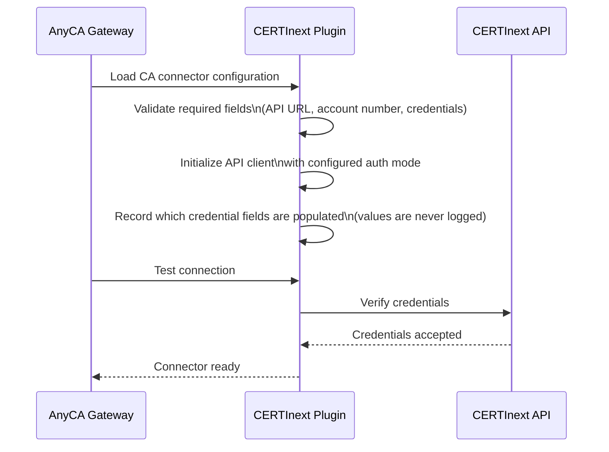
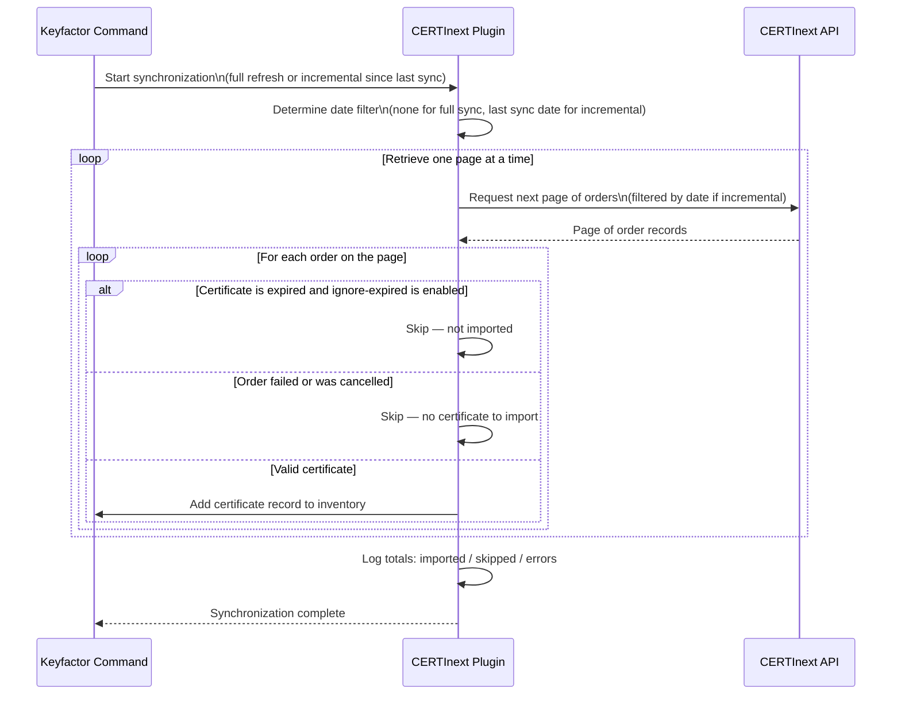
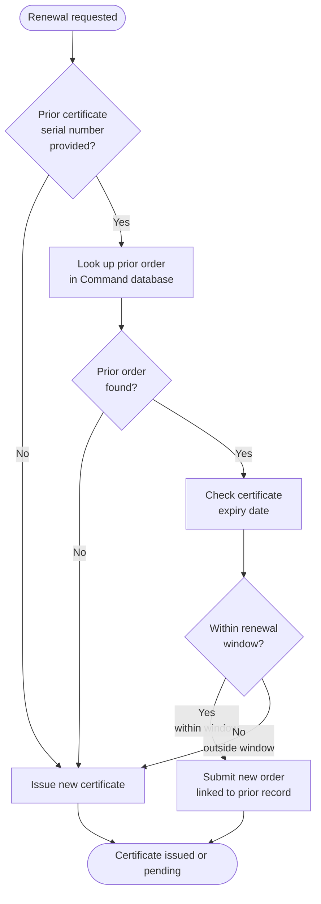
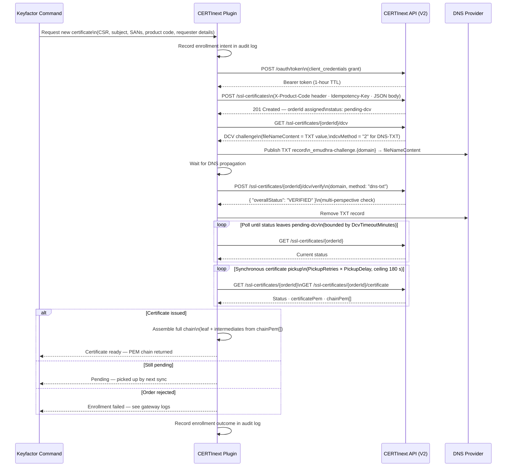
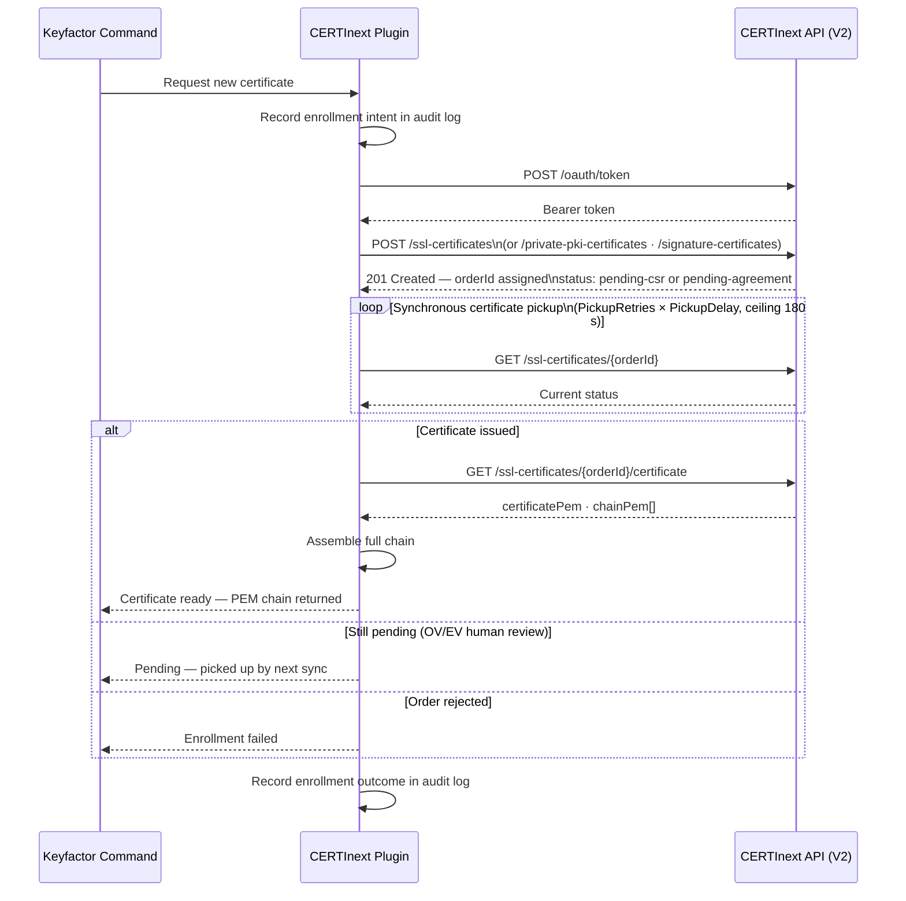
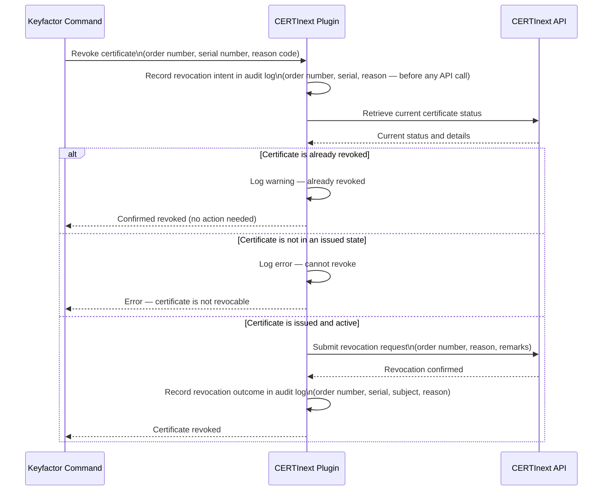
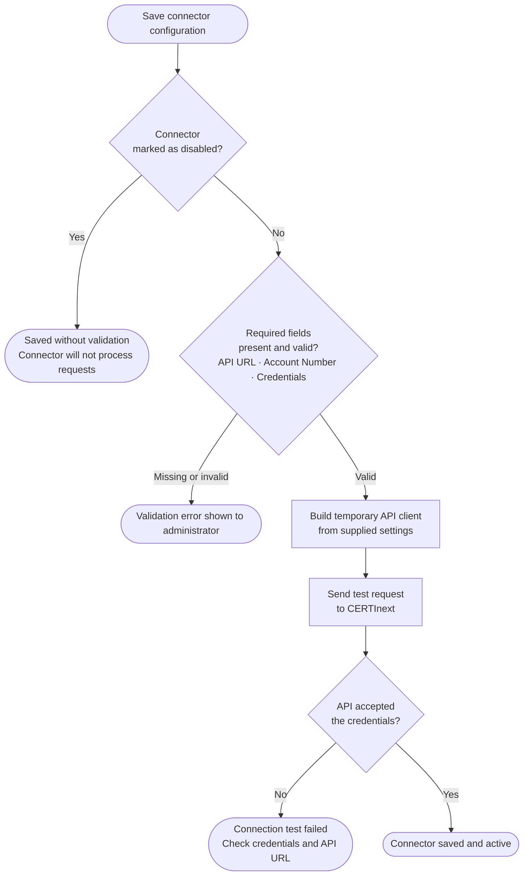

<h1 align="center" style="border-bottom: none">
    CERTInext AnyCA Gateway REST Plugin
</h1>

<p align="center">
  <!-- Badges -->

<a href="https://github.com/Keyfactor/certinext-caplugin/releases"></a>


</p>

<p align="center">
  <!-- TOC -->
  <a href="#support">
    <b>Support</b>
  </a>
  ·
  <a href="#requirements">
    <b>Requirements</b>
  </a>
  ·
  <a href="#installation">
    <b>Installation</b>
  </a>
  ·
  <a href="#license">
    <b>License</b>
  </a>
  ·
  <a href="https://github.com/orgs/Keyfactor/repositories?q=anycagateway">
    <b>Related Integrations</b>
  </a>
</p>

The CERTInext AnyCA Gateway REST plugin extends the certificate lifecycle capabilities of the CERTInext platform (by eMudhra) to Keyfactor Command via the Keyfactor AnyCA Gateway REST. The plugin represents a fully featured AnyCA REST plugin with the following capabilities:

* CA Synchronization:
    * Download all certificates issued through the CERTInext CA, either as a full inventory or incrementally since the last sync.
    * Expired certificates can optionally be excluded from synchronization using the `IgnoreExpired` configuration flag.
* Certificate Enrollment for profiles configured in CERTInext:
    * New certificate enrollment (new keys and certificate).
    * Certificate renewal — submits a new `GenerateOrderSSL` order when the prior certificate is within the configured renewal window (CERTInext has no dedicated renewal endpoint; the renewal-window check governs how Command tracks old→new, not which API is called).
    * Certificate reissuance (new keys with the same or updated subject/SANs) when outside the renewal window or no prior certificate is found.
    * Synchronous certificate pickup — a fast-issuing order (DV, or already-approved) can return the certificate in the same enrollment call instead of always waiting for the next sync, via `PickupRetries`/`PickupDelay`.
* Certificate Revocation:
    * Request revocation of a previously issued certificate using any RFC 5280 CRL reason code.
* Supported authentication modes for calls to the CERTInext API:
    * AccessKey (HMAC-based request signing) — the primary and recommended mode
    * OAuth (bearer token via client credentials flow)

## Compatibility

The CERTInext AnyCA Gateway REST plugin is compatible with the Keyfactor AnyCA Gateway REST 26.2.0 and later.

## Support
The CERTInext AnyCA Gateway REST plugin is supported by Keyfactor for Keyfactor customers. If you have a support issue, please open a support ticket via the Keyfactor Support Portal at https://support.keyfactor.com.

> To report a problem or suggest a new feature, use the **[Issues](../../issues)** tab. If you want to contribute actual bug fixes or proposed enhancements, use the **[Pull requests](../../pulls)** tab.

## Requirements

* Keyfactor Command 25.5.x or later
* AnyCA Gateway REST framework version 25.5.0 or later
* A CERTInext account with API access enabled and at least one certificate product configured
* Network connectivity from the AnyCA Gateway host to the CERTInext API endpoint for your region (see table below)
* The AnyCA Gateway host must trust the TLS certificate presented by the CERTInext API endpoint

### CERTInext Environments

CERTInext operates three separate environments. Use the sandbox environment for initial integration testing. Switch to a production environment only after all functionality has been verified.

| Environment | Portal Sign-in URL | API Base URL |
|---|---|---|
| Sandbox | https://sandbox-us.certinext.io/ | `https://sandbox-us-api.certinext.io/emSignHub-API/` |
| Production — India (Global) | https://in.certinext.io/ | `https://api.certinext.io/emSignHub-API/` |
| Production — US | https://us.certinext.io/ | `https://us-api.certinext.io/emSignHub-API/` |

> Note: Product codes differ between sandbox and production. Always confirm product codes from the GetProductDetails API call against the environment you are targeting before going live.

## Installation

1. Install the AnyCA Gateway REST per the [official Keyfactor documentation](https://software.keyfactor.com/Guides/AnyCAGatewayREST/Content/AnyCAGatewayREST/InstallIntroduction.htm).

2. On the server hosting the AnyCA Gateway REST, download and unzip the latest [CERTInext AnyCA Gateway REST plugin](https://github.com/Keyfactor/certinext-caplugin/releases/latest) from GitHub.

3. Copy the unzipped directory (usually called `net8.0` or `net10.0`) to the Extensions directory:


    ```shell
    Depending on your AnyCA Gateway REST version, copy the unzipped directory to one of the following locations:
    Program Files\Keyfactor\AnyCA Gateway\AnyGatewayREST\net8.0\Extensions
    Program Files\Keyfactor\AnyCA Gateway\AnyGatewayREST\net10.0\Extensions
    ```

    > The directory containing the CERTInext AnyCA Gateway REST plugin DLLs (`net8.0` or `net10.0`) can be named anything, as long as it is unique within the `Extensions` directory.

4. Restart the AnyCA Gateway REST service.

5. Navigate to the AnyCA Gateway REST portal and verify that the Gateway recognizes the CERTInext plugin by hovering over the ⓘ symbol to the right of the Gateway on the top left of the portal.

## Configuration

1. Follow the [official AnyCA Gateway REST documentation](https://software.keyfactor.com/Guides/AnyCAGatewayREST/Content/AnyCAGatewayREST/AddCA-Gateway.htm) to define a new Certificate Authority, and use the notes below to configure the **Gateway Registration** and **CA Connection** tabs:

    * **Gateway Registration**

        Before enrolling certificates, the Keyfactor Command server must trust the CERTInext issuing CA chain.
        
        1. Log in to the CERTInext portal and download the root CA certificate and any intermediate CA certificates in the chain as PEM or DER files.
        2. On the Keyfactor Command server, import those certificates into the appropriate Windows certificate store — **Trusted Root Certification Authorities** for the root CA and **Intermediate Certification Authorities** for any subordinate CAs.
        3. In the Keyfactor Command Management Portal, navigate to **CA Connectors** and add a new CA using the **CERTInext AnyCA REST Gateway Plugin**.
        4. Complete the CA connector configuration fields described in the next section, then save and test the connection. The gateway performs a live connectivity test against the CERTInext `ValidateCredentials` endpoint during validation.

    * **CA Connection**

        Populate using the configuration fields collected in the [requirements](#requirements) section.

        * **ApiUrl** - REQUIRED: CERTInext API base URL. Its meaning follows UseV2Api. V1 (default): Sandbox (US): https://sandbox-us-api.certinext.io/emSignHub-API/ — Production (US): https://us-api.certinext.io/emSignHub-API/ — Production (Global/India): https://api.certinext.io/emSignHub-API/. V2 (UseV2Api=true): the bare V2 host, e.g. https://sandbox-us-api.certinext.io, no trailing slash or path suffix — V1 and V2 are hosted differently, so this value changes when UseV2Api is toggled.
        * **AccountNumber** - REQUIRED: Your CERTInext account number (numeric string). Available in the CERTInext portal.
        * **GroupNumber** - OPTIONAL: CERTInext group (delegation) number. When set, it is included in GetProductDetails requests AND in the `delegationInformation.groupNumber` field of every SSL order so the order is routed to the correct account group. Some accounts will queue orders for additional review when this field is omitted. Available in the CERTInext portal under Delegation → Groups.
        * **OrganizationNumber** - STRONGLY RECOMMENDED for OV/EV and faster DV issuance: numeric CERTInext organization number for a pre-vetted organization (e.g. your company's pre-vetted entry). When set, every SSL order is submitted with `organizationDetails.preVetting="1"` and the configured `organizationNumber`, telling CERTInext to skip the manual organization-vetting queue. Without this value, orders are placed without any organizationDetails block and CERTInext may park them in `Pending System RA` for extended manual review (observed: tens of hours). Available in the CERTInext portal under Organizations → Pre-vetted Organizations.
        * **TechnicalContactName** - OPTIONAL: Name sent in the `technicalPointOfContact.tpcName` field of every SSL order. Defaults to the configured RequestorName when blank. Some product configurations require a TPoC to be present; omitting it can cause CERTInext to park orders awaiting manual completion of the field.
        * **TechnicalContactEmail** - OPTIONAL: Email sent in the `technicalPointOfContact.tpcEmail` field of every SSL order. Defaults to the configured RequestorEmail when blank.
        * **TechnicalContactIsdCode** - OPTIONAL: International dialing code for the TPoC phone number. Defaults to the configured RequestorIsdCode when blank.
        * **TechnicalContactMobileNumber** - OPTIONAL: Mobile number for the TPoC (digits only). Defaults to the configured RequestorMobileNumber when blank.
        * **AuthMode** - REQUIRED: Authentication mode. 'AccessKey' (default) — uses authKey = SHA256(accessKey + ts + txn) in every request body. 'OAuth' — uses an OAuth2 bearer token (requires OAuthTokenUrl, OAuthClientId, OAuthClientSecret).
        * **ApiKey** - REQUIRED when AuthMode is 'AccessKey': the REST API Access Key generated in the CERTInext portal under Integrations → APIs. This value is used to compute authKey = SHA256(accessKey + ts + txn); it is never transmitted directly.
        * **OAuthTokenUrl** - OAuth token endpoint URL. Required when AuthMode is 'OAuth'.
        * **OAuthClientId** - OAuth client ID. Required when AuthMode is 'OAuth' (V1). Also required, and reused, when UseV2Api is true — V2 authenticates with these same OAuthClientId/OAuthClientSecret fields via client_credentials against {ApiUrl}/oauth/token, rather than separate V2-only credentials.
        * **OAuthClientSecret** - OAuth client secret. Required when AuthMode is 'OAuth' (V1). Also required, and reused, when UseV2Api is true (see OAuthClientId).
        * **RequestorName** - REQUIRED: Default requestor name submitted with all certificate orders. This is the name of the person/service responsible for the certificates.
        * **RequestorEmail** - REQUIRED: Default requestor email submitted with all certificate orders. Must be a valid email address registered in your CERTInext account.
        * **RequestorIsdCode** - International dialing code for the requestor phone number (e.g. '1' for US). Default: '1'.
        * **RequestorMobileNumber** - Requestor mobile number (digits only, no country code).
        * **RequestorDesignation** - OPTIONAL: Job title / role of the requestor (e.g. 'IT Administrator'). Sent in V2 orders' `requestor.designation` field. Free text with no CA-side enum. Left blank by default, in which case the field is omitted entirely from the order rather than sent with a default value.
        * **SignerPlace** - City or location of the subscriber agreement signer (e.g. 'San Francisco, CA'). REQUIRED when UseV2Api is on: the V2 Subscriber Agreement sent with every SSL order requires it, so the connector cannot be saved with it blank. A per-template SignerPlace enrollment parameter overrides it.
        * **SignerIp** - IP address of the subscriber agreement signer. Required by CERTInext for all orders.
        * **DefaultProductCode** - OPTIONAL: Default numeric product code used when not specified at template level. Product codes are provided by eMudhra (e.g. the SSL DV 1-year code for your account). Retrieve available codes from Integrations → APIs → GetProductDetails.
        * **AccountingModel** - OPTIONAL: CERTInext billing model sent in `orderDetails.accountingModel`. "2" = credit-based (most accounts, default). "1" = cash model.
        * **EmailNotifications** - OPTIONAL: Whether CERTInext sends lifecycle-event emails to the requestor. "1" = full notification set (V1 sends it as-is; V2 maps it to "all"). "0" = silent on both V1 and V2 (V2 confirmed live 2026-09-28). Blank/unset stays silent on V1 (sent as "0") but is omitted on V2, so the CA's own default ("all", not silent) applies instead. Any other value fails V2 enrollment before any CA call. Default: "0" — V2 orders are now silent by default, matching V1 (previously V2 always sent "all").
        * **SubscriptionValidityYears** - OPTIONAL: Default validity in years for SSL orders. "1", "2", or "3". Override per template via the ValidityYears product parameter. Default: "1".
        * **SubscriptionAutoRenew** - OPTIONAL: Whether CERTInext should auto-renew certificates issued through this connector. "0" = disabled (recommended — renewal is driven by Keyfactor Command), "1" = enabled. Default: "0".
        * **SubscriptionRenewCriteriaDays** - OPTIONAL: Days before expiry at which CERTInext auto-renews (only honored when SubscriptionAutoRenew = "1"). Typical values: "30" or "60". Default: "30".
        * **AutoSecureWww** - OPTIONAL: If "1", CERTInext automatically adds the `www.` variant of the primary domain as an additional SAN. "0" = use only the CN/SANs supplied with the CSR. Default: "0".
        * **IgnoreExpired** - If true, expired certificates will be skipped during synchronization. Default: false.
        * **PageSize** - Number of orders to fetch per page during synchronization. Default: 100, max: 500.
        * **Enabled** - Enables or disables the CA connector. Set to false to create the connector record before credentials are available. Default: true.
        * **LogSensitiveRequestData** - OPTIONAL diagnostic escape hatch. When true, enabling it writes requestor personal data (name, email, phone, and other organization contact details) and full CA request/response payloads to the gateway logs. Meant for temporary use while verifying a new deployment — confirming exactly what was sent to the CA and that the order succeeded — and should be turned back off once verification is complete. When false (default), personal-data fields are redacted (email is masked but keeps its domain, e.g. 'j***@example.com') and the enrollment log line omits the requester name entirely. Email SAN values (rfc822Name) in log lines are masked the same way; DNS, IP and URI SANs are always logged in full. Credentials (API keys, OAuth secrets, tokens) are always redacted regardless of this setting. Default: false.
        * **DcvEnabled** - OPTIONAL: When true, the gateway will perform DNS-based Domain Control Validation (DCV) during enrollment for orders that require it, using the configured DNS provider plugin. Requires a DNS provider plugin (e.g. azure-azuredns-dnsplugin) to be deployed on the gateway. Default: true.
        * **DcvTxtRecordTemplate** - OPTIONAL: Format string for the DNS TXT record hostname used during DCV. {0} is replaced with the domain name being validated. Default: _emsign-validation.{0}
        * **DcvPropagationDelaySeconds** - OPTIONAL: Seconds to wait after publishing the DNS TXT record before asking CERTInext to verify it. Increase for zones with slow propagation. Default: 30.
        * **DcvTimeoutMinutes** - OPTIONAL: Maximum minutes to wait for the entire DCV flow (DNS publish + propagation + verify) before timing out the enrollment. Can also be set via the CERTINEXT_DCV_TIMEOUT_MINUTES environment variable; the env var takes precedence when both are set. Default: 10.
        * **DcvWaitForChallengeSeconds** - OPTIONAL: How long (seconds) the plugin will wait inside Enroll() for CERTInext to expose the DCV challenge (i.e. populate `domainVerification` in TrackOrder). Under concurrent load CERTInext sometimes takes a few seconds after GenerateOrderSSL before the slot appears. Without this wait, the plugin's initial TrackOrder check sees null and skips DCV — the order then has to wait for the next gateway sync cycle to be picked up. Setting to 0 disables the wait (single-check behaviour). Can also be set via the CERTINEXT_DCV_WAIT_FOR_CHALLENGE_SECONDS environment variable; the env var takes precedence when both are set. Default: 60.
        * **DcvWaitForIssuanceSeconds** - OPTIONAL: How long (seconds) the plugin will wait inside Enroll() after DCV verifies for CERTInext to finish generating the certificate. CERTInext issuance is async — DCV may be verified but the cert PEM isn't yet available for download. Without this wait, Enroll() returns a pending result and the issued cert is picked up by the next sync cycle. Setting to 0 disables the wait (single-fetch behaviour). Can also be set via the CERTINEXT_DCV_WAIT_FOR_ISSUANCE_SECONDS environment variable; the env var takes precedence when both are set. Default: 60.
        * **DcvSyncMaxOrderAgeHours** - OPTIONAL: During synchronization, only pending DV orders younger than this many hours are eligible to be driven through DCV. This keeps a sync pass fast when there is a large backlog of old, never-completing pending orders (e.g. abandoned orders or domains outside the configured DNS provider's zone): they age out and are simply reported as pending rather than retried every pass. Recently-placed orders (the ones that legitimately deferred DCV) are always within the window and complete via the normal scan cadence. Set to 0 to disable the age filter (attempt DCV for all pending). Default: 24.
        * **DcvSyncMaxPerPass** - OPTIONAL: Maximum number of pending DV orders the plugin will attempt to drive through DCV in a single synchronization pass. Bounds the per-pass cost regardless of backlog size; remaining pending orders are reported as-is and picked up on a later pass (the per-minute incremental scan keeps recent orders moving). Set to 0 to disable the cap. Default: 50.
        * **UseV2Api** - OPTIONAL: When true, the plugin routes Enroll / GetSingleRecord / Revoke / Synchronize through the CERTInext V2 REST API (/api/certinext/v2/), including V2 /reports/orders for Synchronize. Requires ApiUrl (the V2 base URL in this mode) plus OAuthClientId and OAuthClientSecret. V1 credentials (ApiKey/AccountNumber/AuthMode) are not required when this is true. Default: false (V1 API).
        * **V2SyncLookbackHours** - OPTIONAL (V2 mode only): during an incremental Synchronize, the plugin queries V2 /reports/orders with a 'from' date of (lastSync minus this many hours) rather than exactly lastSync, since live probing could not confirm whether the API's from/to filter brackets order-placement date or issuance date. A lookback window ensures an order created before lastSync but issued afterward (e.g. a slow DCV order) still surfaces on the next incremental pass. Ignored when UseV2Api is false. Default: 72.

2. A Keyfactor Command certificate template maps an enrollment request to a specific CERTInext product. Create one template per CERTInext product that you want to make available to requesters.

In the Keyfactor Command Management Portal, navigate to **Certificate Templates** and create a new template associated with the CERTInext CA connector. The following enrollment parameters are available:

| Parameter | Required / Optional | Type | Description | Example / Default |
|---|---|---|---|---|
| `ProductCode` | Optional | String | Override the numeric CERTInext product code for this template. Product codes are provisioned per account by eMudhra — obtain the correct code from `GetProductDetails` for your account. If omitted, the built-in default code for the selected product name is used (see [Product Codes](#product-codes)). Set this explicitly when targeting the sandbox environment or a non-standard code. | DV SSL: `842` (sandbox) or `838` (production) |
| `ProfileId` | Deprecated | String | Legacy alias for `ProductCode`. Accepted for backward compatibility — if `ProductCode` is not set, `ProfileId` is used in its place. New templates should use `ProductCode`. | `838` |
| `ValidityYears` | Optional | Number | Subscription validity period in years: `1`, `2`, or `3`. Default: `1`. CERTInext certificates are issued within a subscription term at up to 390 days per certificate, with free renewals within the term. | `1` |
| `ValidityDays` | Deprecated | Number | Legacy validity field. If set, the value is divided by 365 and rounded up to derive a year count. New templates should use `ValidityYears`. | `365` |
| `AutoApprove` | Optional | Boolean | **Currently has no effect** — reserved for future use. The plugin does not call any approval endpoint against CERTInext regardless of this setting. See [issue tracking this](https://github.com/Keyfactor/certinext-caplugin/issues/25). | `false` |
| `RequesterName` | Optional | String | Per-template override for the requestor name. When set, overrides the connector-level `RequestorName` for orders using this template. | `Keyfactor Automation` |
| `RequesterEmail` | Optional | String | Per-template override for the requestor email address. When set, overrides the connector-level `RequestorEmail` for orders using this template. | `pki-admin@example.com` |
| `RenewalWindowDays` | Optional | Number | Number of days before certificate expiration within which a renewal is attempted instead of a reissue. Default: `90`. | `90` |
| `KeyType` | Optional | String | Key algorithm to request at enrollment time. The key type is carried by the submitted CSR. CERTInext accepts **RSA 2048 / 3072 / 4096 and ECC P-256 / P-384** only — larger RSA, ECC P-521, and the Ed25519/Ed448 curves are rejected by the CA (`Invalid key size`). If omitted, the product default is used. | `RSA2048`, `RSA3072`, `RSA4096`, `EC256`, `EC384` |
| `DomainName` | Optional | String | Primary domain name for SSL/TLS orders. If omitted, the gateway derives the domain from the CSR `CN` field. | `example.com` |
| `SignerName` | Optional | String | Per-template override for the subscriber agreement signer name. When omitted, defaults to the connector-level `RequestorName`. | `Jane Smith` |
| `SignerPlace` | Optional | String | Per-template override for the subscriber agreement signer location. When omitted, defaults to the connector-level `SignerPlace`. | `Austin` |
| `SignerIp` | Optional | String | Per-template override for the subscriber agreement signer IP address. When omitted, defaults to the connector-level `SignerIp`. | `203.0.113.10` |

3. Follow the [official Keyfactor documentation](https://software.keyfactor.com/Guides/AnyCAGatewayREST/Content/AnyCAGatewayREST/AddCA-Keyfactor.htm) to add each defined Certificate Authority to Keyfactor Command and import the newly defined Certificate Templates.

4. In Keyfactor Command (v12.3+), for each imported Certificate Template, follow the [official documentation](https://software.keyfactor.com/Core-OnPrem/Current/Content/ReferenceGuide/Configuring%20Template%20Options.htm) to define enrollment fields for each of the following parameters:

    * **ProductCode** - OPTIONAL: Override the numeric CERTInext product code for this template. When omitted, the default production code for the selected product is used automatically (e.g. DV SSL → 838). Set this explicitly when targeting sandbox or a non-standard code.
    * **ProfileId** - DEPRECATED: Use ProductCode instead. Kept for backward compatibility — mapped to ProductCode if ProductCode is not set.
    * **ValidityYears** - OPTIONAL: Subscription validity in years: 1, 2, or 3. Default: 1. Note: CERTInext validates per 390-day certificate within the subscription; the 'validity' field in the order is the subscription term, not certificate lifetime.
    * **ValidityDays** - DEPRECATED: Use ValidityYears instead. If set, value is divided by 365 and rounded up to get the subscription year count.
    * **AutoApprove** - OPTIONAL: If true, the gateway will attempt automatic approval of certificates that are returned in a pending-approval state. Default: false.
    * **RequesterName** - OPTIONAL: Default requester name to include in the enrollment request. Used when no requester name can be derived from the subject.
    * **RequesterEmail** - OPTIONAL: Default requester email address. Used when no email can be derived from the subject.
    * **RenewalWindowDays** - OPTIONAL: Number of days before certificate expiration within which a renewal is triggered. Certificates expiring further than this window are reissued instead. Certificates that have already expired also fall back to reissue. Default: 90.
    * **KeyType** - OPTIONAL: Key algorithm to request (e.g. 'RSA2048', 'RSA4096', 'EC256', 'EC384'). If omitted, the profile default is used.
    * **DomainName** - OPTIONAL: Primary domain for SSL/TLS orders (for V2 private-pki orders, the primary hostname). Derived from the CSR CN if omitted.
    * **SignerName** - OPTIONAL: Per-template subscriber agreement signer name. Falls back to the connector-level RequestorName if omitted.
    * **SignerPlace** - OPTIONAL: Per-template signer city/location. Falls back to the connector-level SignerPlace if omitted.
    * **SignerIp** - OPTIONAL: Per-template signer IP address. Falls back to the connector-level SignerIp if omitted.

## CERTInext API Setup

### AccessKey (HMAC) — the primary auth mode

The CERTInext REST API uses HMAC-style request signing. Every API call includes a computed `authKey` field in the request body. The access key itself is never transmitted — only the derived hash is sent.

The `authKey` is computed as:

```
authKey = SHA256(accessKey + requestTs + requestTxnId)
```

Where `requestTs` is the ISO 8601 timestamp of the request and `requestTxnId` is the unique transaction ID generated per request. The gateway performs this computation automatically on every outbound API call.

**Steps to generate an Access Key:**

1. Log in to the CERTInext portal for your environment (e.g. https://in.certinext.io).
2. Navigate to **Integrations → APIs**.
3. Click **+ Create API Credentials** at the top right of the page.
4. In the dialog, fill in the following fields:
    - **API Type**: Select `REST`.
    - **Description**: Enter a descriptive label, such as `keyfactor-gateway`.
    - **User**: Select the CERTInext user account this credential will be associated with.
    - **Auth Type**: Select `Access Key`.
5. Click **Generate**.
6. In the confirmation dialog, copy the displayed Access Key immediately. This is the only time the key is shown in plaintext.
7. Confirm that the new credential row appears in the APIs list with status **Active** before proceeding.

Enter the copied value in the `ApiKey` field of the CA connector configuration. The field is masked in the Keyfactor Command UI and stored in Command's encrypted gateway configuration.

### OAuth — alternative auth mode

If your CERTInext account has OAuth enabled, you can use OAuth client credentials as an alternative to AccessKey signing.

1. Log in to the CERTInext portal.
2. Navigate to **Integrations → APIs**.
3. Click **+ Create API Credentials**.
4. Set **API Type** to `REST` and **Auth Type** to `OAuth`.
5. Complete the form and click **Generate**.
6. Note the **Client ID** and **Client Secret**. Enter them in the `OAuthClientId` and `OAuthClientSecret` fields respectively.
7. Confirm the OAuth token endpoint URL with eMudhra and enter it in the `OAuthTokenUrl` field.
8. Set the `AuthMode` connector field to `OAuth`.

> Note: Credentials are stored in Keyfactor Command's encrypted gateway configuration and are never written to disk by the plugin.

## CA Configuration

The following fields are presented in the Keyfactor Command Management Portal when creating or editing the CERTInext CA connector.

> Note: the connector's own save-time validation only enforces `ApiUrl`, `AccountNumber`, and the credential fields for the selected `AuthMode`. Other fields marked **Required** below are required by CERTInext for a successful order — the connector will save without them, but enrollment will fail or the order will be parked pending until they're set.

| Field | Required / Optional | Description | Where to find it | Example |
|---|---|---|---|---|
| `ApiUrl` | Required | CERTInext API base URL. In V1 mode (default), must include the `/emSignHub-API/` path segment. When `UseV2Api` is `true` (see [V2 API](#v2-api-preview) below), this is instead the bare V2 host with no trailing slash or path suffix — the two APIs are hosted differently, so this value changes when `UseV2Api` is toggled. Must use `https` — the OAuth client secret (V2) or API key (V1) is sent to this URL on every request, and `http` would transmit it in cleartext. `http` is rejected at connection-validation time except for a loopback host (`localhost`/`127.0.0.1`/`::1`), which is allowed for local test servers only. | See the environments table above. | `https://api.certinext.io/emSignHub-API/` |
| `AccountNumber` | Required | Your CERTInext account number (numeric string). Included in the `meta` block of every API request. | Portal → click your name or avatar → **Account Settings** or **My Profile**. | `1234567890` |
| `AuthMode` | Required | Authentication mode. `AccessKey` uses HMAC signing (recommended). `OAuth` uses a bearer token. | N/A — choose based on the credential type you created. | `AccessKey` |
| `ApiKey` | Conditional | The REST API Access Key generated in the CERTInext portal. Used to compute `authKey = SHA256(accessKey + ts + txn)`. The raw key is never transmitted. Required when `AuthMode` is `AccessKey`. This field is masked in the UI. | Portal → **Integrations → APIs** → generate or view the credential row. | *(generated, masked in UI)* |
| `OAuthTokenUrl` | Conditional | OAuth token endpoint URL. Required when `AuthMode` is `OAuth`. | Provided by eMudhra for your account. | `https://auth.certinext.io/oauth/token` |
| `OAuthClientId` | Conditional | OAuth client ID. Required when `AuthMode` is `OAuth` (V1). Also required — and reused as-is — when `UseV2Api` is `true`; V2 does not have its own separate client ID field. | Portal → **Integrations → APIs** → the OAuth credential row. | `keyfactor-gateway` |
| `OAuthClientSecret` | Conditional | OAuth client secret. Required when `AuthMode` is `OAuth` (V1). Also required — and reused as-is — when `UseV2Api` is `true`. This field is masked in the UI. | Generated at OAuth credential creation time. | *(generated, masked in UI)* |
| `RequestorName` | Required | Default name of the person or service submitting certificate orders. Sent in the `requestorInformation` block of every order request. | Use the name of the team or automation account responsible for these certificates. | `PKI Automation` |
| `RequestorEmail` | Required | Default email address for the requestor. Must be a valid email address associated with your CERTInext account. Sent in the `requestorInformation` block of every order request. | Use a monitored team inbox or the account holder's email. | `pki-admin@example.com` |
| `RequestorIsdCode` | Optional | International dialing code for the requestor phone number (digits only, no `+` prefix). Default: `1` (United States). | N/A — use the country code for your requestor. | `1` |
| `RequestorMobileNumber` | Optional | Requestor mobile number (digits only, no country code). Included in the `requestorInformation` block. | N/A | `5551234567` |
| `RequestorDesignation` | Optional | Job title / role of the requestor (e.g. `IT Administrator`). Sent in the `requestorInformation` block (V1) and the `requestor.designation` field (V2 mode). Free text with no CA-side enum. Left blank by default, in which case the field is omitted from the order entirely rather than sent with a default value. | N/A | `IT Administrator` |
| `SignerPlace` | Required | City or location of the person accepting the subscriber agreement on behalf of your organization. Required by CERTInext for all orders. When `UseV2Api` is `true` the connector can't be saved with this blank, because the V2 Subscriber Agreement sent with every SSL order requires it (a template's `SignerPlace` enrollment parameter still overrides it). | Use the physical city where the signer is located. | `Austin` |
| `SignerIp` | Required | Public IP address of the host accepting the subscriber agreement. Required by CERTInext for all orders. | Use the outbound IP of the AnyCA Gateway host, or the IP of the workstation from which the agreement was accepted. | `203.0.113.10` |
| `GroupNumber` | Optional | CERTInext group (delegation) number. When set, it is passed in the `productDetails.groupNumber` field of `GetProductDetails` requests *and* in `delegationInformation.groupNumber` on every SSL order. Some sandbox accounts return an empty product list from `GetProductDetails` unless this field is included. Available in the CERTInext portal under **Delegation → Groups**. | Portal → **Delegation → Groups**. | `2345678901` |
| `OrganizationNumber` | Optional, strongly recommended for OV/EV and faster DV | Numeric CERTInext organization number for a pre-vetted organization. When set, every SSL order is submitted with `organizationDetails.preVetting="1"` and this number, telling CERTInext to skip its manual organization-vetting queue. Without it, orders may sit in `Pending System RA` for extended manual review (observed: tens of hours). | Portal → **Organizations → Pre-vetted Organizations**. | `1234567` |
| `TechnicalContactName` / `TechnicalContactEmail` / `TechnicalContactIsdCode` / `TechnicalContactMobileNumber` | Optional | Populate `technicalPointOfContact` on every SSL order. Each defaults to the corresponding `Requestor*` field when blank. Some product configurations require a technical point of contact to be present; omitting it can cause CERTInext to park orders awaiting manual completion of the field. | N/A | *(defaults to Requestor fields)* |
| `AccountingModel` | Optional | CERTInext billing model sent in `orderDetails.accountingModel`. `2` = credit-based (most accounts). `1` = cash model. Default: `2`. | N/A | `2` |
| `EmailNotifications` | Optional | Whether CERTInext sends lifecycle-event emails to the requestor. `1` = full notification set (V1 sends it as-is; V2 maps it to `all`). `0` = silent on both V1 and V2 (V2 confirmed live 2026-09-28). Blank/unset stays silent on V1 (sent as `0`) but is omitted on V2, so the CA's own default (`all`, not silent) applies instead. Any other value fails V2 enrollment before any CA call. Default: `0` — V2 orders are now silent by default, matching V1 (previously V2 always sent `all`). | N/A | `0` |
| `SubscriptionValidityYears` | Optional | Connector-level default validity in years for SSL orders (`1`, `2`, or `3`). Overridden per template by the `ValidityYears` enrollment parameter. Default: `1`. | N/A | `1` |
| `SubscriptionAutoRenew` | Optional | Whether CERTInext should auto-renew certificates issued through this connector. `0` = disabled (recommended — renewal is driven by Keyfactor Command), `1` = enabled. Default: `0`. | N/A | `0` |
| `SubscriptionRenewCriteriaDays` | Optional | Days before expiry at which CERTInext auto-renews. Only honored when `SubscriptionAutoRenew` is `1`. Default: `30`. | N/A | `30` |
| `AutoSecureWww` | Optional | If `1`, CERTInext automatically adds the `www.` variant of the primary domain as an additional SAN. Default: `0`. | N/A | `0` |
| `SubmitNonDnsSans` | Optional | If `true` (default), SANs that aren't DNS names (IP address, email, URI) are submitted to CERTInext instead of silently dropped. CERTInext can't validate them, so such an order won't issue until they're removed. Set to `false` to restore the pre-1.0.1 behavior of submitting DNS names only. Default: `true`. | N/A | `true` |
| `DefaultProductCode` | Optional, but effectively required if you use renewals (V1), or ProductId-only templates against an ambiguous V2 catalog | **V1 mode:** used for renewals only — CERTInext's `TrackOrder` doesn't return the prior order's product code, so the renewal path sends this value verbatim, ignoring the template's `ProductCode`/`ProfileId`. If left blank, renewals go out with an empty product code. Has no effect on new V1 enrollments. **V2 mode:** also used to disambiguate a template that sets only `ProductId` (no explicit `ProductCode`) when the live V2 catalog has more than one product sharing the product's expected assurance level — if this value doesn't match one of the candidate codes, that enrollment (and template save-time validation) fails with an error listing them. See [issue tracking the V1 renewal behavior](https://github.com/Keyfactor/certinext-caplugin/issues/26). | Call `GetProductDetails` against your account/environment (see product code table below). | `842` |
| `IgnoreExpired` | Optional | If `true`, expired certificates are skipped during synchronization and are not imported into Keyfactor Command. Default: `false`. | N/A | `false` |
| `PageSize` | Optional | Number of orders to retrieve per page during synchronization. Default: `100`. Maximum: `500`. Reduce this value if synchronization requests time out. | N/A | `100` |
| `Enabled` | Optional | Enables or disables the CA connector. Setting this to `false` allows the connector record to be created before all credentials are available, without triggering a live connectivity test. Default: `true`. | N/A | `true` |
| `LogSensitiveRequestData` | Optional | **Diagnostic escape hatch — off by default.** When `true`, this writes requestor personal data (name, email, phone, and other organization contact details) and full CA request/response payloads to the gateway logs. It's meant for temporary use while verifying a new deployment (confirming exactly what was sent to the CA and that the order succeeded) — turn it back off once verification is complete. When `false` (default), personal-data fields are redacted (email is masked but keeps its domain, e.g. `j***@example.com`) and the enrollment log line omits the requester name entirely. Email SAN values (rfc822Name) in log lines are masked the same way; DNS, IP and URI SANs are always logged in full. Credentials (API keys, OAuth secrets, tokens) are always redacted regardless of this setting. Default: `false`. | N/A | `false` |
| `PickupRetries` | Optional | Number of times `Enroll` polls CERTInext for the certificate after a successful order submission, before returning pending and leaving pickup to the next sync. Set to `0` to disable the wait entirely. OV/EV orders validate asynchronously (minutes to hours) and typically exhaust this wait regardless of the value. Default: `5`. | N/A | `5` |
| `PickupDelay` | Optional | Seconds between certificate-pickup retries. The total pickup budget is a fixed 5-second initial delay + (`PickupRetries` × `PickupDelay`), hard-capped at 180 seconds regardless of how the two values are set. Aim for well under ~90s total so the call doesn't run long enough to trip Command's own enrollment timeout. Default: `10` (a ~55s ceiling with default `PickupRetries`). | N/A | `10` |

> **Pickup timing detail:** after a successful order placement, the plugin waits a fixed 5-second initial delay before the first poll attempt, then polls CERTInext every `PickupDelay` seconds up to `PickupRetries` times. Each poll calls `GetCertificate` to check whether the certificate has been issued. The total time budget is: **5s + (PickupRetries × PickupDelay) + API round-trip time per poll (~1s each)**. With defaults this is approximately 5 + (5 × 10) + 5 = **~60 seconds**.
>
> **Tuning for faster pickup:** if the CERTInext API typically issues certificates within a few seconds of order placement (as observed with DV and auto-approved orders), you can reduce per-enrollment wait time by lowering `PickupDelay` and raising `PickupRetries` to compensate — this polls more frequently without changing the total budget. For example:
>
> | Configuration | PickupRetries | PickupDelay | Total budget | Poll cadence |
> |---------------|:---:|:---:|---|---|
> | Default | `5` | `10` | ~55s | Every 10s |
> | Faster polling | `10` | `5` | ~55s | Every 5s |
> | Aggressive | `50` | `1` | ~55s | Every 1s |
> | Minimal wait | `0` | — | 0s | No polling; defers to sync |
>
> The 5-second initial delay before the first poll is not configurable. The 180-second hard ceiling applies regardless of configuration.
| `DcvEnabled` | Optional | When `true`, the gateway performs DNS-based Domain Control Validation (DCV) during enrollment for orders that require it. Requires a DNS provider plugin (e.g. `azure-azuredns-dnsplugin`) to be deployed on the gateway. Default: `true`. | N/A | `true` |
| `DcvTxtRecordTemplate` | Optional | Format string for the DNS TXT record hostname published during DCV. `{0}` is replaced with the domain being validated. Default: `_emsign-validation.{0}`. | N/A | `_emsign-validation.{0}` |
| `DcvPropagationDelaySeconds` | Optional | Seconds to wait after publishing the DNS TXT record before asking CERTInext to verify it. Increase for zones with slow propagation. Applies only to the `Enroll()`-time DCV path — DCV driven during sync uses its own fixed 3-second delay. Default: `30`. | N/A | `30` |
| `DcvTimeoutMinutes` | Optional | Maximum minutes to wait for the entire DCV flow (DNS publish + propagation + verify) before cancelling the enrollment. Can also be set via the `CERTINEXT_DCV_TIMEOUT_MINUTES` environment variable; the environment variable takes precedence when both are set. Default: `10`. | N/A | `10` |
| `DcvWaitForChallengeSeconds` | Optional | How long `Enroll()` waits for CERTInext to expose the DCV challenge after order placement, before giving up and deferring to the next sync. Set to `0` to disable the wait. Can also be set via `CERTINEXT_DCV_WAIT_FOR_CHALLENGE_SECONDS`. Default: `60`. | N/A | `60` |
| `DcvWaitForIssuanceSeconds` | Optional | How long `Enroll()` waits for CERTInext to finish generating the certificate after DCV verifies. Set to `0` to disable the wait. Can also be set via `CERTINEXT_DCV_WAIT_FOR_ISSUANCE_SECONDS`. Default: `60`. | N/A | `60` |
| `DcvSyncMaxOrderAgeHours` | Optional | During synchronization, only pending DV orders younger than this many hours are driven through DCV, so a large backlog of old/abandoned pending orders doesn't slow down every sync pass. Set to `0` to disable the age filter. Default: `24`. | N/A | `24` |
| `DcvSyncMaxPerPass` | Optional | Maximum number of pending DV orders driven through DCV in a single sync pass. Set to `0` to disable the cap. Default: `50`. | N/A | `50` |

> Note: `AccountNumber` and group-level identifiers are distinct values. The `AccountNumber` is your top-level user account identifier. CERTInext groups (cost centers or departments) each have their own `groupNumber`, which is passed per-order and is separate from any organization number displayed on the Organizations page.

> Note: Only the credential fields that correspond to the selected `AuthMode` are evaluated at runtime. Fields belonging to the other auth mode are ignored.

## Product Codes

CERTInext uses numeric product codes to identify certificate types. **Product codes are provisioned per account by eMudhra** — the codes available to your account are determined when your account is set up. The codes in the tables below are the values observed on specific sandbox and production accounts; your account may have different codes.

To retrieve the exact codes available to your account, call the `GetProductDetails` endpoint:
- If you have a `GroupNumber` configured, include it in the request `productDetails` block — some accounts require this to return a non-empty list.
- Use the `make get-product-details-group` Makefile target to retrieve products from the sandbox with `groupNumber` included.

> Note: Product codes differ between the sandbox and production environments. Always verify the correct code before switching environments.

> Note: Product codes are per-account. If you receive "Invalid Product Code" (EMS-1162) when placing an order, your account does not have that product provisioned. Contact your eMudhra account representative to request provisioning of the product codes you need.

### SSL/TLS

The product codes in this table were observed on:
- the US sandbox environment (`sandbox-us-api.certinext.io`) in April–May 2026
- the Production India environment (`api.certinext.io`) via the live draft-order coverage matrix in [development.md](development.md)

**Your account may still have different codes.** Always call `GetProductDetails` against your target environment before going live.

| Product | Sandbox Code | Production Code | Required fields beyond base (`domainName`, `csr`, `requestorInformation`, `subscriptionDetails`, `agreementDetails`) |
|---|---|---|---|
| DV (Domain Validated) | `842` | `838` | None. `domainName` is derived from the CSR CN if omitted on the template. |
| DV Wildcard | `843` | `839` | CSR CN must use wildcard format (e.g. `*.example.com`). `domainName` in the order must also use the wildcard format. |
| DV UCC (Multi-domain) | `844` | `840` | `certificateInformation.additionalDomains` — array of additional SAN values beyond the primary `domainName`. |
| DV Wildcard UCC (Multi-domain Wildcard) | `845` | `841` | Combines wildcard and multi-domain requirements. CSR CN and `domainName` must use wildcard format; `certificateInformation.additionalDomains` required. |
| OV (Organization Validated) | `846` | `842` | `organizationDetails.organizationNumber` (your CERTInext org ID); `certificateInformation.locality`, `postalCode`, and full organization address fields (`streetAddress`, `city`, `state`, `country`). |
| OV Wildcard | `847` | `843` | Same as OV. CSR CN and `domainName` must use wildcard format. |
| OV UCC (Multi-domain) | `848` | `844` | Same as OV plus `certificateInformation.additionalDomains`. |
| OV Wildcard UCC (Multi-domain Wildcard) | `849` | `845` | Combines OV, wildcard, and multi-domain requirements. Same as OV plus wildcard CN/domainName and `certificateInformation.additionalDomains`. |
| EV (Extended Validation) | `850` | `846` | All OV fields plus: `contractSignerInfo` object (`name`, `email`, `isdCode`, `mobileNumber`, `designation`, `employeeID`); `certificateApproverInfo` object (same fields); `certificateInformation.companyRegistrationNumber`; `streetAddress2` must be non-empty. |
| EV UCC (Multi-domain EV) | `851` | `847` | Same as EV plus `certificateInformation.additionalDomains`. |

> Note: SSL/TLS codes appear to be offset by 4 between the US sandbox and Production India in the snapshots we've observed — but treat that as a coincidence, not a guarantee. eMudhra controls the per-account mapping and may use different numeric codes for any new account. Always confirm via `GetProductDetails`.

> Note: The CERTInext portal may display additional short-validity products (e.g. **DV SSL Certificate 1 Month**, **DV SSL Certificate Wildcard 1 Month**) that do not appear in the `GetProductDetails` API response and have no published product code. These products are not accessible via the API and are therefore **not supported by this plugin**. Contact eMudhra to determine whether API ordering is available for these products on your account.

### Private PKI

| Product | Sandbox Code | Production Code | Availability |
|---|---|---|---|
| emSign Intranet SSL 1 year | `149` | `100` | Requires special provisioning by eMudhra. Not orderable on standard accounts. |
| IGTF Host 1 year | (not observed) | `104` | Requires special provisioning by eMudhra. Not orderable on standard accounts. |

> Note: Private PKI products need a separate entitlement. On an account without it, placing an order returns EMS-1162 (product not provisioned). Contact eMudhra to have these products enabled. An earlier V1 note recorded the sandbox code `149` returning EMS-1162. More recently, a read-only V2 catalog check on the plugin's sandbox account (2026-09-25) listed `149` ("Sandbox emSign Intranet SSL 1 Year", `productTypeID` `39`) as active. No order has been placed against it, so it's unconfirmed whether a V2 order for it is accepted. Check your own account's catalog rather than relying on either observation.

### S/MIME and Document Signing

The same numeric product codes have been observed for S/MIME and document-signing products on both the US sandbox and Production India in the snapshots we have. **Treat that as an empirical observation, not a contract** — eMudhra is free to assign different codes per account. Always confirm via `GetProductDetails`.

| Product | Sandbox / Production Code | Availability |
|---|---|---|
| S/MIME | `894` | Requires a separate S/MIME entitlement on the account. Not available on standard SSL accounts. |
| Document Signer | `819`–`827` | Requires document signing entitlement. Not orderable on standard accounts. See the code-to-product table below. |

The two CERTInext references disagree on which Document Signer code is which product. The V2 API
spec's Product Codes table lists `819`–`821` as Natural Person and `825`–`827` as Legal Entity. The
earlier V1 Postman collection this table was first built from listed them the other way round. Both
list `822`–`824` as Legal Person. Neither mapping has been checked against a live catalog, so confirm
the product name for each code in your account's catalog before you use one.

| Code | V2 API spec | Earlier V1 Postman collection |
|---|---|---|
| `819` / `820` / `821` | Natural Person, 1 / 2 / 3 year | Legal Entity, 1 / 2 / 3 year |
| `822` / `823` / `824` | Legal Person, 1 / 2 / 3 year | Legal Person, 1 / 2 / 3 year |
| `825` / `826` / `827` | Legal Entity, 1 / 2 / 3 year | Natural Person, 1 / 2 / 3 year |

> Note: S/MIME (894) and document signing products (819–827) require a separate entitlement that is not included in a standard SSL/TLS account. Contact eMudhra to request access.

To retrieve the full list of product codes available to your account, call the `GetProductDetails` endpoint against your target environment. The sandbox and production APIs each return their own set of codes.

> Note: SSL/TLS products are supported on standard accounts — see the SSL/TLS table above for the exact sandbox/production code pair for each product. Private PKI (Production `100`, `104` / Sandbox `149`), S/MIME (`894`), and document-signing products (`819`–`827`) require special provisioning by eMudhra and are not available on standard SSL/TLS accounts — ordering them returns EMS-1162.

## V2 API (Preview)

The plugin includes an opt-in CERTInext V2 REST API code path that uses modern OAuth2 `client_credentials` authentication and a new order-centric resource model. V2 is disabled by default; V1 remains the active path unless `UseV2Api` is explicitly set to `true`. When enabled, V2 is fully self-contained: Enroll, GetSingleRecord, Revoke, and Synchronize all route through the V2 API, and V1 credentials (`ApiKey`, `AccountNumber`, `AuthMode`) are not required.

### V2 CA Connector Fields

V2 mode reuses the connector's `ApiUrl`, `OAuthClientId`, and `OAuthClientSecret` fields (documented above) rather than separate V2-only credentials — `ApiUrl` becomes the V2 host and `OAuthClientId`/`OAuthClientSecret` authenticate against it, regardless of `AuthMode`. Only the fields below are specific to V2 mode:

| Field | Required / Optional | Description | Example |
|---|---|---|---|
| `UseV2Api` | Optional | Enable the V2 API code path for enrollment, revocation, status checks, and synchronization. Default: `false`. | `false` |
| `V2SyncLookbackHours` | Optional | V2 mode only. During an incremental Synchronize, the plugin queries `from` = (last sync time minus this many hours) rather than the exact last-sync time, since it's not confirmed whether the API's `from`/`to` filter brackets order-placement date or issuance date — a lookback window keeps an order created before last sync but issued afterward (e.g. a slow DCV order) from being missed. Default: `72`. | `72` |

#### V2 OAuth2 Setup

1. Log in to the CERTInext portal for your environment.
2. Navigate to **Integrations → APIs**.
3. Click **+ Create API Credentials**, set **API Type** to `REST`, and select the **OAuth** auth type (not `Access Key`). The V2 spec requires the key to be generated in OAuth mode. A key that wasn't gets HTTP 403 `unauthorized_client` at token time.
4. Note the client ID and client secret. Enter them in `OAuthClientId` and `OAuthClientSecret`. The V2 spec's token example uses the account number as `client_id`, but the plugin never substitutes `AccountNumber` for it, so set `OAuthClientId` explicitly. See [Step 1 of the migration guide](#step-1--create-a-v2-oauth2-credential) for what hasn't been verified about reusing V1 OAuth keys.
5. Set `UseV2Api` to `true` and set `ApiUrl` to the V2 base URL (no trailing path suffix), e.g. `https://sandbox-us-api.certinext.io`.
6. V1-only fields (`ApiKey`, `AccountNumber`, `AuthMode`) are not required in this mode and can be left blank.

#### V2 Token Caching

The plugin obtains a V2 bearer token via the standard OAuth2 `client_credentials` grant (`grant_type=client_credentials`, form-encoded) against `{ApiUrl}/oauth/token`. Tokens are cached in memory and reused until 60 seconds before expiry (minimum 30-second cache). Token refresh is thread-safe.

### V2 Certificate Template Fields

When `UseV2Api` is `true`, two additional enrollment parameters become relevant:

| Parameter | Required / Optional | Type | Description | Example / Default |
|---|---|---|---|---|
| `ProductFamily` | Optional | String | CERTInext V2 product family. Supported for enrollment: `ssl` (SSL/TLS) and `private-pki` (Private PKI — see [V2 Private PKI Orders](#v2-private-pki-orders)). `signature` (Document Signer) is accepted by the parameter, but Document Signer enrollment is not yet supported: a `signature` enrollment fails before any order is placed. Default: `ssl`. | `ssl` |
| `ProductVariant` | Optional | String | Product variant within the family. `ssl`: `dv`, `ov`, or `ev`. If omitted, the plugin derives it from the selected product (e.g. an OV product sends `ov`, an EV product sends `ev`) rather than always defaulting to `dv`; an explicit override that contradicts the product's derived variant fails enrollment with an actionable error instead of being sent as-is. `private-pki`: `intranet-ssl` or `igtf-host` — required, with no default. | `dv` |

`ProductCode` continues to carry the numeric product code and is sent in the `X-Product-Code` header on V2 order placement.

### V2 Product Code Resolution

When `UseV2Api` is `true`, the numeric product code sent to CERTInext is resolved as follows:

1. **Explicit `ProductCode` (or the deprecated `ProfileId` alias) on the template** — sent as-is in the `X-Product-Code` header, after template save-time validation confirms it exists in the live V2 catalog.
2. **No explicit code set** — the plugin maps the template's selected product to the catalog's expected `productTypeID` and looks for catalog entries sharing it:
   - **Exactly one match** — used automatically.
   - **No match** — enrollment (and template save-time validation) fails; the account may not be entitled to the product.
   - **More than one match** — the live catalog can carry several entries at the same assurance level (e.g. two DV SSL entries with different billing terms). The connector's `DefaultProductCode` must name one of them, or enrollment fails with an error listing every candidate code and name. Set `ProductCode` explicitly on the template, or set `DefaultProductCode` on the connector, to disambiguate.

This differs from V1, where `DefaultProductCode` only affects renewals (see the [`DefaultProductCode` field](#ca-configuration) above) — in V2 mode it also disambiguates new enrollments and template validation for a `ProductId`-only template.

### V2 Private PKI Orders

With `ProductFamily=private-pki`, the plugin places the order against CERTInext's Private PKI endpoint using the Private PKI request body, which differs from the SSL/TLS one:

- **Product code is required.** Set `ProductCode` explicitly to your account's Private PKI catalog code. Private PKI codes vary per customer catalog, so the plugin can't look one up from the product selected on the template. Template validation checks that the code exists in the V2 catalog and is a Private PKI product (catalog `productTypeID` `39`).
- **Variant is required.** Set `ProductVariant` to `intranet-ssl` or `igtf-host`.
- **Hostname.** The order's primary `hostname` comes from `DomainName`, or from the CSR's CN when `DomainName` isn't set.
- **SANs, including IP addresses.** Additional SANs are sent in the order's `additionalHosts` field, which accepts DNS names and IPv4/IPv6 addresses. SANs come from the gateway's SAN list; the plugin falls back to the SANs in the CSR only when the gateway supplies none. Email and URI SANs can't be expressed in `additionalHosts`, so they're left off the order and a warning is written to the gateway log. `SubmitNonDnsSans` isn't consulted for Private PKI orders.
- **No DCV, organization, or subscriber agreement.** Private PKI orders have none of these steps, so DCV is never attempted for them, and `OrganizationNumber`, `AutoSecureWww`, `SignerName`, `SignerPlace`, and `SignerIp` aren't used.
- **Shared fields.** The requestor, technical contact, subscription, email-notification, and group settings are sent exactly as they are for SSL/TLS orders.

### V2 Order Lifecycle

V2 orders are identified by the `orderId` the V2 order placement endpoint returns, which the plugin stores unchanged as the `CARequestID` and uses for all later tracking, certificate download, and revocation calls. The V2 spec's examples show `ord_`-prefixed IDs, but orders placed through V2 on the sandbox so far have returned numeric order numbers in the same format as V1 (e.g. `6625262451`). Treat the ID as an opaque string.

V2 status strings map to Keyfactor enrollment statuses as follows:

| V2 Status | Keyfactor Status | Notes |
|---|---|---|
| `issued` | Issued | Certificate is immediately downloaded and returned to Command. |
| `pending-dcv` | Pending External Validation | Order is awaiting domain control validation. |
| `pending-csr` | Pending External Validation | Order is awaiting CSR submission or processing. |
| `pending-agreement` | Pending External Validation | Order requires subscriber agreement acceptance. |
| `pending-organization-verification` | Pending External Validation | OV/EV order is awaiting organization verification. |
| `pending-documents` | Pending External Validation | Order is awaiting supporting document submission. |
| `pending-approval` | Pending External Validation | Order is awaiting final CA/LRA approval before issuance. |
| `revoked` | Revoked | Order has been revoked. |
| `cancelled` | Failed | Order was cancelled; a new enrollment is required. |
| `rejected` | Failed | Order was rejected by the CA/LRA; a new enrollment is required. |
| `expired` | Issued | An expired-but-not-revoked order is reported as issued (GENERATED), matching V1's convention — it remains visible in Command's inventory rather than disappearing as a failure. |

Any V2 status not in this table (e.g. a value CERTInext adds in the future) also maps to Failed, but the
plugin logs a warning distinguishing "unmapped status" from the statuses above that are deliberately
mapped to Failed — see the gateway trace log if certificates unexpectedly show as failed.

V2 has no *renew* endpoint. CERTInext does document a `/reissue` endpoint (`mode: rekey|update-sans`, with optional `revokePrevious`/`revokeReason`), but the plugin does not use it by design — all three enrollment types (New, Reissue, RenewOrReissue) place a fresh V2 order, and the prior order/certificate is left issued rather than auto-revoked.

### V2 Revocation Reason Handling

CERTInext's V2 revoke endpoint accepts only a subset of its own documented reason enum. When Command's revoke reason maps to one CERTInext rejects, the plugin substitutes an accepted reason and retries once, rather than failing the revoke outright: CA-compromise and AA-compromise are retried as key-compromise; unspecified (Command's default when no reason is given) and certificate-hold are retried as cessation-of-operation. See [Revocation Reason Codes](#revocation-reason-codes) in the migration guide below for the full accepted/rejected matrix.

## Migrating from V1 to V2

The CERTInext V2 REST API is an opt-in, order-centric API with modern OAuth2 authentication. It is
controlled entirely by the `UseV2Api` connector flag: `false` (default) keeps the connector on the
V1 API documented above; `true` switches **all** operations — Enroll, GetSingleRecord, Revoke, and
Synchronize — to V2. The two APIs cannot be mixed on a single connector.

> **V2 is labeled Preview.** It has real functional gaps relative to V1 (see
> [Known Gaps](#known-gaps) below) — most notably that per-SAN DCV on multi-domain (UCC) orders
> hasn't been confirmed by CERTInext or verified end to end (see below), and that Document Signer
> (`ProductFamily=signature`) enrollment isn't supported yet. Read this whole document — especially
> that section — before migrating a production connector.

### Before You Begin: Confirm V2 Will Work for Your Templates

**V2 supports multi-domain (UCC) certificates**, including **DV UCC, DV Wildcard UCC, OV UCC, OV
Wildcard UCC, and EV UCC**. The plugin detects a UCC product from the live Catalog's `productTypeID`
and sends the extra SAN domains in the order's `additionalDomains` field. Per the CERTInext V2 spec,
a UCC order's SANs are taken from the order, not the CSR. `additionalDomains` takes DNS names only,
so any non-DNS SAN (IP, email, URI) is left off a UCC order and a warning is written to the gateway
log. For a non-UCC SSL product, a CSR that carries DNS SANs beyond the primary domain and its `www.`
variant is rejected with a `FAILED` result before any order is placed; UCC products are exempt from
that check.

**UCC DCV: the plugin runs DCV for each SAN, but the behavior isn't confirmed yet.** For a UCC order,
the plugin's DNS-01 DCV flow publishes, verifies, and cleans up a TXT record for each domain that
CERTInext reports as not yet validated, not just the primary domain. CERTInext hasn't yet confirmed
how per-SAN DCV is meant to work on V2, and this path hasn't been verified end to end against a live
UCC order. Test each UCC template on the sandbox before you rely on it in production, and keep it on
a V1 connector if you need that guarantee today.

### Step 1 — Create a V2 OAuth2 Credential

V2 authenticates with an OAuth2 `client_credentials` token, and the CERTInext V2 spec requires the
API key to be generated in **OAuth mode**. The credential goes in the connector's
`OAuthClientId`/`OAuthClientSecret` fields:

1. Log in to the CERTInext portal for your environment.
2. Navigate to **Integrations → APIs**.
3. Click **+ Create API Credentials**.
4. Set **API Type** to `REST` and select the **OAuth** auth type, not `Access Key`.
5. Complete the form and click **Generate**.
6. Note the client ID and client secret right away.

A V1 `Access Key` credential won't work against V2. If the key wasn't generated in OAuth mode, the
token request fails with HTTP 403 `unauthorized_client`, and the plugin reports that the key wasn't
generated in OAuth mode. A wrong client ID or secret fails with HTTP 401 `invalid_client` instead.
Nobody has checked whether a key that was already created in OAuth mode for V1's `AuthMode: OAuth`
also works on V2. If you reuse one and get the 403, create a new OAuth-mode key.

The V2 spec's token example sends the account number as `client_id`. It hasn't been verified whether
the portal ever shows a client ID that differs from the account number. The plugin never substitutes
`AccountNumber` for the client ID, so always set `OAuthClientId` explicitly, even if the value
matches your account number.

### Step 2 — Update the CA Connector

You can update the existing CA connector in place, or (recommended for a first migration) create a
second connector pointed at the same CERTInext account with `UseV2Api=true`, so you can validate V2
behavior without disrupting V1 traffic.

| V1 field | What happens when you set `UseV2Api = true` |
|---|---|
| `ApiUrl` | **Must change format.** V1 requires the `/emSignHub-API/` path segment (e.g. `https://us-api.certinext.io/emSignHub-API/`); V2 is the bare host with no trailing slash or path suffix (e.g. `https://us-api.certinext.io`). Using the V1-style URL under V2 (or vice versa) will fail every call. In both modes, `ApiUrl` must use `https` — `http` is rejected at connection-validation time except for a loopback host, which stays allowed for local test servers. |
| `AccountNumber` | Not required, and not read by any V2 code path. V2 authenticates with `OAuthClientId`; the plugin doesn't reuse `AccountNumber` as the OAuth `client_id` (see Step 1). |
| `AuthMode` | Not required. V2 always authenticates via OAuth2 `client_credentials`, regardless of this setting. |
| `ApiKey` | Not required. V2 never computes an `authKey`. |
| `OAuthClientId` / `OAuthClientSecret` | **Reused, but repointed.** Set them to the OAuth-mode credential from Step 1. It's unverified whether a V1 `AuthMode: OAuth` key also works on V2 (see Step 1). |
| `OAuthTokenUrl` | Not used. V2 always requests a token from `{ApiUrl}/oauth/token`; the token URL is derived, not configured. |
| `GroupNumber` | **Honored.** Sent as `groupNumber` on V2 order create (SSL/TLS and Private PKI) and as a `groupNumber` query parameter on the catalog and orders-report calls. Omitted when blank, so the account's default group applies. It hasn't been verified live whether the catalog and report filters actually narrow results on a multi-group account. |
| `OrganizationNumber` | **Required for OV/EV, otherwise unused.** V2 OV/EV orders now send `organization.organizationNumber` (with `preVetted=true`) from this setting — CERTInext hard-rejects an OV/EV order with no organization data (HTTP 422 `EMS-1180`), so `OrganizationNumber` must be set on the connector before enrolling OV/EV certificates via V2. DV orders never send an organization block, so this setting has no effect for DV. |
| `AccountingModel` | Not used by V2 order placement. |
| `EmailNotifications` | **Honored, with one default-value difference from V1.** `1` maps to `emailNotifications: "all"`; `0` maps to `"0"` (confirmed live 2026-09-28 to suppress order-creation emails, same as V1). Blank/unset is omitted on V2 (the CA's own default of `"all"` applies) rather than sent as `"0"` the way V1's own fallback does — set `EmailNotifications=0` explicitly if you want V2 orders silent. Any other value fails the V2 enrollment before any CA call. |
| `SubscriptionAutoRenew` / `SubscriptionRenewCriteriaDays` | Honored. `SubscriptionAutoRenew=1` sets `subscription.autoRenew=true`; `SubscriptionRenewCriteriaDays` sets `subscription.renewBeforeDays` (blank omits the field, so the CA's documented default of 30 applies). An unparseable or negative `SubscriptionRenewCriteriaDays` fails the enrollment before any CA call. |
| `DefaultProductCode` | Not used for V2 renewals (see [Renewals](#renewals-and-reissuance) below) — V2 has no separate renewal call to fall back to a default code for. |
| `TechnicalContactName` / `Email` / `IsdCode` / `MobileNumber` | **Honored.** Sent as the order's `technicalPointOfContact` block on V2 SSL/TLS and Private PKI orders. Each blank field falls back to the matching `Requestor*` value, the same as V1. `designation` is always sent as `Technical Contact`. |
| `IgnoreExpired` | **Honored during V2 Synchronize.** When `true`, a report row whose `certificateExpiryDate` parses and is in the past is skipped. A row with a missing or unparseable expiry date is kept. |
| `SubmitNonDnsSans` | **SSL family (`ProductFamily=ssl`):** not consulted. A non-UCC order carries only the primary domain (plus `www.` when `AutoSecureWww` is set). A UCC order's `additionalDomains` takes DNS names only, so non-DNS SANs are left off the order with a warning in the gateway log (see [Before You Begin](#before-you-begin-confirm-v2-will-work-for-your-templates)). **Private PKI family (`ProductFamily=private-pki`):** not consulted — the order's `additionalHosts` field accepts DNS names and IPv4/IPv6 addresses natively, so IP-address SANs are always submitted; email and URI SANs cannot be expressed there and are left off the order with a warning in the gateway log. |
| `PageSize` | Still used, now against V2's `/reports/orders` paging. |
| `RequestorName` / `RequestorEmail` / `RequestorMobileNumber` / `RequestorDesignation` | Still used — carried into the V2 order's `requestor` block. `RequestorDesignation` is omitted from the order when blank (the default) rather than sent with any value. |
| `SignerPlace` / `SignerIp` | Still used — carried into the V2 order's `agreement` block. |
| `SubscriptionValidityYears` | Still used as the fallback validity when the template's `ValidityYears` parameter is not set. |
| `AutoSecureWww` | Still used — controls whether V2 adds the `www.` variant. |

New fields, `UseV2Api` and `V2SyncLookbackHours`, are documented in [V2 API (Preview)](#v2-api-preview)
above.

### Step 3 — Update Certificate Templates

For each template you're migrating:

1. **If the template sets only `ProductId` (no explicit `ProductCode`), check whether the live V2
   catalog has more than one product at that assurance level.** The plugin resolves the numeric code
   automatically from the catalog when exactly one entry matches; when the catalog has several (e.g.
   two DV SSL entries with different billing terms), you must either set `ProductCode` explicitly on
   the template or set the connector's `DefaultProductCode` to one of the candidates — otherwise every
   enrollment against that template fails with an error listing the candidate codes. See
   [V2 Product Code Resolution](configuration.md#v2-product-code-resolution) for the full resolution
   order.
2. Add `ProductFamily` (default `ssl`) if not already present — this is a V2-only parameter with no
   V1 equivalent. `ProductVariant` (`dv`/`ov`/`ev`) is optional for `ssl`: if left unset, the plugin
   derives it from the selected product (an OV product sends `ov`, an EV product sends `ev`) instead
   of defaulting to `dv`; set it explicitly only to override. For a Private PKI template, set
   `ProductFamily=private-pki`, `ProductVariant` to `intranet-ssl` or `igtf-host` (required, no
   default), and an explicit `ProductCode` (see [V2 Private PKI Orders](#v2-private-pki-orders)).
   `ProductFamily=signature` (Document Signer) enrollment is not yet supported.
3. Re-verify `ProductCode` (if set explicitly) against the V2 catalog. V1 and V2 product codes are not
   guaranteed to be the same numeric values on your account — call `GetProductDetailsV2Async` (or the
   equivalent live probe) rather than assuming the V1 code carries over. Template validation
   (`ValidateProductInfo`) automatically checks `ProductCode` against the V2 catalog once
   `UseV2Api=true`, so an incorrect code will be caught at template save time, not silently at
   enrollment.
4. If the template enrolls for a UCC (multi-domain) product, test it on the sandbox first. The plugin
   runs DCV for each SAN, but CERTInext hasn't confirmed that behavior yet (see
   [Before You Begin](#before-you-begin-confirm-v2-will-work-for-your-templates)).
5. If the product is OV or EV (whether `ProductVariant` is set explicitly or left to be derived), set
   `OrganizationNumber` on the CA connector (a pre-vetted organization number from CERTInext's
   Accounts → List Organizations). It is mandatory for OV/EV under V2 — enrollment fails fast with a
   clear error if it's missing, rather than reaching the CA
   and getting back an opaque 422.

### Step 4 — Test Before Cutting Over

Run a full enroll → sync → revoke cycle against the sandbox environment with `UseV2Api=true` before
pointing a production template at the V2 connector. At minimum, confirm:

- A new enrollment issues (or parks pending DCV/approval as expected) and is retrievable via
  `GetSingleRecord`.
- A full and an incremental `Synchronize` both pick up the order.
- `Revoke` succeeds for the Command revoke reasons you actually use.

## Behavioral Differences After Migrating

- **Order identifiers.** The V2 spec's examples show `ord_`-prefixed order IDs (e.g.
  `ord_8K9mQ2vR8nP4bL`), but the orders placed through V2 against the sandbox so far have come back
  with numeric order numbers in the same format as V1 (e.g. `6625262451`). V1-placed order numbers
  also resolve through V2 Track Order and appear under the same number in the V2 orders report, so
  existing `CARequestID` values carry over. The plugin stores whatever `orderId` CERTInext returns as
  the `CARequestID`. Treat it as an opaque string in any external tooling rather than assuming either
  format.
- **Status vocabulary.** V2 reports order status as strings (`issued`, `pending-dcv`, `pending-csr`,
  `pending-agreement`, `pending-organization-verification`, `pending-documents`, `pending-approval`,
  `revoked`, `cancelled`, `rejected`, `expired`) rather than V1's numeric CERTInext status codes. The
  plugin maps both to the same Keyfactor `EndEntityStatus` values, so this is transparent to Command,
  but it changes what you'll see in gateway trace logs.
- **Synchronization source.** V2 sync reads CERTInext's `/reports/orders` endpoint instead of V1's
  `GetOrderReport`. Incremental sync queries a window starting `V2SyncLookbackHours` (default 72)
  before the last sync time rather than the exact last-sync timestamp, because it isn't confirmed
  whether the API's date filter brackets order-placement or issuance date — this trades a small
  amount of redundant re-processing for not missing a slow-issuing order.

### Renewals and Reissuance

CERTInext V2 has no *renew* endpoint, but it does document a `/reissue` endpoint (`mode:
rekey|update-sans`, with optional `revokePrevious`/`revokeReason`). The plugin intentionally does not
use it.
**Every** Command `Renew`, `Reissue`, and `RenewOrReissue` enrollment instead places a brand-new V2
order — the same call path as a new enrollment — rather than reusing V1's renewal-window logic or the
`/reissue` endpoint. The prior order and certificate are left issued, not auto-revoked; Command links
the old and new certificates via history only. If your CERTInext account is on a credit-based billing
model, **each renewal under V2 consumes a new credit**, unlike V1 where a renewal inside the
`RenewalWindowDays` window is billed as part of the existing subscription term. Factor this into your
migration decision if you rely on CERTInext's free-renewal-within-subscription behavior.

### Revocation Reason Codes

V1 sends CERTInext a numeric `revokeReasonId`; V2 sends a kebab-case string reason. The plugin
handles this translation automatically. On SSL/TLS orders, only `key-compromise` (1),
`affiliation-changed` (3), `superseded` (4), `cessation-of-operation` (5), and `privilege-withdrawn`
(9) were accepted in live sandbox testing. `unspecified` (0, Command's default when no reason is
given), `ca-compromise` (2), `certificate-hold` (6), and `aa-compromise` (10) are all rejected live
with `"Invalid Revoke Reason ID"` — `ca-compromise` and `certificate-hold` are listed in the spec for
SSL/TLS, `aa-compromise` isn't listed for SSL/TLS at all, but the live sandbox rejects all four the
same way. Rather than fail the revoke, the plugin retries each once with a close accepted
substitute: `ca-compromise` and `aa-compromise` retry as `key-compromise`; `unspecified` and
`certificate-hold` retry as `cessation-of-operation` (chosen over `key-compromise` for those two
because neither implies an actual key compromise, and `key-compromise` carries the spec's own BR
§4.9.1.1 24-hour CRL-turnaround obligation that would misrepresent the revoke). No customer action is
needed for any of these four cases. Any other revoke failure is surfaced as-is, without a retry.
Revoke reasons for Private PKI orders haven't been tested live. Separately, a revoke note containing
a semicolon (`;`) is rejected with `"Invalid Revoke Remarks"`. The plugin's own generated notes avoid
semicolons, but a future customer-supplied note would need to avoid them too.

## Known Gaps

As of this writing, the following V2 limitations are known and unresolved. None of them are
show-stoppers for a single-domain, credit-tolerant deployment, but you should decide with these in
mind rather than discover them after cutting over:

- **UCC per-SAN DCV is unconfirmed.** The plugin runs DCV for each SAN on a UCC order, but CERTInext
  hasn't confirmed the per-SAN DCV behavior and the path hasn't been verified end to end. See
  [Before You Begin](#before-you-begin-confirm-v2-will-work-for-your-templates) above.
- **Document Signer (`ProductFamily=signature`) enrollment isn't supported yet.** It fails before any
  order is placed.
- **Every renewal/reissue places a new order and consumes a new credit** — see
  [Renewals and Reissuance](#renewals-and-reissuance) above.
- **`OrganizationNumber` is now required to enroll OV/EV via V2, but only unlocks acceptance, not
  V1's pre-vetting speed benefit.** V2 OV/EV orders send `organization.organizationNumber` with
  `preVetted=true` (mirroring V1's `organizationDetails.preVetting`), which is what makes CERTInext
  accept the order at all — omitting it gets a hard 422 rejection. Whether this also grants V1's
  observed vetting-queue speedup has not been independently confirmed for V2; if your account was
  relying on `OrganizationNumber` to fast-path DV issuance under V1, note that DV orders under V2
  never send an organization block, so that specific benefit does not carry over.
- **`AccountingModel` has no V2 effect.** V2 order create has no equivalent field. `GroupNumber`, the
  technical-contact fields, `EmailNotifications`, `SubscriptionAutoRenew`/`RenewCriteriaDays`, and
  `IgnoreExpired` are all honored on V2 (see the table above).
- **V2 `TrackOrder` responses omit `_links`** — a spec-shape discrepancy observed live; no functional
  impact has been identified so far, but it means any future feature that expects those links (e.g.
  a direct download link) can't rely on them yet.

## Rolling Back to V1

Rolling back is just setting `UseV2Api` back to `false` on the connector — the V1 credential fields
(`ApiKey`/`AccountNumber`/`AuthMode` or V1 `OAuth`) are unaffected by having been unused while V2 was
active, as long as you didn't overwrite them in Step 2.

**Rollback caveat (unverified):** `Enroll`, `GetSingleRecord`, `Revoke`, and `Synchronize` choose V1
or V2 purely from the connector's current `UseV2Api` flag, not from the stored `CARequestID`. What
has been observed on the sandbox runs in one direction only: V1-placed order numbers resolve through
V2 Track Order, and V2-placed orders so far have numeric order numbers in the same format as V1. The
reverse hasn't been tested. Nobody has checked whether V1 Track Order or `GetOrderReport` can see an
order that was placed through V2. Until that's confirmed, treat rolling back a connector that has
already issued V2 certificates as untested. Before you rely on it, check on the sandbox that sync,
revoke, and renewal still work for those certificates after switching back. Certificates enrolled
before the switch to V2 are V1 orders and are unaffected.

## Architecture

This document describes how the CERTInext AnyCA Gateway REST plugin integrates with Keyfactor Command and the CERTInext certificate authority. It covers the three primary certificate lifecycle operations — synchronization, enrollment, and revocation — and how the plugin routes each through the CERTInext API.

## Component Overview

```
┌─────────────────────────────────────────────────────────┐
│                  Keyfactor Command                       │
│                                                         │
│   Certificate Enrollment  ·  Revocation  ·  Sync Jobs   │
└────────────────────────────┬────────────────────────────┘
                             │
                    AnyCA Gateway REST
                    (plugin host process)
                             │
┌────────────────────────────▼────────────────────────────┐
│            CERTInext AnyCA Gateway Plugin                │
│                                                         │
│   Translates Keyfactor operations into CERTInext API    │
│   calls, maps responses back to Command's data model,   │
│   and enforces audit logging on every operation.        │
└────────────────────────────┬────────────────────────────┘
                             │  HTTPS · HMAC-signed requests
                             │
┌────────────────────────────▼────────────────────────────┐
│               CERTInext REST API (eMudhra)               │
│                                                         │
│  V1 (HMAC)  ValidateCredentials · GenerateOrderSSL      │
│             TrackOrder · GetCertificate · GetOrderReport │
│             RevokeOrder · GetProductDetails · SubmitCSR  │
│                                                         │
│  V2 (OAuth2 Bearer)  POST /oauth/token                  │
│             POST /ssl-certificates                       │
│             GET  /ssl-certificates/{id}                  │
│             GET  /ssl-certificates/{id}/dcv              │
│             POST /ssl-certificates/{id}/dcv/verify       │
│             GET  /ssl-certificates/{id}/certificate      │
│             POST /ssl-certificates/{id}/revoke           │
└─────────────────────────────────────────────────────────┘
```

## Request Authentication

Every API call is signed using HMAC-SHA256. The access key itself is never transmitted — only a derived hash is sent:

```
authKey = SHA256(accessKey + requestTs + requestTxnId)
```

A unique transaction ID (`requestTxnId`) is generated for each request. The timestamp (`requestTs`) and transaction ID travel alongside the `authKey` so the CERTInext server can reproduce and verify the hash. The plugin handles this automatically; no manual signing is required during normal operation.

An OAuth client-credentials mode is also available as an alternative. When OAuth is configured, the plugin exchanges a client ID and secret for a short-lived bearer token and automatically refreshes it before expiry.

When `UseV2Api` is enabled, the plugin uses a dedicated OAuth2 `client_credentials` flow, reusing the connector's `OAuthClientId`/`OAuthClientSecret` fields regardless of the V1 `AuthMode` setting. The plugin posts `client_id` and `client_secret` (form-encoded) to `{ApiUrl}/oauth/token` (the same `ApiUrl` field, which becomes the V2 host in this mode), caches the resulting bearer token for its 1-hour lifetime, and automatically refreshes it 60 seconds before expiry.

## Certificate Identifiers

CERTInext assigns two different reference numbers to each order. Understanding the difference matters when tracing certificates across systems:

| Identifier | When it is assigned | What it is used for |
|---|---|---|
| **Request Number** | Immediately when an order is created | Tracking a draft order before it is formally submitted; attaching a CSR to a pending order |
| **Order Number** | After the order is formally submitted and accepted | All post-issuance operations: checking status, downloading the certificate, revoking — **this is the identifier stored in Keyfactor Command** |

---

## Gateway Startup

When the AnyCA Gateway process starts, it loads each configured CA connector. For CERTInext, this step reads the connector settings, establishes the API client, and confirms that the credentials are structurally valid.


```mermaid
sequenceDiagram
    participant GW as AnyCA Gateway
    participant Plugin as CERTInext Plugin
    participant API as CERTInext API

    GW->>Plugin: Load CA connector configuration
    Plugin->>Plugin: Validate required fields\n(API URL, account number, credentials)
    Plugin->>Plugin: Initialize API client\nwith configured auth mode
    Plugin->>Plugin: Record which credential fields are populated\n(values are never logged)
    GW->>Plugin: Test connection
    Plugin->>API: Verify credentials
    API-->>Plugin: Credentials accepted
    Plugin-->>GW: Connector ready
```

---

## Synchronization

Keyfactor Command periodically synchronizes its certificate inventory with CERTInext. The plugin retrieves all orders page by page and feeds them into Command's database. Synchronization can be a full refresh or incremental (only orders placed since the last successful sync).


```mermaid
sequenceDiagram
    participant CMD as Keyfactor Command
    participant Plugin as CERTInext Plugin
    participant API as CERTInext API

    CMD->>Plugin: Start synchronization\n(full refresh or incremental since last sync)
    Plugin->>Plugin: Determine date filter\n(none for full sync, last sync date for incremental)

    loop Retrieve one page at a time
        Plugin->>API: Request next page of orders\n(filtered by date if incremental)
        API-->>Plugin: Page of order records

        loop For each order on the page
            alt Certificate is expired and ignore-expired is enabled
                Plugin->>Plugin: Skip — not imported
            else Order failed or was cancelled
                Plugin->>Plugin: Skip — no certificate to import
            else Valid certificate
                Plugin->>CMD: Add certificate record to inventory
            end
        end
    end

    Plugin->>Plugin: Log totals: imported / skipped / errors
    Plugin-->>CMD: Synchronization complete
```

**Full vs. incremental sync:** A full sync imports every order in the account regardless of age. An incremental sync requests only orders placed after the previous sync timestamp, which is faster for accounts with large order histories.

**Expired certificates:** The `IgnoreExpired` connector setting controls whether expired certificates are included in synchronization. When enabled, expired certificates are silently skipped and will not appear in the Keyfactor Command inventory.

**DCV-during-sync:** on a DCV-enabled build, each sync pass also drives DNS-01 validation forward for pending DV orders that are still waiting on it, bounded by `DcvSyncMaxOrderAgeHours` (skip orders older than this) and `DcvSyncMaxPerPass` (cap how many are attempted per pass), so a large backlog of stalled pending orders can't slow down every sync.

---

## Certificate Enrollment

When a requester submits a certificate request through Keyfactor Command, the plugin translates the request into a CERTInext order and returns the result. The plugin handles three enrollment scenarios: new issuance, renewal (within a configured window before expiry), and reissuance (new keys, same profile).

### New Certificate or Reissuance

```mermaid
sequenceDiagram
    participant CMD as Keyfactor Command
    participant Plugin as CERTInext Plugin
    participant API as CERTInext API

    CMD->>Plugin: Request new certificate\n(CSR, subject, SANs, product code, requester details)
    Plugin->>Plugin: Validate product code is present
    Plugin->>Plugin: Record enrollment intent in audit log\n(subject, SANs, product, requester — before any API call)

    Plugin->>API: Place certificate order\n(CSR, domain, organization details,\nsubscriber agreement, requestor info)
    API-->>Plugin: Order accepted — order number assigned

    opt DNS-01 DCV build, DCV enabled, and this order requires it
        Plugin->>Plugin: Publish DNS TXT challenge\nvia the configured DNS provider plugin
        Plugin->>API: Ask CERTInext to verify the record
        API-->>Plugin: Domain validated (or still pending —\nfalls through to the pending path below)
    end

    Plugin->>API: Check order status
    API-->>Plugin: Order status and certificate details

    alt Certificate issued immediately
        Plugin-->>CMD: Certificate ready — PEM returned
    else Certificate pending or not yet downloadable
        loop Synchronous certificate pickup\n(PickupRetries × PickupDelay, default 3 × 5 s; ceiling 180 s)
            Plugin->>API: Poll order status\nand attempt certificate download
            API-->>Plugin: Status / certificate PEM
        end
        alt Certificate became available during pickup
            Plugin-->>CMD: Certificate ready — PEM returned
        else Still not available
            Plugin-->>CMD: Pending — Command will pick it up\nduring the next synchronization
        end
    else Order rejected by CERTInext
        Plugin-->>CMD: Enrollment failed — see gateway logs
    end

    Plugin->>Plugin: Record enrollment outcome in audit log\n(order number, serial number, status)
```

**DCV:** on a DCV-enabled build, DNS-01 validation runs inline for DV orders that require it, bounded by `DcvTimeoutMinutes`. When DCV isn't enabled, isn't built into this host, or the order doesn't require it, this step is skipped entirely and the order proceeds straight to the pending/pickup path like any other asynchronously-issued order.

**Synchronous certificate pickup:** after placing an order (or after DCV completes), the plugin polls CERTInext a bounded number of times — `PickupRetries` attempts spaced `PickupDelay` seconds apart, with a hard ceiling of 180 seconds — before returning a pending disposition to Command. This lets fast-issuing DV certificates (and pre-approved renewals) come back in the same enrollment call. OV and EV orders undergo human review over minutes to hours and almost always exhaust this window; they are picked up by the next synchronization run.

### Renewal

When Command initiates a renewal, the plugin checks whether the existing certificate is within the configured renewal window. If it is, the prior order record is used as context for the new request. If it is outside the window (or the prior certificate cannot be located), the plugin falls back to issuing a new certificate.

> **Note:** CERTInext does not have a dedicated certificate renewal endpoint. Both renewal and reissuance paths submit a new `GenerateOrderSSL` order. The distinction affects how Keyfactor Command tracks the certificate record, not what is sent to CERTInext.

> **Note:** If the prior-order lookup itself throws (rather than cleanly returning "not found" — e.g. a transient database error), the plugin falls back to issuing a new certificate rather than failing the enrollment.


```mermaid
flowchart TD
    A([Renewal requested]) --> B{Prior certificate\nserial number\nprovided?}
    B -- No --> C[Issue new certificate]
    B -- Yes --> D[Look up prior order\nin Command database]
    D --> E{Prior order\nfound?}
    E -- No --> C
    E -- Yes --> F[Check certificate\nexpiry date]
    F --> G{Within renewal\nwindow?}
    G -- Yes\nwithin window --> H[Submit new order\nlinked to prior record]
    G -- No\noutside window --> C
    H --> I([Certificate issued or pending])
    C --> I
```

### V2 API Path (UseV2Api = true)

When `UseV2Api` is enabled, Ping, Enroll, GetSingleRecord, Revoke, and Synchronize all route through the V2 REST API — Synchronize calls V2 `/reports/orders` rather than the V1 `GetOrderReport` endpoint, and V1 credentials are not required in this mode.

#### DCV required (DV SSL)


```mermaid
sequenceDiagram
    participant CMD as Keyfactor Command
    participant Plugin as CERTInext Plugin
    participant API as CERTInext API (V2)
    participant DNS as DNS Provider

    CMD->>Plugin: Request new certificate\n(CSR, subject, SANs, product code, requester details)
    Plugin->>Plugin: Record enrollment intent in audit log

    Plugin->>API: POST /oauth/token\n(client_credentials grant)
    API-->>Plugin: Bearer token (1-hour TTL)

    Plugin->>API: POST /ssl-certificates\n(X-Product-Code header · Idempotency-Key · JSON body)
    API-->>Plugin: 201 Created — orderId assigned\nstatus: pending-dcv

    Plugin->>API: GET /ssl-certificates/{orderId}/dcv
    API-->>Plugin: DCV challenge\n(fileNameContent = TXT value,\ndcvMethod = "2" for DNS-TXT)

    Plugin->>DNS: Publish TXT record\n_emudhra-challenge.{domain} → fileNameContent
    Plugin->>Plugin: Wait for DNS propagation

    Plugin->>API: POST /ssl-certificates/{orderId}/dcv/verify\n(domain, method: "dns-txt")
    API-->>Plugin: { "overallStatus": "VERIFIED" }\n(multi-perspective check)

    Plugin->>DNS: Remove TXT record

    loop Poll until status leaves pending-dcv\n(bounded by DcvTimeoutMinutes)
        Plugin->>API: GET /ssl-certificates/{orderId}
        API-->>Plugin: Current status
    end

    loop Synchronous certificate pickup\n(PickupRetries × PickupDelay, ceiling 180 s)
        Plugin->>API: GET /ssl-certificates/{orderId}\nGET /ssl-certificates/{orderId}/certificate
        API-->>Plugin: Status · certificatePem · chainPem[]
    end

    alt Certificate issued
        Plugin->>Plugin: Assemble full chain\n(leaf + intermediates from chainPem[])
        Plugin-->>CMD: Certificate ready — PEM chain returned
    else Still pending
        Plugin-->>CMD: Pending — picked up by next sync
    else Order rejected
        Plugin-->>CMD: Enrollment failed — see gateway logs
    end

    Plugin->>Plugin: Record enrollment outcome in audit log
```

#### No DCV required (OV/EV/Private PKI)


```mermaid
sequenceDiagram
    participant CMD as Keyfactor Command
    participant Plugin as CERTInext Plugin
    participant API as CERTInext API (V2)

    CMD->>Plugin: Request new certificate
    Plugin->>Plugin: Record enrollment intent in audit log

    Plugin->>API: POST /oauth/token
    API-->>Plugin: Bearer token

    Plugin->>API: POST /ssl-certificates\n(or /private-pki-certificates · /signature-certificates)
    API-->>Plugin: 201 Created — orderId assigned\nstatus: pending-csr or pending-agreement

    loop Synchronous certificate pickup\n(PickupRetries × PickupDelay, ceiling 180 s)
        Plugin->>API: GET /ssl-certificates/{orderId}
        API-->>Plugin: Current status
    end

    alt Certificate issued
        Plugin->>API: GET /ssl-certificates/{orderId}/certificate
        API-->>Plugin: certificatePem · chainPem[]
        Plugin->>Plugin: Assemble full chain
        Plugin-->>CMD: Certificate ready — PEM chain returned
    else Still pending (OV/EV human review)
        Plugin-->>CMD: Pending — picked up by next sync
    else Order rejected
        Plugin-->>CMD: Enrollment failed
    end

    Plugin->>Plugin: Record enrollment outcome in audit log
```

**Token caching:** the Bearer token is cached for its 1-hour lifetime and shared across all V2 calls in the same gateway process. A new token is fetched automatically 60 seconds before expiry.

**Idempotency:** V2 order-create and revoke calls carry a fresh `Idempotency-Key` UUID, but the plugin can't rely on it to prevent duplicates. The V2 spec describes the header as "Parsed today; enforced in a future release", and a new key is generated on every call, so a retry never reuses one. In a live sandbox check (2026-09-25), two order-create calls sent with the same key created two separate orders. The second call returned a generic HTTP 500 even though its order had been created. The plugin never retries an order-create call, and the AnyCA Gateway doesn't retry a timed-out `Enroll`. The only revoke retry is the one-time reason fallback described under [Revocation](#revocation), which is sent after CERTInext has already rejected the first call. If an operator resubmits after an order-create error, check the CERTInext portal for an order that was created anyway.

**Full certificate chain:** the V2 `/certificate` endpoint returns the leaf certificate in `certificatePem` and any intermediate certificates in `chainPem[]`. The plugin concatenates these into a single PEM before returning to Command.

**Order IDs:** the plugin stores the V2 `orderId` unchanged as the `CARequestID`. The V2 spec's examples show `ord_`-prefixed IDs, but orders placed through V2 on the sandbox so far have returned numeric order numbers in the same format as V1 (e.g. `6625262451`), and V1 order numbers resolve through V2 Track Order unchanged.

**Synchronize uses V2 reports:** with `UseV2Api = true`, Synchronize pages through V2 `/reports/orders` and downloads the certificate body for each issued order. An incremental sync starts `V2SyncLookbackHours` (default 72) before the last sync time.

---

## Revocation

When a certificate is revoked in Keyfactor Command, the plugin verifies the certificate's current state before calling the CERTInext revocation endpoint. This prevents unnecessary API calls for certificates that are already revoked or in a non-revocable state.


```mermaid
sequenceDiagram
    participant CMD as Keyfactor Command
    participant Plugin as CERTInext Plugin
    participant API as CERTInext API

    CMD->>Plugin: Revoke certificate\n(order number, serial number, reason code)
    Plugin->>Plugin: Record revocation intent in audit log\n(order number, serial, reason — before any API call)

    Plugin->>API: Retrieve current certificate status
    API-->>Plugin: Current status and details

    alt Certificate is already revoked
        Plugin->>Plugin: Log warning — already revoked
        Plugin-->>CMD: Confirmed revoked (no action needed)
    else Certificate is not in an issued state
        Plugin->>Plugin: Log error — cannot revoke
        Plugin-->>CMD: Error — certificate is not revocable
    else Certificate is issued and active
        Plugin->>API: Submit revocation request\n(order number, reason, remarks)
        API-->>Plugin: Revocation confirmed

        Plugin->>Plugin: Record revocation outcome in audit log\n(order number, serial, subject, reason)
        Plugin-->>CMD: Certificate revoked
    end
```

**Idempotency:** If Command retries a revocation request (for example, after a timeout), the plugin detects that the certificate is already revoked and returns success without submitting a duplicate request to CERTInext.

**Audit trail:** The revocation intent is written to the gateway log *before* the API call is made. This ensures that the intent is captured even if the API call subsequently fails, satisfying SOX audit requirements.

**Reason code fallback (V2 only):** the V2 spec documents 8 RFC 5280 reason values for the SSL/TLS
revoke endpoint. `aa-compromise` is listed only for the Document Signer and Private PKI endpoints,
which document 9. In live sandbox testing on SSL/TLS orders, independent of this plugin, only 5 values
succeeded: `key-compromise`, `affiliation-changed`, `superseded`, `cessation-of-operation`, and
`privilege-withdrawn`. Three documented values, `unspecified`, `ca-compromise`, and
`certificate-hold`, returned a 422 "Invalid Revoke Reason ID". So did the undocumented `aa-compromise`.
Revoke reasons for Private PKI and Document Signer orders haven't been tested live.

Rather than surface any of these four rejections to the caller, the plugin retries each once with a
close accepted substitute: `unspecified` (CRL reason 0, Command's default when no explicit reason is
given — by far the most common revoke case) and `certificate-hold` (CRL reason 6) retry as
`cessation-of-operation`; `ca-compromise` (CRL reason 2) and `aa-compromise` (CRL reason 10) retry as
`key-compromise`. `cessation-of-operation` was chosen over `key-compromise` for the first pair
because neither `unspecified` nor `certificate-hold` implies an actual key compromise, and
`key-compromise` carries the spec's own BR 4.9.1.1 24-hour CRL-turnaround obligation, which would
misrepresent the revoke. Only these four specific rejections trigger a retry; any other revoke
failure is surfaced as-is. See `issues/0026` for the full reason-value test matrix and the open
question to CERTInext support about whether the documented reason enum is intentional.

**Note field quirk:** CERTInext's revoke `note` (audit remarks) field rejects a semicolon (`;`) with a
separate 422, "Invalid Revoke Remarks." — confirmed live that comma, period, slash, and parentheses are
all accepted; only `;` triggers it. The retry note above avoids semicolons for this reason.

---

## Connector Validation

When an administrator saves or edits a CERTInext CA connector in the Keyfactor Command Management Portal, the gateway validates the configuration and performs a live connectivity check.


```mermaid
flowchart TD
    A([Save connector configuration]) --> B{Connector\nmarked as disabled?}
    B -- Yes --> C([Saved without validation\nConnector will not process requests])
    B -- No --> D{Required fields\npresent and valid?\nAPI URL · Account Number · Credentials}
    D -- Missing or invalid --> E([Validation error shown to administrator])
    D -- Valid --> F[Build temporary API client\nfrom supplied settings]
    F --> G[Send test request\nto CERTInext]
    G --> H{API accepted\nthe credentials?}
    H -- No --> I([Connection test failed\nCheck credentials and API URL])
    H -- Yes --> J([Connector saved and active])
```

**Disabled connectors:** Setting `Enabled` to `false` allows the connector record to be created and saved before credentials are available. The live connectivity test is skipped, so no credentials are required at save time.

---

## API Endpoint Reference

The table below maps each Keyfactor Command operation to the CERTInext API endpoint it calls.

**V1 endpoints (default)**

| Operation | CERTInext API endpoint |
|---|---|
| Test connection / verify credentials | `POST ValidateCredentials` |
| Issue new certificate | `POST GenerateOrderSSL` then `POST TrackOrder` |
| Renew certificate | `POST GenerateOrderSSL` then `POST TrackOrder` |
| Check certificate status | `POST TrackOrder` + `POST GetCertificate` |
| Revoke certificate | `POST RevokeOrder` |
| Synchronize inventory | `POST GetOrderReport` (paginated) |
| List available product codes | `POST GetProductDetails` |
| Attach CSR to draft order | `POST SubmitCSR` |

**V2 endpoints (UseV2Api = true)**

| Operation | V2 endpoint |
|---|---|
| Obtain Bearer token | `POST /oauth/token` |
| Test connection | `GET /api/certinext/v2/auth/me` |
| Issue / renew certificate | `POST /api/certinext/v2/{family}-certificates` |
| Check order status | `GET /api/certinext/v2/{family}-certificates/{orderId}` |
| Get DCV challenge (DV SSL) | `GET /api/certinext/v2/ssl-certificates/{orderId}/dcv` |
| Verify DCV | `POST /api/certinext/v2/ssl-certificates/{orderId}/dcv/verify` |
| Download certificate | `GET /api/certinext/v2/{family}-certificates/{orderId}/certificate` |
| Revoke certificate | `POST /api/certinext/v2/{family}-certificates/{orderId}/revoke` |
| List available products | `GET /api/certinext/v2/catalog/products` |
| Synchronize inventory | `GET /api/certinext/v2/reports/orders` (paginated) |

`{family}` is `ssl-certificates`, `private-pki-certificates`, or `signature-certificates`.

## License

Apache License 2.0, see [LICENSE](LICENSE).

## Related Integrations

See all [Keyfactor Any CA Gateways (REST)](https://github.com/orgs/Keyfactor/repositories?q=anycagateway).
