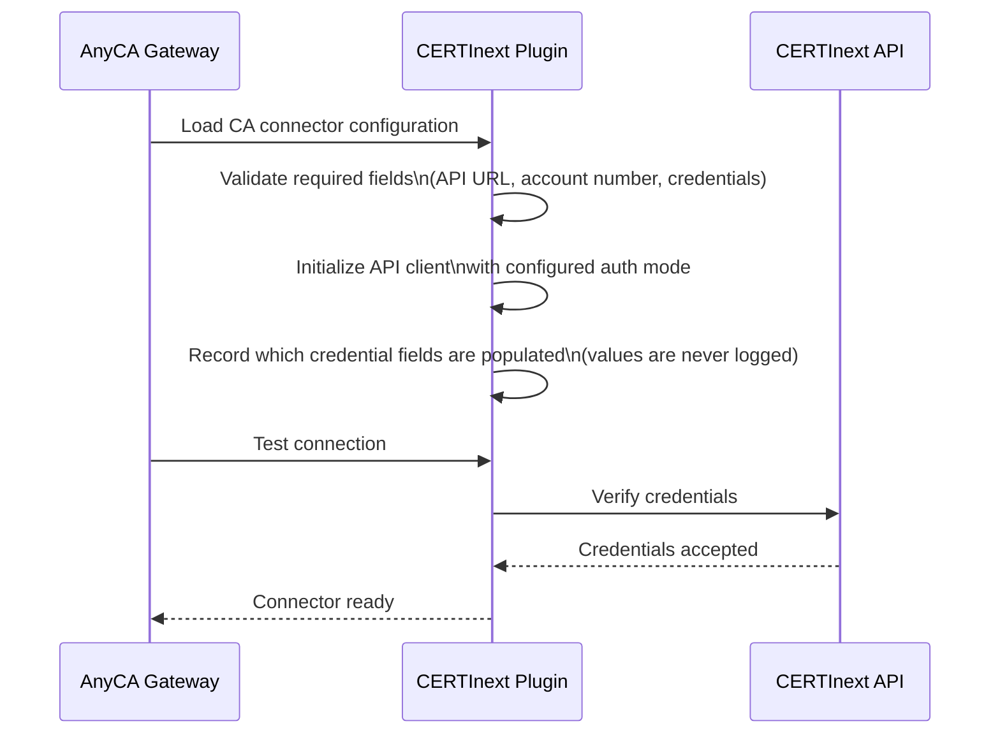
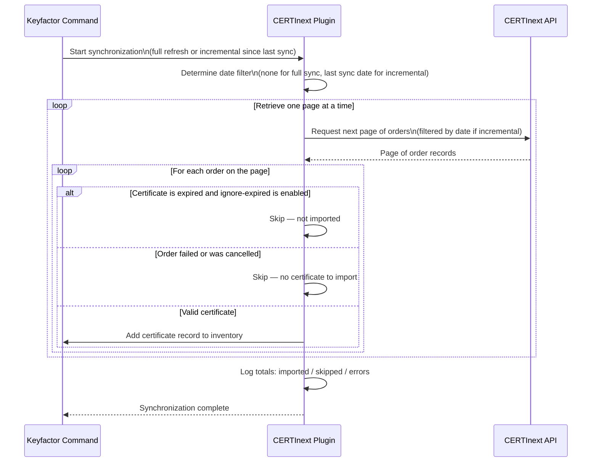
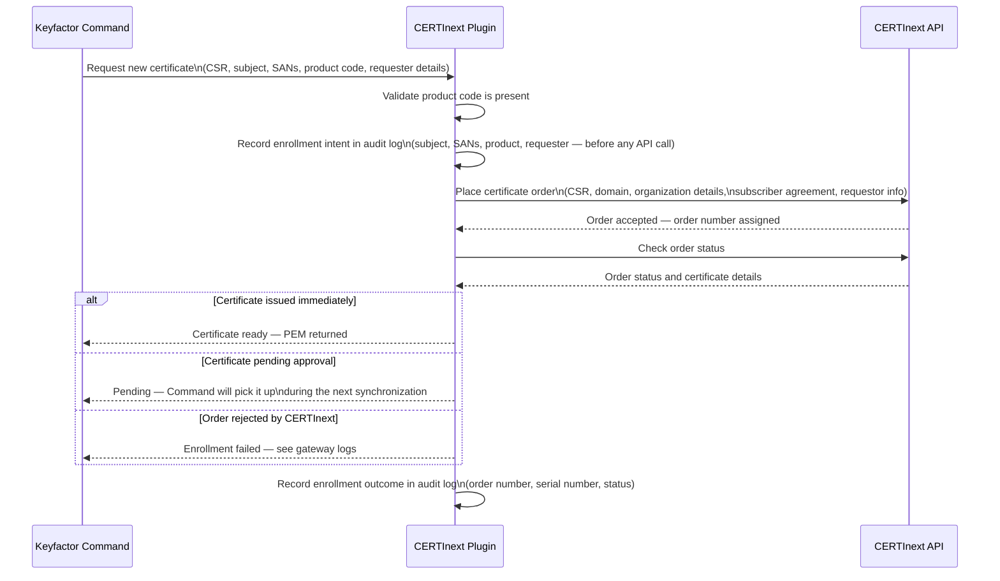
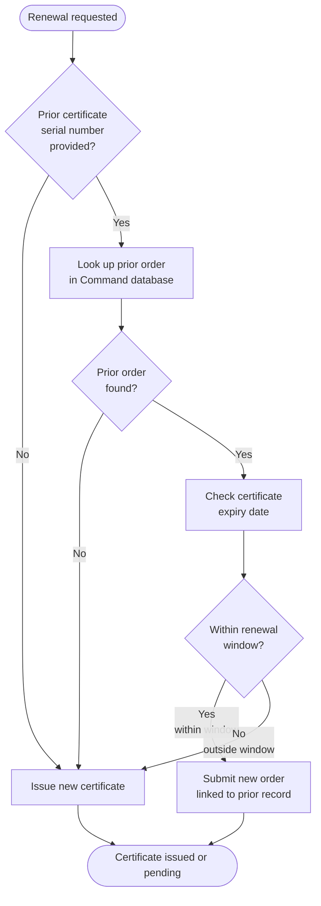
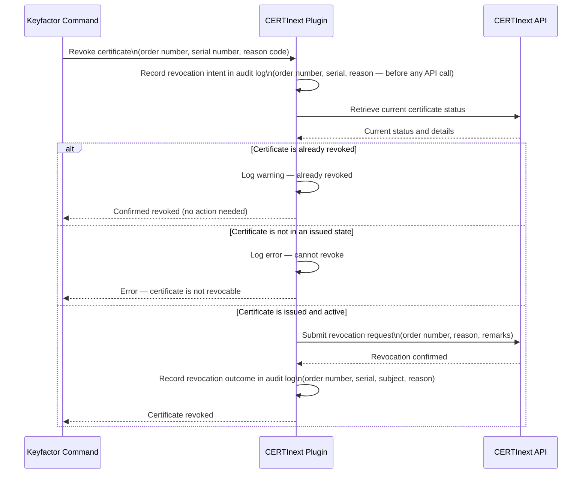
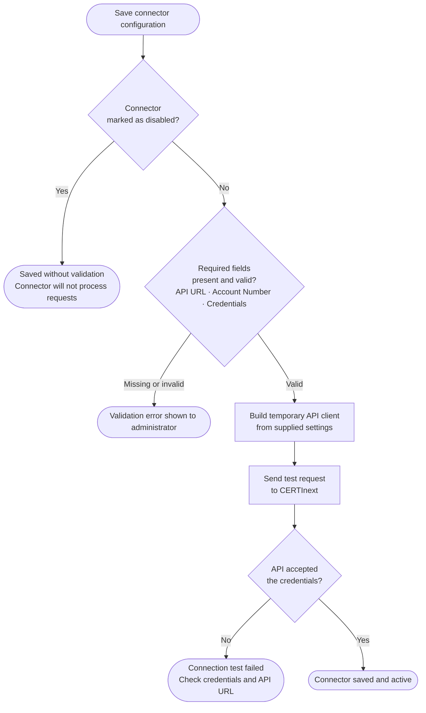

## Architecture

This document describes how the CERTInext AnyCA Gateway REST plugin integrates with Keyfactor Command and the CERTInext certificate authority. It covers the three primary certificate lifecycle operations — synchronization, enrollment, and revocation — and how the plugin routes each through the CERTInext API.

## Component Overview

```
┌─────────────────────────────────────────────────────────┐
│                  Keyfactor Command                       │
│                                                         │
│   Certificate Enrollment  ·  Revocation  ·  Sync Jobs   │
└────────────────────────────┬────────────────────────────┘
                             │
                    AnyCA Gateway REST
                    (plugin host process)
                             │
┌────────────────────────────▼────────────────────────────┐
│            CERTInext AnyCA Gateway Plugin                │
│                                                         │
│   Translates Keyfactor operations into CERTInext API    │
│   calls, maps responses back to Command's data model,   │
│   and enforces audit logging on every operation.        │
└────────────────────────────┬────────────────────────────┘
                             │  HTTPS · HMAC-signed requests
                             │
┌────────────────────────────▼────────────────────────────┐
│               CERTInext REST API (eMudhra)               │
│                                                         │
│   ValidateCredentials   GenerateOrderSSL   TrackOrder   │
│   GetCertificate   RevokeOrder   GetOrderReport         │
│   GetProductDetails   SubmitCSR                         │
└─────────────────────────────────────────────────────────┘
```

## Request Authentication

Every API call is signed using HMAC-SHA256. The access key itself is never transmitted — only a derived hash is sent:

```
authKey = SHA256(accessKey + requestTs + requestTxnId)
```

A unique transaction ID (`requestTxnId`) is generated for each request. The timestamp (`requestTs`) and transaction ID travel alongside the `authKey` so the CERTInext server can reproduce and verify the hash. The plugin handles this automatically; no manual signing is required during normal operation.

An OAuth client-credentials mode is also available as an alternative. When OAuth is configured, the plugin exchanges a client ID and secret for a short-lived bearer token and automatically refreshes it before expiry.

## Certificate Identifiers

CERTInext assigns two different reference numbers to each order. Understanding the difference matters when tracing certificates across systems:

| Identifier | When it is assigned | What it is used for |
|---|---|---|
| **Request Number** | Immediately when an order is created | Tracking a draft order before it is formally submitted; attaching a CSR to a pending order |
| **Order Number** | After the order is formally submitted and accepted | All post-issuance operations: checking status, downloading the certificate, revoking — **this is the identifier stored in Keyfactor Command** |

---

## Gateway Startup

When the AnyCA Gateway process starts, it loads each configured CA connector. For CERTInext, this step reads the connector settings, establishes the API client, and confirms that the credentials are structurally valid.



---

## Synchronization

Keyfactor Command periodically synchronizes its certificate inventory with CERTInext. The plugin retrieves all orders page by page and feeds them into Command's database. Synchronization can be a full refresh or incremental (only orders placed since the last successful sync).



**Full vs. incremental sync:** A full sync imports every order in the account regardless of age. An incremental sync requests only orders placed after the previous sync timestamp, which is faster for accounts with large order histories.

**Expired certificates:** The `IgnoreExpired` connector setting controls whether expired certificates are included in synchronization. When enabled, expired certificates are silently skipped and will not appear in the Keyfactor Command inventory.

---

## Certificate Enrollment

When a requester submits a certificate request through Keyfactor Command, the plugin translates the request into a CERTInext order and returns the result. The plugin handles three enrollment scenarios: new issuance, renewal (within a configured window before expiry), and reissuance (new keys, same profile).

### New Certificate or Reissuance



### Renewal

When Command initiates a renewal, the plugin checks whether the existing certificate is within the configured renewal window. If it is, the prior order record is used as context for the new request. If it is outside the window (or the prior certificate cannot be located), the plugin falls back to issuing a new certificate.

> **Note:** CERTInext does not have a dedicated certificate renewal endpoint. Both renewal and reissuance paths submit a new `GenerateOrderSSL` order. The distinction affects how Keyfactor Command tracks the certificate record, not what is sent to CERTInext.



---

## Revocation

When a certificate is revoked in Keyfactor Command, the plugin verifies the certificate's current state before calling the CERTInext revocation endpoint. This prevents unnecessary API calls for certificates that are already revoked or in a non-revocable state.



**Idempotency:** If Command retries a revocation request (for example, after a timeout), the plugin detects that the certificate is already revoked and returns success without submitting a duplicate request to CERTInext.

**Audit trail:** The revocation intent is written to the gateway log *before* the API call is made. This ensures that the intent is captured even if the API call subsequently fails, satisfying SOX audit requirements.

---

## Connector Validation

When an administrator saves or edits a CERTInext CA connector in the Keyfactor Command Management Portal, the gateway validates the configuration and performs a live connectivity check.



**Disabled connectors:** Setting `Enabled` to `false` allows the connector record to be created and saved before credentials are available. The live connectivity test is skipped, so no credentials are required at save time.

---

## API Endpoint Reference

The table below maps each Keyfactor Command operation to the CERTInext API endpoint it calls.

| Operation | CERTInext API endpoint |
|---|---|
| Test connection / verify credentials | `POST ValidateCredentials` |
| Issue new certificate | `POST GenerateOrderSSL` then `POST TrackOrder` |
| Renew certificate | `POST GenerateOrderSSL` then `POST TrackOrder` |
| Check certificate status | `POST TrackOrder` + `POST GetCertificate` |
| Revoke certificate | `POST RevokeOrder` |
| Synchronize inventory | `POST GetOrderReport` (paginated) |
| List available product codes | `POST GetProductDetails` |
| Attach CSR to draft order | `POST SubmitCSR` |
