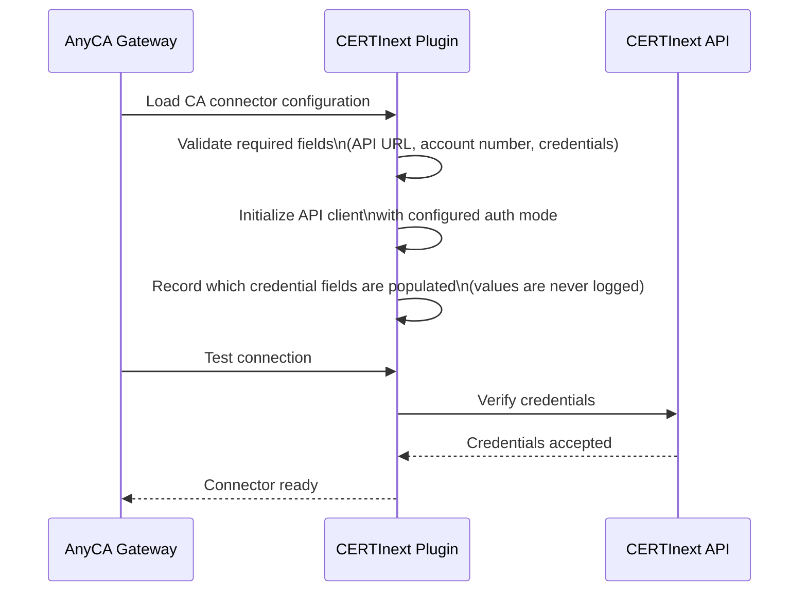
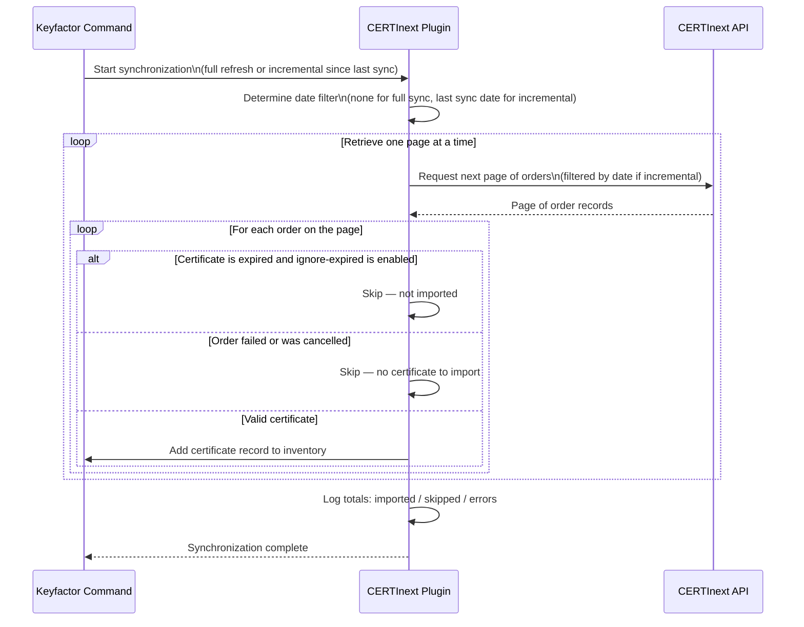
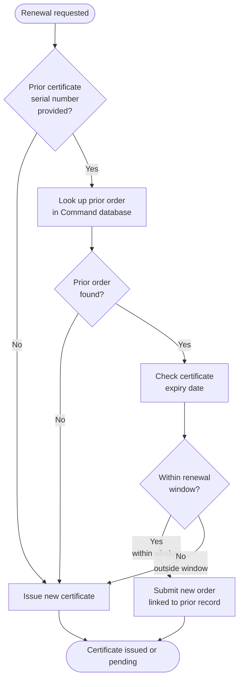
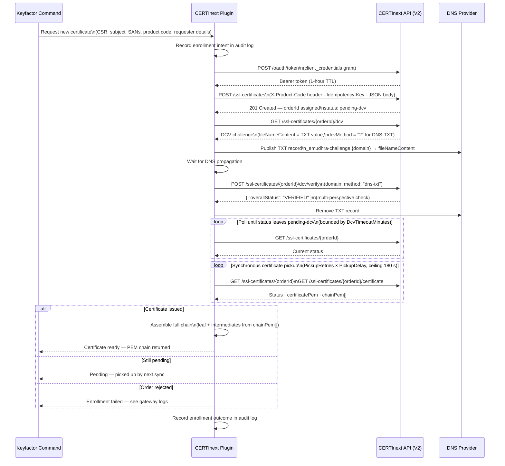
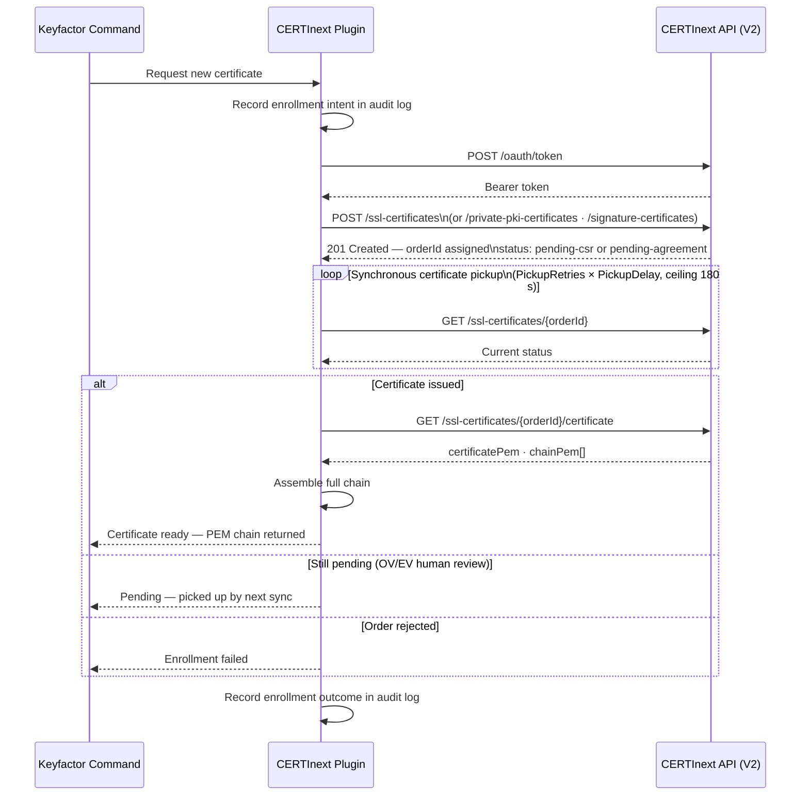
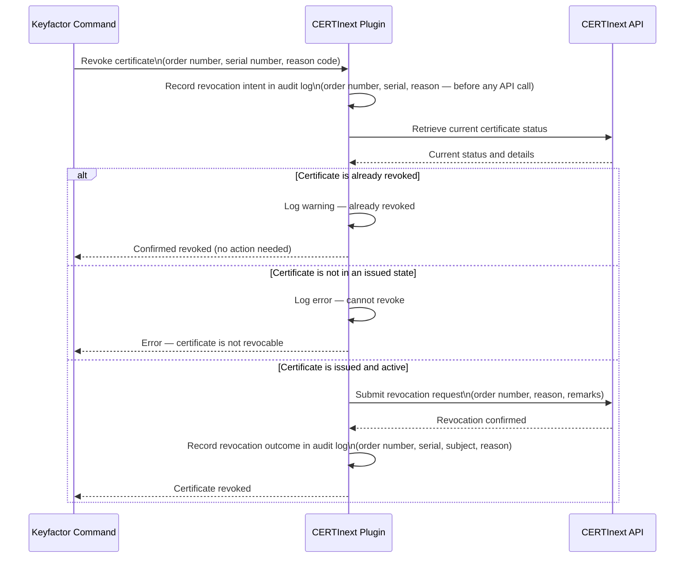
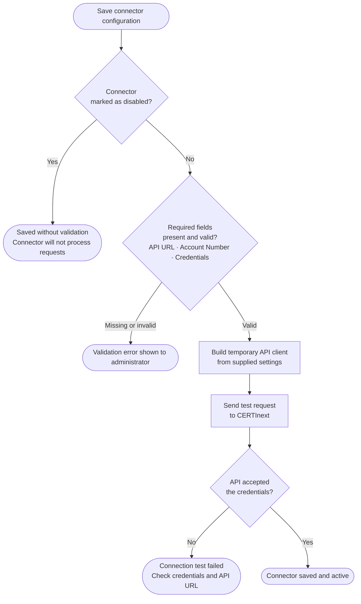

## Architecture

This document describes how the CERTInext AnyCA Gateway REST plugin integrates with Keyfactor Command and the CERTInext certificate authority. It covers the three primary certificate lifecycle operations — synchronization, enrollment, and revocation — and how the plugin routes each through the CERTInext API.

## Component Overview

```
┌─────────────────────────────────────────────────────────┐
│                  Keyfactor Command                       │
│                                                         │
│   Certificate Enrollment  ·  Revocation  ·  Sync Jobs   │
└────────────────────────────┬────────────────────────────┘
                             │
                    AnyCA Gateway REST
                    (plugin host process)
                             │
┌────────────────────────────▼────────────────────────────┐
│            CERTInext AnyCA Gateway Plugin                │
│                                                         │
│   Translates Keyfactor operations into CERTInext API    │
│   calls, maps responses back to Command's data model,   │
│   and enforces audit logging on every operation.        │
└────────────────────────────┬────────────────────────────┘
                             │  HTTPS · HMAC-signed requests
                             │
┌────────────────────────────▼────────────────────────────┐
│               CERTInext REST API (eMudhra)               │
│                                                         │
│  V1 (HMAC)  ValidateCredentials · GenerateOrderSSL      │
│             TrackOrder · GetCertificate · GetOrderReport │
│             RevokeOrder · GetProductDetails · SubmitCSR  │
│                                                         │
│  V2 (OAuth2 Bearer)  POST /oauth/token                  │
│             POST /ssl-certificates                       │
│             GET  /ssl-certificates/{id}                  │
│             GET  /ssl-certificates/{id}/dcv              │
│             POST /ssl-certificates/{id}/dcv/verify       │
│             GET  /ssl-certificates/{id}/certificate      │
│             POST /ssl-certificates/{id}/revoke           │
└─────────────────────────────────────────────────────────┘
```

## Request Authentication

Every API call is signed using HMAC-SHA256. The access key itself is never transmitted — only a derived hash is sent:

```
authKey = SHA256(accessKey + requestTs + requestTxnId)
```

A unique transaction ID (`requestTxnId`) is generated for each request. The timestamp (`requestTs`) and transaction ID travel alongside the `authKey` so the CERTInext server can reproduce and verify the hash. The plugin handles this automatically; no manual signing is required during normal operation.

An OAuth client-credentials mode is also available as an alternative. When OAuth is configured, the plugin exchanges a client ID and secret for a short-lived bearer token and automatically refreshes it before expiry.

When `UseV2Api` is enabled, the plugin uses a dedicated OAuth2 `client_credentials` flow — separate from the V1 OAuth alternative. The plugin posts `client_id` and `client_secret` (form-encoded) to `/oauth/token`, caches the resulting bearer token for its 1-hour lifetime, and automatically refreshes it 60 seconds before expiry. V2 credentials are provisioned separately by CERTInext and are not derived from the V1 access key.

## Certificate Identifiers

CERTInext assigns two different reference numbers to each order. Understanding the difference matters when tracing certificates across systems:

| Identifier | When it is assigned | What it is used for |
|---|---|---|
| **Request Number** | Immediately when an order is created | Tracking a draft order before it is formally submitted; attaching a CSR to a pending order |
| **Order Number** | After the order is formally submitted and accepted | All post-issuance operations: checking status, downloading the certificate, revoking — **this is the identifier stored in Keyfactor Command** |

---

## Gateway Startup

When the AnyCA Gateway process starts, it loads each configured CA connector. For CERTInext, this step reads the connector settings, establishes the API client, and confirms that the credentials are structurally valid.


```mermaid
sequenceDiagram
    participant GW as AnyCA Gateway
    participant Plugin as CERTInext Plugin
    participant API as CERTInext API

    GW->>Plugin: Load CA connector configuration
    Plugin->>Plugin: Validate required fields\n(API URL, account number, credentials)
    Plugin->>Plugin: Initialize API client\nwith configured auth mode
    Plugin->>Plugin: Record which credential fields are populated\n(values are never logged)
    GW->>Plugin: Test connection
    Plugin->>API: Verify credentials
    API-->>Plugin: Credentials accepted
    Plugin-->>GW: Connector ready
```

---

## Synchronization

Keyfactor Command periodically synchronizes its certificate inventory with CERTInext. The plugin retrieves all orders page by page and feeds them into Command's database. Synchronization can be a full refresh or incremental (only orders placed since the last successful sync).


```mermaid
sequenceDiagram
    participant CMD as Keyfactor Command
    participant Plugin as CERTInext Plugin
    participant API as CERTInext API

    CMD->>Plugin: Start synchronization\n(full refresh or incremental since last sync)
    Plugin->>Plugin: Determine date filter\n(none for full sync, last sync date for incremental)

    loop Retrieve one page at a time
        Plugin->>API: Request next page of orders\n(filtered by date if incremental)
        API-->>Plugin: Page of order records

        loop For each order on the page
            alt Certificate is expired and ignore-expired is enabled
                Plugin->>Plugin: Skip — not imported
            else Order failed or was cancelled
                Plugin->>Plugin: Skip — no certificate to import
            else Valid certificate
                Plugin->>CMD: Add certificate record to inventory
            end
        end
    end

    Plugin->>Plugin: Log totals: imported / skipped / errors
    Plugin-->>CMD: Synchronization complete
```

**Full vs. incremental sync:** A full sync imports every order in the account regardless of age. An incremental sync requests only orders placed after the previous sync timestamp, which is faster for accounts with large order histories.

**Expired certificates:** The `IgnoreExpired` connector setting controls whether expired certificates are included in synchronization. When enabled, expired certificates are silently skipped and will not appear in the Keyfactor Command inventory.

**DCV-during-sync:** on a DCV-enabled build, each sync pass also drives DNS-01 validation forward for pending DV orders that are still waiting on it, bounded by `DcvSyncMaxOrderAgeHours` (skip orders older than this) and `DcvSyncMaxPerPass` (cap how many are attempted per pass), so a large backlog of stalled pending orders can't slow down every sync.

---

## Certificate Enrollment

When a requester submits a certificate request through Keyfactor Command, the plugin translates the request into a CERTInext order and returns the result. The plugin handles three enrollment scenarios: new issuance, renewal (within a configured window before expiry), and reissuance (new keys, same profile).

### New Certificate or Reissuance

```mermaid
sequenceDiagram
    participant CMD as Keyfactor Command
    participant Plugin as CERTInext Plugin
    participant API as CERTInext API

    CMD->>Plugin: Request new certificate\n(CSR, subject, SANs, product code, requester details)
    Plugin->>Plugin: Validate product code is present
    Plugin->>Plugin: Record enrollment intent in audit log\n(subject, SANs, product, requester — before any API call)

    Plugin->>API: Place certificate order\n(CSR, domain, organization details,\nsubscriber agreement, requestor info)
    API-->>Plugin: Order accepted — order number assigned

    opt DNS-01 DCV build, DCV enabled, and this order requires it
        Plugin->>Plugin: Publish DNS TXT challenge\nvia the configured DNS provider plugin
        Plugin->>API: Ask CERTInext to verify the record
        API-->>Plugin: Domain validated (or still pending —\nfalls through to the pending path below)
    end

    Plugin->>API: Check order status
    API-->>Plugin: Order status and certificate details

    alt Certificate issued immediately
        Plugin-->>CMD: Certificate ready — PEM returned
    else Certificate pending or not yet downloadable
        loop Synchronous certificate pickup\n(PickupRetries × PickupDelay, default 3 × 5 s; ceiling 180 s)
            Plugin->>API: Poll order status\nand attempt certificate download
            API-->>Plugin: Status / certificate PEM
        end
        alt Certificate became available during pickup
            Plugin-->>CMD: Certificate ready — PEM returned
        else Still not available
            Plugin-->>CMD: Pending — Command will pick it up\nduring the next synchronization
        end
    else Order rejected by CERTInext
        Plugin-->>CMD: Enrollment failed — see gateway logs
    end

    Plugin->>Plugin: Record enrollment outcome in audit log\n(order number, serial number, status)
```

**DCV:** on a DCV-enabled build, DNS-01 validation runs inline for DV orders that require it, bounded by `DcvTimeoutMinutes`. When DCV isn't enabled, isn't built into this host, or the order doesn't require it, this step is skipped entirely and the order proceeds straight to the pending/pickup path like any other asynchronously-issued order.

**Synchronous certificate pickup:** after placing an order (or after DCV completes), the plugin polls CERTInext a bounded number of times — `PickupRetries` attempts spaced `PickupDelay` seconds apart, with a hard ceiling of 180 seconds — before returning a pending disposition to Command. This lets fast-issuing DV certificates (and pre-approved renewals) come back in the same enrollment call. OV and EV orders undergo human review over minutes to hours and almost always exhaust this window; they are picked up by the next synchronization run.

### Renewal

When Command initiates a renewal, the plugin checks whether the existing certificate is within the configured renewal window. If it is, the prior order record is used as context for the new request. If it is outside the window (or the prior certificate cannot be located), the plugin falls back to issuing a new certificate.

> **Note:** CERTInext does not have a dedicated certificate renewal endpoint. Both renewal and reissuance paths submit a new `GenerateOrderSSL` order. The distinction affects how Keyfactor Command tracks the certificate record, not what is sent to CERTInext.

> **Note:** If the prior-order lookup itself throws (rather than cleanly returning "not found" — e.g. a transient database error), the plugin falls back to issuing a new certificate rather than failing the enrollment.


```mermaid
flowchart TD
    A([Renewal requested]) --> B{Prior certificate\nserial number\nprovided?}
    B -- No --> C[Issue new certificate]
    B -- Yes --> D[Look up prior order\nin Command database]
    D --> E{Prior order\nfound?}
    E -- No --> C
    E -- Yes --> F[Check certificate\nexpiry date]
    F --> G{Within renewal\nwindow?}
    G -- Yes\nwithin window --> H[Submit new order\nlinked to prior record]
    G -- No\noutside window --> C
    H --> I([Certificate issued or pending])
    C --> I
```

### V2 API Path (UseV2Api = true)

When `UseV2Api` is enabled, Ping, Enroll, GetSingleRecord, and Revoke route through the V2 REST API. Synchronize continues to call the V1 `GetOrderReport` endpoint until the V2 `/reports/orders` endpoint is available.

#### DCV required (DV SSL)


```mermaid
sequenceDiagram
    participant CMD as Keyfactor Command
    participant Plugin as CERTInext Plugin
    participant API as CERTInext API (V2)
    participant DNS as DNS Provider

    CMD->>Plugin: Request new certificate\n(CSR, subject, SANs, product code, requester details)
    Plugin->>Plugin: Record enrollment intent in audit log

    Plugin->>API: POST /oauth/token\n(client_credentials grant)
    API-->>Plugin: Bearer token (1-hour TTL)

    Plugin->>API: POST /ssl-certificates\n(X-Product-Code header · Idempotency-Key · JSON body)
    API-->>Plugin: 201 Created — orderId assigned\nstatus: pending-dcv

    Plugin->>API: GET /ssl-certificates/{orderId}/dcv
    API-->>Plugin: DCV challenge\n(fileNameContent = TXT value,\ndcvMethod = "2" for DNS-TXT)

    Plugin->>DNS: Publish TXT record\n_emudhra-challenge.{domain} → fileNameContent
    Plugin->>Plugin: Wait for DNS propagation

    Plugin->>API: POST /ssl-certificates/{orderId}/dcv/verify\n(domain, method: "dns-txt")
    API-->>Plugin: { "overallStatus": "VERIFIED" }\n(multi-perspective check)

    Plugin->>DNS: Remove TXT record

    loop Poll until status leaves pending-dcv\n(bounded by DcvTimeoutMinutes)
        Plugin->>API: GET /ssl-certificates/{orderId}
        API-->>Plugin: Current status
    end

    loop Synchronous certificate pickup\n(PickupRetries × PickupDelay, ceiling 180 s)
        Plugin->>API: GET /ssl-certificates/{orderId}\nGET /ssl-certificates/{orderId}/certificate
        API-->>Plugin: Status · certificatePem · chainPem[]
    end

    alt Certificate issued
        Plugin->>Plugin: Assemble full chain\n(leaf + intermediates from chainPem[])
        Plugin-->>CMD: Certificate ready — PEM chain returned
    else Still pending
        Plugin-->>CMD: Pending — picked up by next sync
    else Order rejected
        Plugin-->>CMD: Enrollment failed — see gateway logs
    end

    Plugin->>Plugin: Record enrollment outcome in audit log
```

#### No DCV required (OV/EV/Private PKI)


```mermaid
sequenceDiagram
    participant CMD as Keyfactor Command
    participant Plugin as CERTInext Plugin
    participant API as CERTInext API (V2)

    CMD->>Plugin: Request new certificate
    Plugin->>Plugin: Record enrollment intent in audit log

    Plugin->>API: POST /oauth/token
    API-->>Plugin: Bearer token

    Plugin->>API: POST /ssl-certificates\n(or /private-pki-certificates · /signature-certificates)
    API-->>Plugin: 201 Created — orderId assigned\nstatus: pending-csr or pending-agreement

    loop Synchronous certificate pickup\n(PickupRetries × PickupDelay, ceiling 180 s)
        Plugin->>API: GET /ssl-certificates/{orderId}
        API-->>Plugin: Current status
    end

    alt Certificate issued
        Plugin->>API: GET /ssl-certificates/{orderId}/certificate
        API-->>Plugin: certificatePem · chainPem[]
        Plugin->>Plugin: Assemble full chain
        Plugin-->>CMD: Certificate ready — PEM chain returned
    else Still pending (OV/EV human review)
        Plugin-->>CMD: Pending — picked up by next sync
    else Order rejected
        Plugin-->>CMD: Enrollment failed
    end

    Plugin->>Plugin: Record enrollment outcome in audit log
```

**Token caching:** the Bearer token is cached for its 1-hour lifetime and shared across all V2 calls in the same gateway process. A new token is fetched automatically 60 seconds before expiry.

**Idempotency:** every unsafe V2 POST carries a unique `Idempotency-Key` UUID. If the gateway retries the same request (for example after a timeout), CERTInext returns the original response without creating a duplicate order.

**Full certificate chain:** the V2 `/certificate` endpoint returns the leaf certificate in `certificatePem` and any intermediate certificates in `chainPem[]`. The plugin concatenates these into a single PEM before returning to Command.

**Order IDs:** V2 order IDs are opaque strings (e.g. `ord_abc123`). They are stored as the `CARequestID` in Command alongside V1 numeric IDs — both coexist in the database.

**Synchronize stays on V1:** the V2 `/reports/orders` endpoint returns 501 Not Implemented. Synchronization always calls the V1 `GetOrderReport` endpoint regardless of `UseV2Api`. A warning is logged when `UseV2Api = true` to make this visible. A follow-up update will switch sync to V2 once the endpoint ships.

---

## Revocation

When a certificate is revoked in Keyfactor Command, the plugin verifies the certificate's current state before calling the CERTInext revocation endpoint. This prevents unnecessary API calls for certificates that are already revoked or in a non-revocable state.


```mermaid
sequenceDiagram
    participant CMD as Keyfactor Command
    participant Plugin as CERTInext Plugin
    participant API as CERTInext API

    CMD->>Plugin: Revoke certificate\n(order number, serial number, reason code)
    Plugin->>Plugin: Record revocation intent in audit log\n(order number, serial, reason — before any API call)

    Plugin->>API: Retrieve current certificate status
    API-->>Plugin: Current status and details

    alt Certificate is already revoked
        Plugin->>Plugin: Log warning — already revoked
        Plugin-->>CMD: Confirmed revoked (no action needed)
    else Certificate is not in an issued state
        Plugin->>Plugin: Log error — cannot revoke
        Plugin-->>CMD: Error — certificate is not revocable
    else Certificate is issued and active
        Plugin->>API: Submit revocation request\n(order number, reason, remarks)
        API-->>Plugin: Revocation confirmed

        Plugin->>Plugin: Record revocation outcome in audit log\n(order number, serial, subject, reason)
        Plugin-->>CMD: Certificate revoked
    end
```

**Idempotency:** If Command retries a revocation request (for example, after a timeout), the plugin detects that the certificate is already revoked and returns success without submitting a duplicate request to CERTInext.

**Audit trail:** The revocation intent is written to the gateway log *before* the API call is made. This ensures that the intent is captured even if the API call subsequently fails, satisfying SOX audit requirements.

---

## Connector Validation

When an administrator saves or edits a CERTInext CA connector in the Keyfactor Command Management Portal, the gateway validates the configuration and performs a live connectivity check.


```mermaid
flowchart TD
    A([Save connector configuration]) --> B{Connector\nmarked as disabled?}
    B -- Yes --> C([Saved without validation\nConnector will not process requests])
    B -- No --> D{Required fields\npresent and valid?\nAPI URL · Account Number · Credentials}
    D -- Missing or invalid --> E([Validation error shown to administrator])
    D -- Valid --> F[Build temporary API client\nfrom supplied settings]
    F --> G[Send test request\nto CERTInext]
    G --> H{API accepted\nthe credentials?}
    H -- No --> I([Connection test failed\nCheck credentials and API URL])
    H -- Yes --> J([Connector saved and active])
```

**Disabled connectors:** Setting `Enabled` to `false` allows the connector record to be created and saved before credentials are available. The live connectivity test is skipped, so no credentials are required at save time.

---

## API Endpoint Reference

The table below maps each Keyfactor Command operation to the CERTInext API endpoint it calls.

**V1 endpoints (default)**

| Operation | CERTInext API endpoint |
|---|---|
| Test connection / verify credentials | `POST ValidateCredentials` |
| Issue new certificate | `POST GenerateOrderSSL` then `POST TrackOrder` |
| Renew certificate | `POST GenerateOrderSSL` then `POST TrackOrder` |
| Check certificate status | `POST TrackOrder` + `POST GetCertificate` |
| Revoke certificate | `POST RevokeOrder` |
| Synchronize inventory | `POST GetOrderReport` (paginated) |
| List available product codes | `POST GetProductDetails` |
| Attach CSR to draft order | `POST SubmitCSR` |

**V2 endpoints (UseV2Api = true)**

| Operation | V2 endpoint |
|---|---|
| Obtain Bearer token | `POST /oauth/token` |
| Test connection | `GET /api/certinext/v2/auth/me` |
| Issue / renew certificate | `POST /api/certinext/v2/{family}-certificates` |
| Check order status | `GET /api/certinext/v2/{family}-certificates/{orderId}` |
| Get DCV challenge (DV SSL) | `GET /api/certinext/v2/ssl-certificates/{orderId}/dcv` |
| Verify DCV | `POST /api/certinext/v2/ssl-certificates/{orderId}/dcv/verify` |
| Download certificate | `GET /api/certinext/v2/{family}-certificates/{orderId}/certificate` |
| Revoke certificate | `POST /api/certinext/v2/{family}-certificates/{orderId}/revoke` |
| List available products | `GET /api/certinext/v2/catalog/products` |
| Synchronize inventory | `POST GetOrderReport` (V1 — V2 /reports/orders not yet available) |

`{family}` is `ssl-certificates`, `private-pki-certificates`, or `signature-certificates`.
