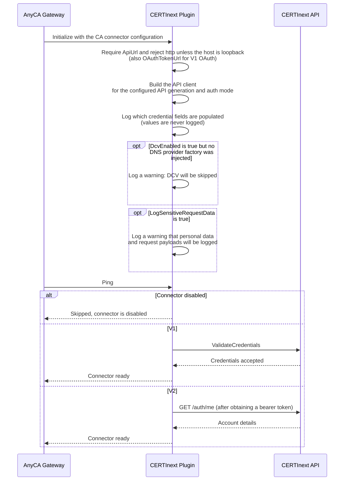
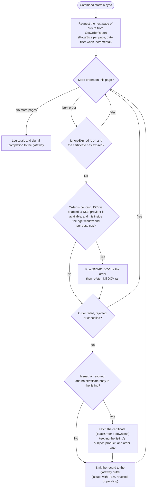
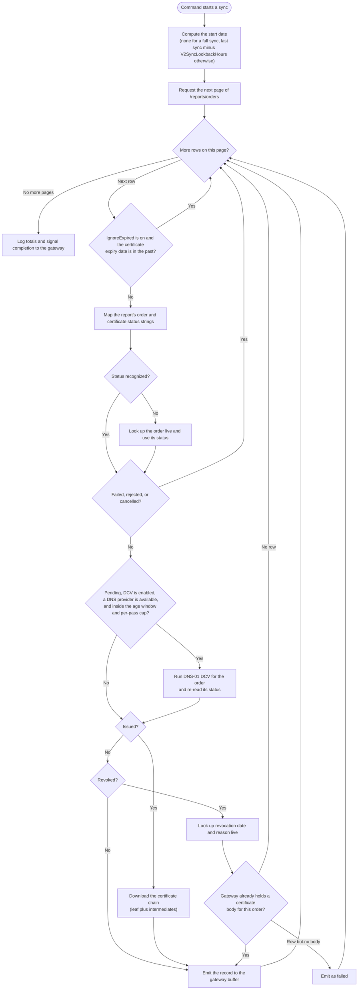
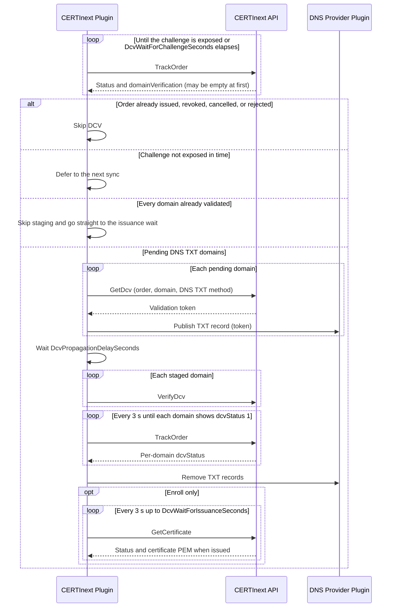
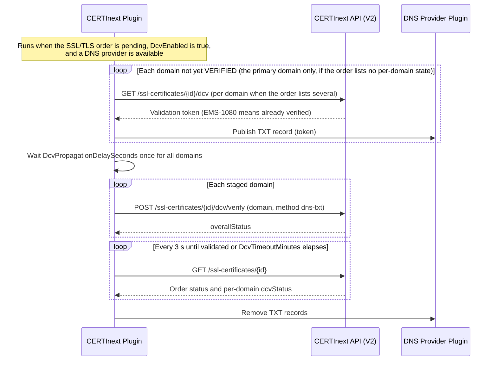
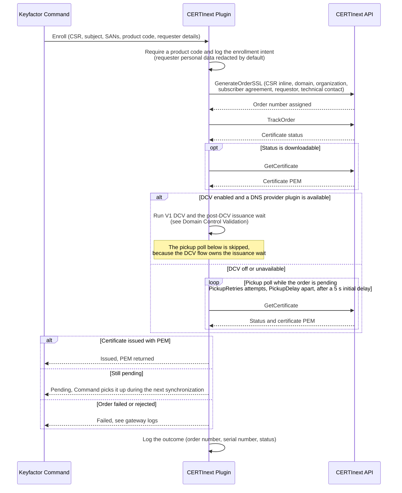
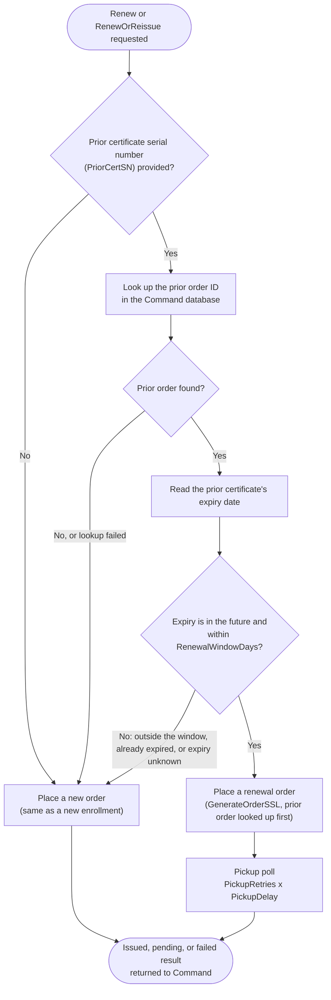
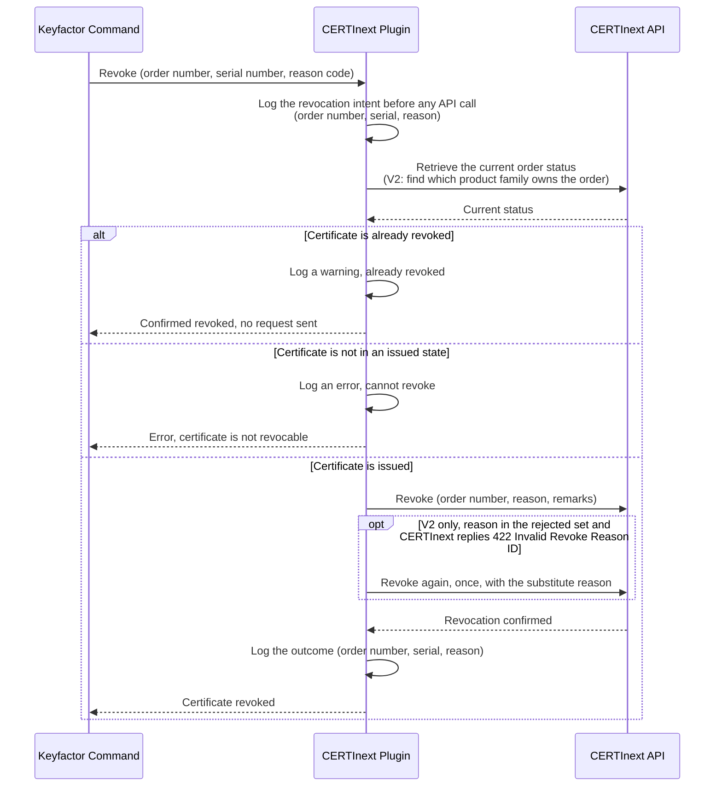
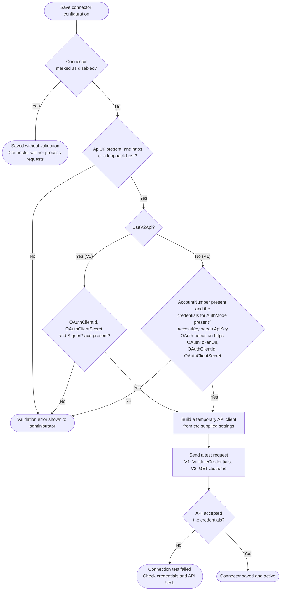

## Architecture

This document describes how the CERTInext AnyCA Gateway REST plugin integrates with Keyfactor Command and the CERTInext certificate authority. It covers the primary certificate lifecycle operations — synchronization, enrollment, domain control validation, and revocation — for both CERTInext API generations (V1 and V2), and how the plugin routes each one.

## Component Overview

```
┌─────────────────────────────────────────────────────────┐
│                  Keyfactor Command                      │
│                                                         │
│   Certificate Enrollment  ·  Revocation  ·  Sync Jobs   │
└────────────────────────────┬────────────────────────────┘
                             │
                    AnyCA Gateway REST
                    (plugin host process)
                             │
┌────────────────────────────▼────────────────────────────┐
│            CERTInext AnyCA Gateway Plugin               │
│                                                         │
│   Translates Keyfactor operations into CERTInext API    │
│   calls, maps responses back to Command's data model,   │
│   publishes DNS-01 validation records through the       │
│   gateway's DNS provider plugin, and logs every         │
│   operation.                                            │
└────────────────────────────┬────────────────────────────┘
                             │  HTTPS · AccessKey (V1) or OAuth2 bearer
                             │
┌────────────────────────────▼────────────────────────────┐
│             CERTInext REST API (eMudhra)                │
│                                                         │
│ V1  ValidateCredentials · GenerateOrderSSL              │
│     TrackOrder · GetCertificate · GetOrderReport        │
│     RevokeOrder · GetProductDetails                     │
│     GetDcv · VerifyDcv                                  │
│                                                         │
│ V2  POST /oauth/token · GET /auth/me                    │
│     GET  /catalog/products · GET /reports/orders        │
│     POST /{family}                 create order         │
│     PUT  /{family}/{id}/csr                             │
│     GET  /{family}/{id}            track order          │
│     GET  /{family}/{id}/certificate                     │
│     GET  /ssl-certificates/{id}/dcv                     │
│     POST /ssl-certificates/{id}/dcv/verify              │
│     POST /{family}/{id}/revoke · POST .../cancel        │
└─────────────────────────────────────────────────────────┘
```

`{family}` is `ssl-certificates`, `private-pki-certificates`, or `signature-certificates` (see the [API Endpoint Reference](#api-endpoint-reference)).

## Request Authentication

**V1, AccessKey mode.** Every call carries a `meta` block whose `authKey` is a SHA-256 digest of the access key, a timestamp, and a transaction ID. The access key itself is never transmitted — only the derived hash is sent:

```
authKey = SHA256(accessKey + requestTs + requestTxnId)
```

A random numeric transaction ID (`requestTxnId`) is generated for each request. The timestamp (`requestTs`) and transaction ID travel alongside the `authKey` so the CERTInext server can reproduce and verify the hash. The plugin handles this automatically; no manual signing is required during normal operation.

**V1, OAuth mode.** When `AuthMode` is `OAuth`, the plugin exchanges a client ID and secret at `OAuthTokenUrl` for a bearer token, sends it in an `Authorization: Bearer` header, and refreshes it before expiry. The `meta` block is still sent, with an empty `authKey`.

**V2.** When `UseV2Api` is enabled, the plugin uses an OAuth2 `client_credentials` flow, reusing the connector's `OAuthClientId`/`OAuthClientSecret` fields regardless of the V1 `AuthMode` setting. The plugin posts `client_id` and `client_secret` (form-encoded) to `{ApiUrl}/oauth/token` (the same `ApiUrl` field, which becomes the V2 host in this mode) and caches the resulting bearer token until 60 seconds before the expiry the token endpoint reports (minimum 30 seconds). Token refresh is thread-safe.

## Certificate Identifiers

V1 assigns two different reference numbers to each order. Understanding the difference matters when tracing certificates across systems:

| Identifier | When it is assigned | What it is used for |
|---|---|---|
| **Request Number** | Immediately when an order is created | Tracking a draft order before it is formally submitted; attaching a CSR to a pending order |
| **Order Number** | After the order is formally submitted and accepted | All post-issuance operations: checking status, downloading the certificate, revoking — **this is the identifier stored in Keyfactor Command** |

V2 returns a single `orderId` when the order is created; the plugin stores it unchanged as the `CARequestID`.

---

## Gateway Startup

When the AnyCA Gateway process starts, it loads each configured CA connector. For CERTInext, this step reads the connector settings, checks that the API URLs are acceptable, and builds the API client. Credentials are validated separately, when an administrator saves the connector (see [Connector Validation](#connector-validation)).


```mermaid
sequenceDiagram
    participant GW as AnyCA Gateway
    participant Plugin as CERTInext Plugin
    participant API as CERTInext API

    GW->>Plugin: Initialize with the CA connector configuration
    Plugin->>Plugin: Require ApiUrl and reject http unless the host is loopback<br/>(also OAuthTokenUrl for V1 OAuth)
    Plugin->>Plugin: Build the API client<br/>for the configured API generation and auth mode
    Plugin->>Plugin: Log which credential fields are populated<br/>(values are never logged)
    opt DcvEnabled is true but no DNS provider factory was injected
        Plugin->>Plugin: Log a warning: DCV will be skipped
    end
    opt LogSensitiveRequestData is true
        Plugin->>Plugin: Log a warning that personal data<br/>and request payloads will be logged
    end
    GW->>Plugin: Ping
    alt Connector disabled
        Plugin-->>GW: Skipped, connector is disabled
    else V1
        Plugin->>API: ValidateCredentials
        API-->>Plugin: Credentials accepted
        Plugin-->>GW: Connector ready
    else V2
        Plugin->>API: GET /auth/me (after obtaining a bearer token)
        API-->>Plugin: Account details
        Plugin-->>GW: Connector ready
    end
```

---

## Synchronization

Keyfactor Command periodically synchronizes its certificate inventory with CERTInext. The plugin retrieves orders page by page and feeds them into Command's database. Synchronization can be a full refresh or incremental. V1 and V2 differ in the report they read and in how they classify each order.

### V1 synchronization

A full sync reads every order in the account. An incremental sync requests only orders placed on or after the date of the previous sync.


```mermaid
flowchart TD
    A([Command starts a sync]) --> B["Request the next page of orders from GetOrderReport<br/>(PageSize per page, date filter when incremental)"]
    B --> C{More orders on this page?}
    C -- No more pages --> Z["Log totals and signal completion to the gateway"]
    C -- Next order --> D{"IgnoreExpired is on and<br/>the certificate has expired?"}
    D -- Yes --> C
    D -- No --> E{"Order is pending, DCV is enabled, a DNS provider is<br/>available, and it is inside the age window and<br/>per-pass cap?"}
    E -- Yes --> F["Run DNS-01 DCV for the order<br/>then refetch it if DCV ran"]
    E -- No --> G
    F --> G{Order failed, rejected,<br/>or cancelled?}
    G -- Yes --> C
    G -- No --> H{"Issued or revoked,<br/>and no certificate body in the listing?"}
    H -- Yes --> I["Fetch the certificate (TrackOrder + download)<br/>keeping the listing's subject, product, and order date"]
    H -- No --> J
    I --> J["Emit the record to the gateway buffer<br/>(issued with PEM, revoked, or pending)"]
    J --> C
```

**Errors:** if processing an individual order throws, the error is logged and counted and the sync moves on to the next order. Once at least 50 records have been seen and more than 25 percent of them errored, the sync aborts with an error and is retried on the next cycle, rather than completing with mostly failed records. V2 synchronization applies the same rule.

**Expired certificates:** the `IgnoreExpired` connector setting controls whether expired certificates are included. When enabled, expired certificates are skipped and never appear in the Command inventory.

**DCV during sync:** pending orders are driven through DNS-01 validation while they are younger than `DcvSyncMaxOrderAgeHours` (older orders are reported as pending and left alone) and only up to `DcvSyncMaxPerPass` orders per pass, so a large backlog of stalled pending orders can't slow every sync. The V1 sync path uses a short fixed propagation delay and a single-shot challenge check rather than the longer `Enroll` waits. See [Domain Control Validation](#domain-control-validation).

### V2 synchronization

With `UseV2Api = true`, Synchronize pages through V2 `/reports/orders` (at most 100 rows per page, scoped to `GroupNumber` when set). An incremental sync asks for orders from `V2SyncLookbackHours` (default 72) before the last sync date, because the report's date filter may bracket either the order date or the issuance date and a slow order must not be missed.


```mermaid
flowchart TD
    A([Command starts a sync]) --> B["Compute the start date<br/>(none for a full sync, last sync minus V2SyncLookbackHours otherwise)"]
    B --> C["Request the next page of /reports/orders"]
    C --> D{More rows on this page?}
    D -- No more pages --> Z["Log totals and signal completion to the gateway"]
    D -- Next row --> E{"IgnoreExpired is on and the certificate<br/>expiry date is in the past?"}
    E -- Yes --> D
    E -- No --> F["Map the report's order and certificate status strings"]
    F --> G{Status recognized?}
    G -- No --> H["Look up the order live and use its status"]
    G -- Yes --> I
    H --> I{Failed, rejected, or cancelled?}
    I -- Yes --> D
    I -- No --> J{"Pending, DCV is enabled, a DNS provider is available,<br/>and inside the age window and per-pass cap?"}
    J -- Yes --> K["Run DNS-01 DCV for the order<br/>and re-read its status"]
    J -- No --> L
    K --> L{Issued?}
    L -- Yes --> M["Download the certificate chain<br/>(leaf plus intermediates)"]
    L -- No --> N{Revoked?}
    N -- Yes --> O["Look up revocation date and reason live"]
    N -- No --> P
    M --> P
    O --> Q{"Gateway already holds a certificate<br/>body for this order?"}
    Q -- Yes --> P["Emit the record to the gateway buffer"]
    Q -- "Row but no body" --> R["Emit as failed"]
    Q -- "No row" --> D
    R --> D
    P --> D
```

---

## Domain Control Validation

DNS-01 domain control validation (DCV) proves control of each domain on an order by publishing a TXT record that CERTInext then checks. The plugin publishes and removes the record through whichever DNS provider plugin the gateway resolves for the domain (`DcvEnabled`, on by default). DCV runs in three places: inline during `Enroll`, during `Synchronize` for pending orders, and during `GetSingleRecord` for a pending order. It never runs for an order that is already issued, revoked, cancelled, or rejected, and V2 skips it for Private PKI and Document Signer orders, which have no DCV step.

The TXT record is published at `DcvTxtRecordTemplate` (default `_emsign-validation.{0}`) with `{0}` replaced by the domain. A wildcard domain's `*.` label is stripped for the DNS side (the record is published at the base domain), and a wildcard and its apex on the same order share one record. On V1, only domains that CERTInext lists as pending, and that are unassigned or assigned to the DNS TXT method, are processed; on V2, every domain that is not yet verified is. A domain that can't be staged (no DNS provider resolves it, the provider fails, CERTInext returns no token) is logged and skipped so the other domains on the order can still be validated; the order stays pending until the skipped domain is resolved. The whole flow for one order is bounded by `DcvTimeoutMinutes`, and TXT records are always removed afterward, with a separate 60-second bound on each removal.

### V1 DCV


```mermaid
sequenceDiagram
    participant Plugin as CERTInext Plugin
    participant API as CERTInext API
    participant DNS as DNS Provider Plugin

    loop Until the challenge is exposed or DcvWaitForChallengeSeconds elapses
        Plugin->>API: TrackOrder
        API-->>Plugin: Status and domainVerification (may be empty at first)
    end
    alt Order already issued, revoked, cancelled, or rejected
        Plugin->>Plugin: Skip DCV
    else Challenge not exposed in time
        Plugin->>Plugin: Defer to the next sync
    else Every domain already validated
        Plugin->>Plugin: Skip staging and go straight to the issuance wait
    else Pending DNS TXT domains
        loop Each pending domain
            Plugin->>API: GetDcv (order, domain, DNS TXT method)
            API-->>Plugin: Validation token
            Plugin->>DNS: Publish TXT record (token)
        end
        Plugin->>Plugin: Wait DcvPropagationDelaySeconds
        loop Each staged domain
            Plugin->>API: VerifyDcv
        end
        loop Every 3 s until each domain shows dcvStatus 1
            Plugin->>API: TrackOrder
            API-->>Plugin: Per-domain dcvStatus
        end
        Plugin->>DNS: Remove TXT records
        opt Enroll only
            loop Every 3 s up to DcvWaitForIssuanceSeconds
                Plugin->>API: GetCertificate
                API-->>Plugin: Status and certificate PEM when issued
            end
        end
    end
```

If `GetDcv` returns `EMS-956` (CERTInext lists the challenge before it accepts calls for the order), the whole pass is deferred to the next sync. On the sync and single-record paths the plugin refetches the certificate after DCV instead of running the issuance wait.

### V2 DCV


```mermaid
sequenceDiagram
    participant Plugin as CERTInext Plugin
    participant API as CERTInext API (V2)
    participant DNS as DNS Provider Plugin

    Note over Plugin: Runs when the SSL/TLS order is pending, DcvEnabled is true,<br/>and a DNS provider is available
    loop Each domain not yet VERIFIED (the primary domain only, if the order lists no per-domain state)
        Plugin->>API: GET /ssl-certificates/{id}/dcv (per domain when the order lists several)
        API-->>Plugin: Validation token (EMS-1080 means already verified)
        Plugin->>DNS: Publish TXT record (token)
    end
    Plugin->>Plugin: Wait DcvPropagationDelaySeconds once for all domains
    loop Each staged domain
        Plugin->>API: POST /ssl-certificates/{id}/dcv/verify (domain, method dns-txt)
        API-->>Plugin: overallStatus
    end
    loop Every 3 s until validated or DcvTimeoutMinutes elapses
        Plugin->>API: GET /ssl-certificates/{id}
        API-->>Plugin: Order status and per-domain dcvStatus
    end
    Plugin->>DNS: Remove TXT records
```

For an order that lists per-domain verification state (a multi-domain order, for example), every domain that is not yet `VERIFIED` is staged, with one propagation wait for the whole batch, and the poll waits until each verified domain shows `VERIFIED` (or `REJECTED`). For a single-domain order the poll waits for the status to leave `pending-dcv`, and if `verify` doesn't report `VERIFIED` the plugin removes the record and leaves the order pending. Either way, the next sync or `GetSingleRecord` call retries only the domains that are still unverified.

---

## Certificate Enrollment

When a requester submits a certificate request through Keyfactor Command, the plugin translates the request into a CERTInext order and returns the result. V1 and V2 follow different flows; see [Enrollment Decision Logic](#enrollment-decision-logic) for how the enrollment type is handled in each.

### V1 enrollment (New or Reissue)


```mermaid
sequenceDiagram
    participant CMD as Keyfactor Command
    participant Plugin as CERTInext Plugin
    participant API as CERTInext API

    CMD->>Plugin: Enroll (CSR, subject, SANs, product code, requester details)
    Plugin->>Plugin: Require a product code and log the enrollment intent<br/>(requester personal data redacted by default)

    Plugin->>API: GenerateOrderSSL (CSR inline, domain, organization,<br/>subscriber agreement, requestor, technical contact)
    API-->>Plugin: Order number assigned
    Plugin->>API: TrackOrder
    API-->>Plugin: Certificate status
    opt Status is downloadable
        Plugin->>API: GetCertificate
        API-->>Plugin: Certificate PEM
    end

    alt DCV enabled and a DNS provider plugin is available
        Plugin->>Plugin: Run V1 DCV and the post-DCV issuance wait<br/>(see Domain Control Validation)
        Note over Plugin: The pickup poll below is skipped,<br/>because the DCV flow owns the issuance wait
    else DCV off or unavailable
        loop Pickup poll while the order is pending<br/>PickupRetries attempts, PickupDelay apart, after a 5 s initial delay
            Plugin->>API: GetCertificate
            API-->>Plugin: Status and certificate PEM
        end
    end

    alt Certificate issued with PEM
        Plugin-->>CMD: Issued, PEM returned
    else Still pending
        Plugin-->>CMD: Pending, Command picks it up during the next synchronization
    else Order failed or rejected
        Plugin-->>CMD: Failed, see gateway logs
    end
    Plugin->>Plugin: Log the outcome (order number, serial number, status)
```

An order CERTInext reports as issued before the certificate is downloadable is returned as pending rather than as an issued result with no certificate. OV and EV orders are issued after organization verification (minutes to hours) and almost always exhaust the pickup window; the next synchronization imports them. A rate-limit rejection (`Inactive Account User.`) on order placement is retried with backoff before the failure is surfaced.

**Synchronous certificate pickup:** after placing an order, the plugin polls CERTInext a bounded number of times — `PickupRetries` attempts (default 5) spaced `PickupDelay` seconds (default 10) apart after a fixed 5-second initial delay, with a hard ceiling of 180 seconds in total — before returning a pending result to Command. This lets fast-issuing DV certificates come back in the same enrollment call. Only a result with a certificate body counts as issued.

### V1 renewal and RenewOrReissue

When Command initiates a renewal, the plugin checks whether the prior certificate is within the configured renewal window. Inside the window it places a renewal order; outside the window, or when the prior certificate can't be found, it places a new order.

> **Note:** CERTInext does not have a dedicated certificate renewal endpoint. Both paths submit a new `GenerateOrderSSL` order; the prior order is not revoked. The distinction determines how the request is built, not which endpoint is called. A renewal order does not run inline DCV; sync-driven DCV completes a pending DV renewal.

> **Note:** If the prior-order lookup itself throws (rather than cleanly returning "not found" — for example a transient database error), the plugin falls back to a new order rather than failing the enrollment.


```mermaid
flowchart TD
    A([Renew or RenewOrReissue requested]) --> B{"Prior certificate serial number<br/>(PriorCertSN) provided?"}
    B -- No --> C["Place a new order<br/>(same as a new enrollment)"]
    B -- Yes --> D["Look up the prior order ID<br/>in the Command database"]
    D --> E{Prior order found?}
    E -- "No, or lookup failed" --> C
    E -- Yes --> F["Read the prior certificate's expiry date"]
    F --> G{"Expiry is in the future and<br/>within RenewalWindowDays?"}
    G -- Yes --> H["Place a renewal order<br/>(GenerateOrderSSL, prior order looked up first)"]
    G -- "No: outside the window, already expired, or expiry unknown" --> C
    H --> I["Pickup poll<br/>PickupRetries x PickupDelay"]
    C --> J(["Issued, pending, or failed result<br/>returned to Command"])
    I --> J
```

### V2 enrollment flow

With `UseV2Api = true`, every enrollment type (New, Reissue, Renew, RenewOrReissue) takes the same path and places a new order. The plugin checks the request locally first, so a template or request that can never succeed is rejected before any order is placed.


```mermaid
flowchart TD
    A([Enroll requested]) --> B["Log the enrollment intent"]
    B --> C{"Request passes local checks?<br/>family is ssl or private-pki, SignerPlace set for SSL,<br/>Private PKI variant and ProductCode set,<br/>OrganizationNumber set for OV or EV,<br/>valid subscription and notification settings"}
    C -- No --> X1(["Enrollment rejected, no order placed"])
    C -- Yes --> D{Private PKI?}
    D -- Yes --> G
    D -- No --> E["Fetch the product catalog<br/>and resolve the product code and product type"]
    E --> F{"Code resolved?<br/>Explicit ProductCode, or exactly one catalog match,<br/>or DefaultProductCode among several"}
    F -- No --> X2(["Failed result listing the candidates, no order placed"])
    F -- Yes --> F2{"Single-domain product with extra DNS SANs<br/>in the CSR or SAN list?"}
    F2 -- Yes --> X3(["Failed result, no order placed"])
    F2 -- No --> G["Create the order<br/>(X-Product-Code and Idempotency-Key headers)"]
    G --> H["Submit the CSR unchanged<br/>PUT /{family}/{id}/csr"]
    H --> I{CSR accepted?}
    I -- "Rejected by the CA (HTTP 4xx)" --> J["Cancel the orphaned order once"]
    J --> X4(["Failed result carrying the order ID"])
    I -- "Transport error or timeout" --> K["Track the order"]
    K --> L{"Still pending-csr?"}
    L -- Yes --> J
    L -- "Tracking failed" --> P1(["Pending result with the order ID,<br/>next sync resolves it"])
    L -- "Moved past pending-csr" --> M
    I -- Yes --> M["Track the order"]
    M --> M2{Tracking succeeded?}
    M2 -- No --> P1
    M2 -- Yes --> N{"SSL order pending, DCV enabled,<br/>and a DNS provider available?"}
    N -- Yes --> O["Run V2 DCV, then track the order again"]
    N -- No --> Q
    O --> Q{Issued?}
    Q -- Yes --> R["Download the certificate chain"]
    R --> S{Download succeeded?}
    S -- Yes --> T(["Issued result with the PEM chain"])
    S -- No --> U
    Q -- No --> U{"Order still pending, and DCV did not<br/>already wait inside this call?"}
    U -- No --> W
    U -- Yes --> V["Pickup poll<br/>PickupRetries x PickupDelay<br/>track, and download once issued"]
    V --> W{"Order revoked at the CA<br/>before a certificate was delivered?"}
    W -- Yes --> X5(["Failed result"])
    W -- No --> P2(["Issued if the poll found the certificate, failed if the<br/>order was rejected or cancelled, otherwise pending<br/>and picked up by the next sync"])
```

Notes on the V2 flow:

- **Product code.** For SSL/TLS, the plugin fetches the live catalog once per enrollment. With an explicit `ProductCode`, the catalog is used only to recognize multi-domain and wildcard products; if the catalog can't be fetched, the order proceeds as single-domain, so a request with extra SANs is rejected rather than silently accepted. Without an explicit code, the plugin selects the catalog entry whose product type matches the selected product and fails if none or several match (unless `DefaultProductCode` names one). Private PKI never fetches the catalog; its `ProductCode` is required and was validated when the template was saved.
- **Multi-domain products.** DNS SANs other than the primary domain are sent as `additionalDomains`; non-DNS SANs are left off the order with a warning. Private PKI sends DNS and IP SANs as `additionalHosts`.
- **Idempotency.** V2 order-create and revoke calls carry a fresh `Idempotency-Key` UUID on every call. CERTInext's V2 spec describes the header as parsed but not yet enforced, so the plugin does not rely on it to prevent duplicates: it never retries an order-create call, and the AnyCA Gateway doesn't retry a timed-out `Enroll`. If an operator resubmits after an order-create error, check the CERTInext portal for an order that was created anyway.
- **Revoked before delivery.** An order that CERTInext reports as revoked before any certificate was delivered is returned as failed, never as a revoked record with no certificate.
- **Full certificate chain.** The V2 `/certificate` endpoint returns the leaf in `certificatePem` and intermediates in `chainPem[]`. The plugin concatenates them, leaf first, into a single PEM before returning it to Command.
- **Order IDs.** The V2 spec's examples show `ord_`-prefixed IDs, but V2 returns numeric order numbers in the same format as V1 (for example `6625262451`), and V1 order numbers resolve through V2 Track Order unchanged. The plugin stores the ID unchanged as the `CARequestID`.

### Status mapping

CERTInext statuses map to the Keyfactor statuses Command understands as follows. The full V1 status-code list and the V2 status table are under [Order Lifecycle and Pending Approval](#order-lifecycle-and-pending-approval) and [V2 Order Lifecycle](#v2-order-lifecycle).

| CERTInext | Command status |
|---|---|
| Issued, or expired but not revoked | Issued (an expired certificate stays in inventory) |
| Any pending state (approval, validation, CSR, agreement, documents, `unknown`) | Pending external validation |
| Revoked | Revoked |
| Rejected, cancelled, or an unrecognized status | Failed |

---

## Revocation

When a certificate is revoked in Keyfactor Command, the plugin verifies the certificate's current state before calling the CERTInext revocation endpoint. This prevents unnecessary API calls for certificates that are already revoked or in a non-revocable state.


```mermaid
sequenceDiagram
    participant CMD as Keyfactor Command
    participant Plugin as CERTInext Plugin
    participant API as CERTInext API

    CMD->>Plugin: Revoke (order number, serial number, reason code)
    Plugin->>Plugin: Log the revocation intent before any API call<br/>(order number, serial, reason)

    Plugin->>API: Retrieve the current order status<br/>(V2: find which product family owns the order)
    API-->>Plugin: Current status

    alt Certificate is already revoked
        Plugin->>Plugin: Log a warning, already revoked
        Plugin-->>CMD: Confirmed revoked, no request sent
    else Certificate is not in an issued state
        Plugin->>Plugin: Log an error, cannot revoke
        Plugin-->>CMD: Error, certificate is not revocable
    else Certificate is issued
        Plugin->>API: Revoke (order number, reason, remarks)
        opt V2 only, reason in the rejected set and CERTInext replies 422 Invalid Revoke Reason ID
            Plugin->>API: Revoke again, once, with the substitute reason
        end
        API-->>Plugin: Revocation confirmed
        Plugin->>Plugin: Log the outcome (order number, serial, reason)
        Plugin-->>CMD: Certificate revoked
    end
```

**Idempotency:** if Command retries a revocation request (for example after a timeout), the plugin detects that the certificate is already revoked and returns success without submitting a duplicate request to CERTInext.

**Audit trail:** the revocation intent is written to the gateway log *before* the API call is made, so it is recorded even if the API call subsequently fails.

**V1 reason codes:** CERTInext's V1 revoke endpoint accepts only key compromise (1), affiliation changed (3), superseded (4), cessation of operation (5), and privilege withdrawn (9). Every other RFC 5280 reason code, including unspecified (0), is sent as key compromise (1).

**V2 reason code substitution:** the V2 spec documents 8 RFC 5280 reason values for the SSL/TLS revoke endpoint (`aa-compromise` is listed only for the Document Signer and Private PKI endpoints, which document 9). On SSL/TLS orders CERTInext accepts only 5: `key-compromise`, `affiliation-changed`, `superseded`, `cessation-of-operation`, and `privilege-withdrawn`. Three documented values, `unspecified`, `ca-compromise`, and `certificate-hold`, return a 422 "Invalid Revoke Reason ID", as does `aa-compromise`.

Rather than surface any of these four rejections to the caller, the plugin retries each once with a close accepted substitute: `unspecified` (CRL reason 0, Command's default when no explicit reason is given — by far the most common revoke case) and `certificate-hold` (CRL reason 6) retry as `cessation-of-operation`; `ca-compromise` (CRL reason 2) and `aa-compromise` (CRL reason 10) retry as `key-compromise`. `cessation-of-operation` was chosen over `key-compromise` for the first pair because neither `unspecified` nor `certificate-hold` implies an actual key compromise, and `key-compromise` carries the V2 spec's Baseline Requirements §4.9.1.1 24-hour CRL-turnaround obligation, which would misrepresent the revoke. Only these four specific rejections trigger a retry; any other revoke failure is surfaced as-is.

**V2 not revokable:** a 404 from the V2 revoke endpoint means the order was not found or is not in a revokable state. Because the plugin has already located the order's product family, it reports that plainly instead of probing the other families.

**Note field:** CERTInext's revoke `note` (audit remarks) field rejects a semicolon (`;`) with a separate 422, "Invalid Revoke Remarks." Commas, periods, slashes, and parentheses are accepted. The plugin's own generated notes avoid semicolons for this reason.

---

## Connector Validation

When an administrator saves or edits a CERTInext CA connector in the Keyfactor Command Management Portal, the gateway validates the configuration and performs a live connectivity check.


```mermaid
flowchart TD
    A([Save connector configuration]) --> B{Connector<br/>marked as disabled?}
    B -- Yes --> C(["Saved without validation<br/>Connector will not process requests"])
    B -- No --> D{"ApiUrl present, and https<br/>or a loopback host?"}
    D -- No --> E(["Validation error shown to administrator"])
    D -- Yes --> F{UseV2Api?}
    F -- "Yes (V2)" --> G{"OAuthClientId, OAuthClientSecret,<br/>and SignerPlace present?"}
    F -- "No (V1)" --> H{"AccountNumber present and the<br/>credentials for AuthMode present?<br/>AccessKey needs ApiKey<br/>OAuth needs an https OAuthTokenUrl,<br/>OAuthClientId, OAuthClientSecret"}
    G -- No --> E
    H -- No --> E
    G -- Yes --> I["Build a temporary API client<br/>from the supplied settings"]
    H -- Yes --> I
    I --> J["Send a test request<br/>V1: ValidateCredentials, V2: GET /auth/me"]
    J --> K{API accepted<br/>the credentials?}
    K -- No --> L(["Connection test failed<br/>Check credentials and API URL"])
    K -- Yes --> M(["Connector saved and active"])
```

**Disabled connectors:** setting `Enabled` to `false` allows the connector record to be created and saved before credentials are available. The live connectivity test is skipped, so no credentials are required at save time.

The same https-or-loopback check runs again at gateway startup, so a connector saved with an `http` URL before the check existed fails to start until its URL is corrected.

### Template validation

When an administrator saves a certificate template, the gateway asks the plugin to validate its product settings. The product code must be set (explicitly, or derived from the selected product on V1). On V1 it must appear in the CERTInext product list for the account. On V2:

- an explicit `ProductCode` must exist in the live catalog and match the selected product's type;
- without one, exactly one catalog entry must match the selected product, or `DefaultProductCode` must name one of several;
- an SSL template's `ProductVariant` must agree with the selected product;
- a Private PKI template needs a Private PKI `ProductVariant` and an explicit `ProductCode` that is a Private PKI catalog product.

Any failure is shown to the administrator with the candidate codes or the field to fix.

---

## API Endpoint Reference

The table below maps each Keyfactor Command operation to the CERTInext API endpoint it calls.

**V1 endpoints (default)**

| Operation | CERTInext API endpoint |
|---|---|
| Test connection / verify credentials | `POST ValidateCredentials` |
| Issue new certificate | `POST GenerateOrderSSL` (CSR inline), then `POST TrackOrder` and `POST GetCertificate` |
| Renew certificate | `POST TrackOrder` on the prior order, then `POST GenerateOrderSSL` as above |
| Check certificate status | `POST TrackOrder` + `POST GetCertificate` |
| Revoke certificate | `POST RevokeOrder` |
| Synchronize inventory | `POST GetOrderReport` (paginated) |
| Domain control validation | `POST GetDcv`, `POST VerifyDcv` |
| List available product codes | `POST GetProductDetails` |
| Attach CSR to a draft order | `POST SubmitCSR` (developer tooling only; the plugin sends the CSR inline with `GenerateOrderSSL`) |

**V2 endpoints (UseV2Api = true)**

| Operation | V2 endpoint |
|---|---|
| Obtain Bearer token | `POST /oauth/token` |
| Test connection | `GET /api/certinext/v2/auth/me` |
| Create order | `POST /api/certinext/v2/{family}` |
| Submit CSR | `PUT /api/certinext/v2/{family}/{orderId}/csr` |
| Check order status | `GET /api/certinext/v2/{family}/{orderId}` |
| Get DCV challenge (SSL/TLS only) | `GET /api/certinext/v2/ssl-certificates/{orderId}/dcv` (with `?domain=` per domain) |
| Verify DCV (SSL/TLS only) | `POST /api/certinext/v2/ssl-certificates/{orderId}/dcv/verify` |
| Download certificate | `GET /api/certinext/v2/{family}/{orderId}/certificate` |
| Revoke certificate | `POST /api/certinext/v2/{family}/{orderId}/revoke` |
| Cancel an orphaned order | `POST /api/certinext/v2/{family}/{orderId}/cancel` |
| List available products | `GET /api/certinext/v2/catalog/products` |
| Synchronize inventory | `GET /api/certinext/v2/reports/orders` (paginated) |

`{family}` is `ssl-certificates`, `private-pki-certificates`, or `signature-certificates`. The plugin finds the family that owns an existing order by tracking it in each family in that order.
